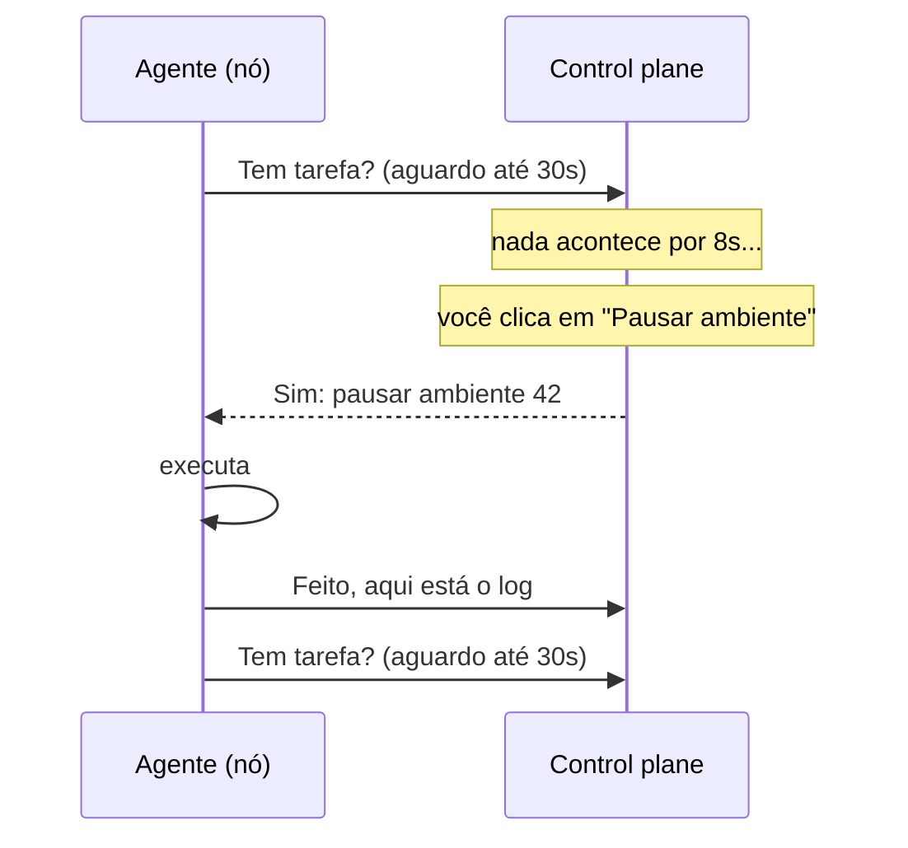
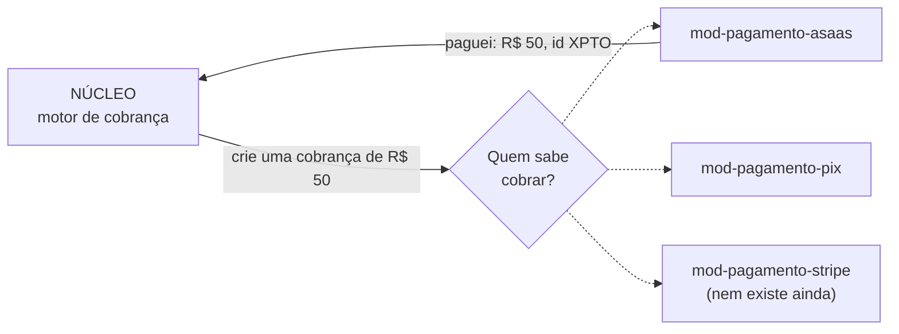
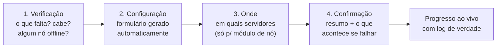
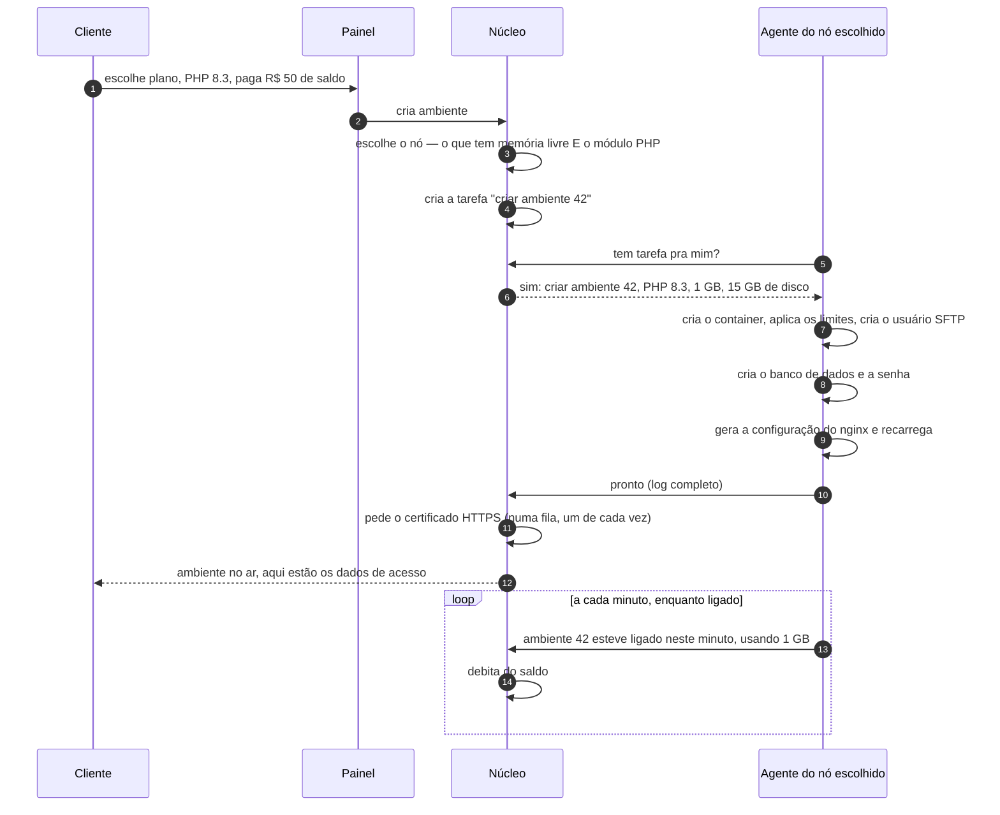
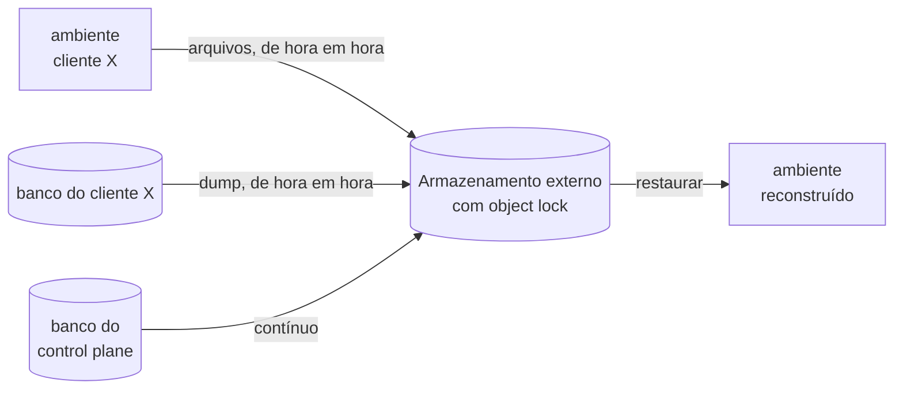

# Como o VelozPanel funciona

> Este documento é para o dono, não para o programador. Se você não é especialista em
> infraestrutura, ele foi escrito para você. Leve uns 20 minutos.

---

## 1. A ideia em uma frase

Você tem alguns servidores. Clientes querem colocar sites neles. O VelozPanel é **o gerente** que
recebe o pedido do cliente, decide em qual servidor vai, manda montar, cobra pelo uso e avisa quando
algo quebra.

**A analogia que vale para o documento inteiro:** pense num **prédio de apartamentos**.

| No prédio | No VelozPanel |
|---|---|
| O prédio (o terreno, a estrutura, a água, a luz) | O **nó** — um servidor VPS |
| O apartamento de cada morador | O **ambiente** de cada cliente — o site dele, isolado dos outros |
| A portaria: recebe visita, confere quem pode entrar, manda subir | O **control plane** — o cérebro |
| O zelador de cada prédio, que recebe ordens da portaria e executa | O **agente** — um programinha em cada servidor |
| O interfone entre a portaria e o zelador | A conexão segura pela internet |
| Serviços que o prédio oferece (garagem, lavanderia, academia) | Os **módulos** — capacidades que você liga e desliga |

Você tem **3 prédios em 3 bairros diferentes** (3 VPS em 3 provedores diferentes), uma portaria só,
e cada prédio tem seu zelador.

---

## 2. As peças

```mermaid
graph TB
  subgraph internet[" "]
    CLI[Cliente<br/>navegador]
    ADM[Você<br/>super admin]
    VIS[Visitante do site<br/>do cliente]
  end

  subgraph cp["CONTROL PLANE — o cérebro (1 VPS, não hospeda cliente)"]
    PAINEL[Painel Next.js<br/>a tela]
    API[API<br/>as regras]
    PG[(PostgreSQL<br/>a memória)]
    JOBS[Motor de tarefas<br/>a fila de serviço]
    VM[(Métricas<br/>os gráficos)]
  end

  subgraph n1["NÓ 1 — provedor A"]
    AG1[agente]
    NG1[nginx<br/>o porteiro do prédio]
    E1[ambiente do cliente X]
    E2[ambiente do cliente Y]
    DB1[(MySQL do nó)]
  end

  subgraph n2["NÓ 2 — provedor B"]
    AG2[agente]
    NG2[nginx]
    E3[ambiente do cliente Z]
    DB2[(MySQL do nó)]
  end

  BKP[(Backup<br/>fora dos servidores)]

  CLI --> PAINEL
  ADM --> PAINEL
  PAINEL --> API
  API --> PG
  API --> JOBS
  JOBS -. "o agente pergunta:<br/>tem tarefa pra mim?" .- AG1
  JOBS -. .- AG2
  AG1 --> E1
  AG1 --> E2
  AG2 --> E3
  VIS --> NG1
  VIS --> NG2
  NG1 --> E1
  NG1 --> E2
  NG2 --> E3
  AG1 -. métricas .-> VM
  AG2 -. métricas .-> VM
  E1 -. backup .-> BKP
  E3 -. backup .-> BKP
```

### O control plane (o cérebro)

Uma VPS separada que **não hospeda cliente nenhum**. Ela tem:

- **o painel** — as telas que você e o cliente veem;
- **a API** — onde ficam todas as regras (quem pode o quê, quanto custa, o que acontece ao pausar);
- **o banco de dados** — a memória de tudo: clientes, ambientes, saldo, faturas, o que está instalado;
- **o motor de tarefas** — a fila de serviço. Nada é feito "na hora": tudo vira uma tarefa numerada,
  que pode ser acompanhada, repetida se falhar e auditada depois;
- **as métricas** — os números que viram os gráficos de CPU, memória e disco.

Por que separado? Porque se o cérebro morasse junto com os clientes, um cliente consumindo toda a
memória do servidor levaria o painel junto — e você ficaria sem enxergar o problema justamente na
hora do problema.

### Os nós (os prédios)

Cada VPS que hospeda cliente. Nela rodam:

- **o agente** — um programinha que fica perguntando ao cérebro "tem tarefa pra mim?" e executa;
- **o nginx** — o porteiro: recebe toda visita da internet e leva para o apartamento certo;
- **os ambientes** — um por cliente, isolados uns dos outros;
- **o banco de dados do nó** — um MySQL compartilhado, com um banco separado por cliente.

### O ambiente (o apartamento)

É o que o cliente compra. Um ambiente tem:
uma quantidade de memória e CPU · um disco com tamanho fixo · uma linguagem numa versão específica
(PHP 8.3, Node 22...) · um ou mais domínios · um banco de dados · e um estado (ligado, pausado,
suspenso).

Um ambiente é um **container**: um pacote fechado onde o programa do cliente roda achando que tem um
servidor só para ele, sem enxergar nem atrapalhar os vizinhos.

---

## 3. Como o cérebro conversa com os prédios (e por que assim)

Sua situação é incomum e ela define o desenho: **os três servidores estão em provedores diferentes**.
Não existe rede privada entre eles. Tudo passa pela internet pública.

Isso levou a três decisões:

**1. Quem liga é sempre o agente, nunca o cérebro.** O agente abre uma conexão de saída e pergunta:
*"tem tarefa pra mim?"*. O servidor **segura a pergunta** por até 30 segundos: se aparecer tarefa,
responde na hora; se não, responde "nada" e o agente pergunta de novo.

Por que importa: o servidor do cliente **não precisa aceitar conexão de fora** para ser administrado.
Menos porta aberta, menos superfície de ataque, e funciona mesmo atrás do firewall do provedor.



**2. Os dois lados se identificam com certificado.** Não é senha: cada nó tem um certificado digital
próprio, gerado nele e que nunca sai de lá. Um nó não consegue se passar por outro.

**3. A fila de tarefas mora no banco de dados.** Nada de sistema de mensageria separado. Uma tarefa é
uma linha numa tabela; o agente pega, executa e marca como feita. Simples de entender, simples de
depurar, e se algo trava você abre a tabela e vê.

**O que acontece se a internet do nó cair?** Os sites dos clientes **continuam no ar** — quem serve
as páginas é o nginx do próprio nó, que não depende do cérebro. O que para é a administração: você
não consegue criar, pausar ou mudar nada naquele nó. Quando a conexão volta, o agente pergunta "o que
mudou enquanto eu estava fora?" e se acerta sozinho.

**E se o cérebro cair?** Mesma coisa, ao contrário: os sites ficam no ar, mas ninguém administra nada
e a cobrança para de contar até ele voltar. Os agentes guardam o que mediram por até 72 horas e
entregam depois — nenhum minuto de uso é perdido.

---

## 4. Módulos — o pedido mais importante seu

Você pediu: *"quero que seja modular"*. Isso significa uma coisa muito específica aqui.

### O que é um módulo

**Um módulo é uma capacidade que dá para ligar e desligar.** MySQL é um módulo. PostgreSQL é outro.
Backup é um módulo. Pix é um módulo. Python é um módulo que ainda não existe e vai poder ser
adicionado sem mexer no resto.

**O que NÃO é módulo:** login, permissões, a fila de tarefas, a lista de servidores, o cálculo de
quanto cada cliente deve. Isso é o **núcleo** — sem essas peças o painel não é nada.

A regra de corte: *se remover a peça o painel deixa de fazer sentido, é núcleo. Se remover só tira
uma capacidade, é módulo.*

### O que torna o sistema realmente modular

Aqui está a parte que quase todo projeto erra, e que a crítica do Ciclo 1 pegou:

> **O núcleo não pode conhecer nenhum módulo pelo nome.**

Um exemplo concreto. Quando o cliente recarrega o saldo, o núcleo precisa cobrar. Ele **não** diz
"chama o Asaas". Ele diz: *"quem quer que esteja registrado como meio de pagamento, crie uma cobrança
de R$ 50"*. Quem responde é o módulo que estiver ligado — Asaas hoje, Pix direto do banco amanhã,
Stripe se um dia você vender fora do Brasil.



O núcleo nunca escreve a palavra "Asaas". Existe um teste automático que **procura essa palavra no
código do núcleo e reprova a entrega se encontrar**. Não é promessa: é verificação a cada mudança.

O mesmo vale para linguagem (o núcleo não sabe o que é PHP, sabe o que é "um runtime"), para DNS,
para backup e para armazenamento.

**Por que isso importa para você especificamente:** cada nó seu está num provedor diferente. Se
amanhã um provedor não servir mais, ou uma taxa de pagamento ficar cara, ou o Pix mudar de regra, você
troca **uma peça** — não reescreve o sistema.

### Como você instala um módulo

Pelo painel: `Admin → Módulos → Catálogo`, clica em **Instalar**, e um assistente de 4 passos
pergunta o necessário:



Por dentro acontecem 14 passos: conferir dependências, validar a configuração, guardar as senhas no
cofre, preparar o banco, mandar instalar em um servidor primeiro (o "canário"), esperar 10 minutos
vendo se ficou saudável, e só então nos demais. **Se qualquer passo falhar, tudo é desfeito
automaticamente** e você vê exatamente onde parou.

**E se um dos três servidores estiver desligado na hora?** A instalação continua. Ele fica marcado
como pendente, o card mostra "2/3 servidores", e nenhum cliente novo é colocado naquele servidor
enquanto ele não tiver o módulo. Quando ele voltar, se acerta sozinho — você não precisa fazer nada.

### O detalhe honesto que você precisa saber

Numa primeira fase, **todos os módulos oficiais já vêm dentro do painel**, desligados. "Instalar" é
ligar, configurar e provisionar nos servidores — rápido, sem download, sem risco.

Um módulo **que ainda não existe** (digamos, Python daqui a seis meses) chega junto com uma
atualização do painel: um comando, dois minutos. O painel avisa quando é esse o caso, com o comando
pronto para copiar.

Isso é uma escolha consciente: baixar código de fora e executar dentro do painel de hospedagem é o
tipo de recurso que parece sofisticado e vira porta de invasão. Quando você tiver módulos escritos
por terceiros, eles rodarão isolados numa caixa separada (um iframe, em outro domínio, sem acesso à
sua sessão) — e aí sim sem precisar atualizar o painel.

---

## 5. O que acontece quando o cliente contrata



**Por que o certificado HTTPS entra numa fila?** Porque a Let's Encrypt tem um limite de emissões. Se
cada servidor pedir certificado por conta própria e o limite estourar, **para todo mundo** — inclusive
as renovações. Então quem pede é o cérebro, um de cada vez, com espera entre tentativas.

---

## 6. Como a cobrança funciona

O modelo é o mesmo do concorrente: **saldo pré-pago com débito por uso**.

1. O cliente **recarrega** o saldo (Pix, boleto, cartão) — como crédito de celular.
2. Todo minuto que o ambiente está **ligado**, um valor proporcional é debitado.
3. Ambiente **pausado** custa quase nada: só o disco continua ocupado, então o disco continua sendo
   cobrado. A memória e a CPU, que são o caro, param de contar.
4. Saldo acabando: avisos por e-mail. Saldo zerado: o ambiente é **suspenso** (não apagado).
5. Suspenso por N dias sem recarga: aí sim entra a política de remoção — sempre com backup guardado
   e aviso prévio.

Dois detalhes que o desenho já resolve e que costumam gerar reclamação:

- **A medição é por minuto, mesmo mostrando "por hora" na tela.** Se fosse por hora cheia, quem
  ligasse e desligasse três vezes num dia pagaria três horas — o oposto do que a pausa promete.
- **Dinheiro é sempre em centavos inteiros no sistema**, nunca em número decimal. Isso elimina a
  classe inteira de bugs de arredondamento em que um centavo some ou aparece.

E o principal: **o motor de cobrança é núcleo, os meios de pagamento são módulos**. Você pode ficar
sem nenhum meio de pagamento instalado — o sistema continua contando o consumo corretamente, só não
consegue receber.

---

## 7. Onde ficam os backups (e por que fora dos servidores)

O backup mora num **armazenamento externo**, em outro provedor ainda, com uma proteção chamada
*object lock*: uma vez gravado, o arquivo não pode ser apagado antes do prazo — **nem por você, nem
por quem invadir sua conta.**

Isso existe por um motivo específico: em ataque de ransomware moderno, a primeira coisa que o
invasor faz é apagar os backups. Se ele conseguir apagar, o backup nunca existiu.



**A regra que não se negocia:** *backup que nunca foi restaurado não é backup, é esperança.* Existe
um runbook de restauração no `40-OPERACAO-DIARIA.md` e ele precisa ser executado por você, de
verdade, uma vez por trimestre. Não pelo sistema: por você, cronometrando.

---

## 8. O que te protege de você mesmo

Cinco mecanismos que evitam que um erro vire desastre:

| Mecanismo | O que faz |
|---|---|
| **Tudo é tarefa** | Nenhuma ação acontece direto. Vira uma tarefa com número, log, tentativa e responsável. Deu errado às 3h da manhã? A tarefa está lá, com o log inteiro |
| **Canário** | Mudança arriscada vai primeiro num servidor só. Fica 10 minutos em observação. Só então vai para os outros |
| **Desfazer em 24 h** | Instalou ou atualizou módulo e piorou? Um botão volta ao estado anterior, inclusive o banco de dados dele |
| **Servidor nasce drenado** | Servidor novo não recebe cliente até você apertar "aceitar novos ambientes". Nenhum cliente cai num servidor não testado |
| **Confirmação por digitação** | Ação irreversível (apagar dados de módulo, esquecer um nó) exige digitar o nome. Não existe "apagar tudo" por clique acidental |

---

## 9. O que este sistema **não** faz (e é proposital)

Ser honesto sobre isto agora evita frustração depois.

| Não faz | Por quê | Alternativa |
|---|---|---|
| Caixa postal de e-mail (@dominio do cliente) | Servidor de e-mail é o item mais trabalhoso da hospedagem: reputação de IP, spam, blacklist. Um erro e todos os clientes param de entregar e-mail | Só **envio** de e-mail pelo site, via serviço externo. Caixa postal, se um dia, com produto pronto |
| Ser o servidor de DNS dos clientes | Responsabilidade pesada demais para o mês 1: DNS fora do ar = todos os sites fora do ar | O painel diz exatamente quais registros criar no provedor de domínio e verifica se propagou |
| Mover cliente entre servidores automaticamente | Sem rede privada entre provedores, copiar dados é lento e caro | Runbook manual: pausar → backup → restaurar no outro → trocar DNS |
| Cliente instalar pacote do sistema (`apt install`) | Isolamento por container não permite | Lista curada de extensões, ligadas por botão no painel. Pedido fora da lista vira ticket |
| Emitir nota fiscal | Decisão sua: *"nota depois vou imprimir"* | O sistema **guarda** todos os dados que a nota exigiria, para não dar trabalho depois |
| Nível de disponibilidade tipo nuvem grande | 3 VPS pequenas em 3 provedores | Prometa o que você entrega. O tempo de recuperação declarado (60 min) é o compromisso honesto |

---

## 10. Resumo em dez linhas

1. Um **cérebro** (control plane) numa VPS, e **nós** (servidores) que hospedam clientes.
2. Cada nó tem um **agente** que pergunta ao cérebro se tem tarefa. O nó nunca recebe conexão de fora.
3. Cada cliente tem um **ambiente**: um container isolado com memória, CPU e disco definidos.
4. **Módulos** são capacidades que ligam e desligam: banco, backup, SSL, meio de pagamento, linguagem.
5. O **núcleo não conhece nenhum módulo pelo nome** — e existe um teste automático que prova isso.
6. Instalar módulo é um assistente de 4 passos no painel, com desfazer em 24 horas.
7. Servidor offline não bloqueia nada: fica pendente e se acerta sozinho quando volta.
8. Cobrança é **saldo pré-pago com débito por minuto**; pausado custa quase nada.
9. Backup mora fora dos servidores, com trava contra apagamento. E precisa ser **testado**.
10. O que o sistema não faz está escrito na seção 9. Isso é escolha, não esquecimento.

---

## Para onde ir agora

- Montar tudo do zero → **[20-INSTALAR-NO-ZERO.md](20-INSTALAR-NO-ZERO.md)**
- Ligar uma capacidade nova → **[30-MODULOS.md](30-MODULOS.md)**
- Algo quebrou → **[40-OPERACAO-DIARIA.md](40-OPERACAO-DIARIA.md)**
- Palavra estranha → **[50-GLOSSARIO.md](50-GLOSSARIO.md)**
