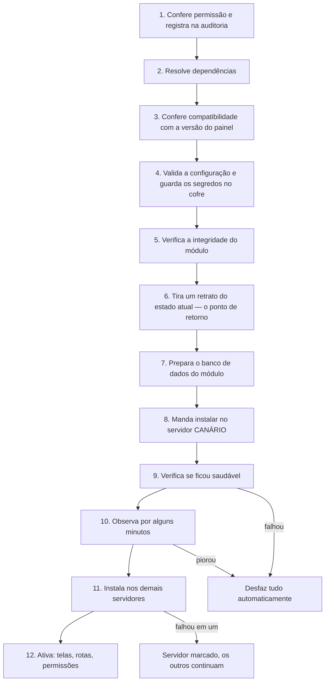

# Módulos — instalar, configurar, atualizar, remover e criar

> Versão de bolso. A especificação completa está em
> `Plan/especialistas/08-modulos-instalacao.md`.

---

## 1. O que é um módulo, em 30 segundos

Uma **capacidade que dá para ligar e desligar**: MySQL, PostgreSQL, backup, SSL, Pix, PHP, Python.

O que **não** é módulo (é núcleo, e não se desliga): login, permissões, clientes, servidores,
ambientes, fila de tarefas, motor de cobrança, auditoria.

Três **escopos**, que mudam onde o módulo vive:

| Escopo | Onde é instalado | Exemplo | Quem liga |
|---|---|---|---|
| `platform` | uma vez, vale para tudo | `mod-pagamento-asaas` | só você |
| `node` | por servidor | `mod-db-mysql` | só você |
| `environment` | por ambiente de cliente | `mod-runtime-php` | você libera, o cliente escolhe |

---

## 2. Catálogo — o que existe

| Módulo | Escopo | Obrigatório? | Faz o quê |
|---|---|---|---|
| `mod-node-base` | node | **sim** | Base do servidor: Docker, nginx, cotas de disco, firewall |
| `mod-storage-s3` | platform | **sim** | Armazenamento externo (backups e artefatos) |
| `mod-metrics` | node | **sim** | Coleta os números que viram os gráficos |
| `mod-ssl` | platform+node | **sim** | Certificados HTTPS, com emissão em fila |
| `mod-backup` | platform+node | **sim** | Backup e **restauração** de ambiente e banco |
| `mod-runtime-php` | environment | não | PHP 7.4 a 8.4, troca de versão pelo painel |
| `mod-runtime-node` | environment | não | Node 18 a 24 |
| `mod-db-mysql` | node | não | MySQL para os ambientes (motor MariaDB) |
| `mod-db-postgres` | node | não | PostgreSQL para os ambientes |
| `mod-ftp-sftp` | node | não | Acesso SFTP do cliente aos arquivos |
| `mod-logs` | environment | não | Logs ao vivo do site |
| `mod-pagamento-asaas` | platform | pelo menos um | Pix, boleto e cartão via Asaas |
| `mod-dns` | platform | não | Diz ao cliente quais registros criar e verifica a propagação |
| `mod-cron` | environment | não | Tarefas agendadas do cliente |
| `mod-git-deploy` | environment | não | Deploy por Git com webhook |
| `mod-email-relay` | platform+node | não | Envio de e-mail pelo site do cliente (sem caixa postal) |
| `mod-pagamento-pix` | platform | não | Pix direto no banco, sem intermediário |
| `mod-runtime-python` | environment | não | Python 3.11 a 3.13 |
| `mod-apps-1click` | environment | não | WordPress, Laravel e afins em um clique |
| `mod-firewall-waf` | node | não | Firewall de aplicação na borda |
| `mod-redis` | environment | não | Cache Redis/Valkey por ambiente |
| `mod-alerts` | platform | não | Regras de alerta sobre as métricas |

**Sem nenhum runtime e nenhum banco, o painel liga e faz login — mas não hospeda nada.**
`mod-runtime-php` + `mod-db-mysql` é o conjunto mínimo para vender. Isso é proposital: é o que prova
que o sistema é realmente modular.

---

## 3. Instalar um módulo

### Pelo painel (o caminho normal)

`Admin → Módulos → Catálogo → Instalar`. Quatro passos:

**Passo 1 — Verificação.** Antes de qualquer mudança, o painel mostra o que falta, o que conflita, e
o estado de cada servidor. Leia esta tela: é aqui que aparece *"node-03 está offline; será aplicado
quando voltar"*.

**Passo 2 — Configuração.** O formulário é gerado do próprio módulo. Campos de senha e chave de API
ficam numa seção separada — eles vão para o **cofre**, não para o banco de configuração, e nunca
aparecem em log.

**Passo 3 — Onde.** Só para módulo de servidor: escolha em quais.

**Passo 4 — Confirmação.** Resumo, tempo estimado, e o que acontece se falhar.

Depois de confirmar, você acompanha o progresso ao vivo, com o log real. Se falhar, o sistema desfaz
sozinho e mostra onde parou, com link direto para o runbook do módulo.

### Pela linha de comando

```bash
velozctl module search backup
velozctl module info mod-backup                 # manifesto + documentação do módulo
velozctl module preflight mod-backup            # só verifica, não muda nada

velozctl module install mod-backup \
  --set retention_daily=7 --set interval_minutes=60 \
  --secret S3_SECRET_KEY=... \
  --wait

velozctl module install mod-db-mysql --nodes node-01,node-02 --canary node-02 --wait
```

Os dois caminhos chamam **a mesma API**. Não existe algo que só a CLI faz.

### Pelo arquivo declarativo

```bash
velozctl apply -f veloz.modules.yaml --dry-run    # SEMPRE primeiro: mostra o diff
velozctl apply -f veloz.modules.yaml
```

Serve para reconstruir a plataforma do zero e para manter no Git o registro do que está ligado.
**Segredo nunca entra no arquivo** — só a indicação de onde buscá-lo.

---

## 4. O que acontece por dentro



**Canário** = instala em um servidor só, espera, e só então nos outros. Assim, se o módulo tiver
problema, ele afeta um terço da plataforma por dez minutos, e não tudo de uma vez.

**Tempo esperado:** módulo de plataforma < 10 s · runtime em 2 nós < 3 min · banco de dados < 8 min.

---

## 5. Servidor offline na hora de instalar

Esse é o **caso normal** — três VPS em três provedores, pela internet.

1. A instalação **continua**. O painel avisa: `2/3 servidores`.
2. O servidor offline fica **pendente**.
3. **Nenhum cliente novo é colocado nele** enquanto o módulo estiver pendente. O sistema já escolhe
   servidor pela lista de capacidades que ele tem.
4. Quando o servidor voltar, ele pergunta *"o que mudou?"*, instala sozinho e reporta.
5. Se passar de **72 horas** pendente, você recebe um alerta.

Você não precisa fazer nada nesse fluxo. Se quiser forçar depois que o servidor voltou:

```bash
velozctl module reconcile mod-db-mysql --node node-03 --wait
```

**Exceção:** alguns módulos exigem **todos** os servidores (`mod-node-base`, `mod-db-*`), porque um
servidor sem eles é um servidor quebrado. Para esses, a instalação é bloqueada até o servidor voltar.

---

## 6. Configurar um módulo já instalado

`Admin → Módulos → <módulo> → Configuração`. Alterar a configuração:

- valida o valor antes de aplicar;
- guarda a versão anterior (dá para voltar);
- gera tarefas para aplicar em cada servidor;
- **não derruba nada** — mudança de configuração é aplicada com recarga, não com reinício, sempre
  que o módulo suportar.

```bash
velozctl module config get mod-db-mysql
velozctl module config set mod-db-mysql innodb_buffer_pool_mb=512
velozctl module config history mod-db-mysql       # todas as revisões, com quem mudou e quando
```

**Segredos** ficam numa aba separada. Trocar um segredo (rotação de chave de API, por exemplo) não
mostra o valor antigo — só permite substituir.

---

## 7. Atualizar um módulo

`Admin → Módulos → Atualizações` lista o que tem versão nova, com o changelog.

```bash
velozctl module upgrade mod-runtime-php --to 1.1.0 --canary node-02 --wait
```

O que acontece: retrato do estado atual → migrações do banco do módulo → atualiza no canário →
observa → atualiza nos demais.

**Você tem 24 horas para desfazer:**

```bash
velozctl module rollback mod-runtime-php
```

ou o botão **Desfazer** na página do módulo. Depois de 24 h o retrato é descartado e o caminho passa
a ser uma versão nova corrigindo o problema.

**Se falhar no meio:** o canário fica na versão nova, os demais voltam à antiga, o módulo entra em
estado `parcial` e você recebe alerta. O sistema nunca fica misturado em silêncio.

---

## 8. Desligar e remover

Três níveis, do mais leve ao definitivo:

| Ação | O que faz | Dados | Reversível |
|---|---|---|---|
| **Desabilitar** | Some do painel, para de aceitar tarefas. **O que já está rodando continua rodando** | intactos | sim, na hora |
| **Desinstalar** | Remove do servidor. Bloqueado se algum ambiente estiver usando | guardados pelo prazo de retenção (30 a 90 dias) | reinstalar dentro do prazo restaura |
| **Purgar** | Apaga os dados do módulo definitivamente | **apagados** | **não** |

```bash
velozctl module disable mod-cron
velozctl module uninstall mod-cron --keep-data
velozctl module purge mod-cron --confirm mod-cron    # exige digitar o nome
```

**Desabilitar `mod-runtime-php` não derruba os sites PHP dos clientes.** Ele só impede mudanças
novas. Derrubar carga é `uninstall`, e ele é bloqueado enquanto houver ambiente usando.

**`mod-pagamento-*` tem regra própria:** não desinstala com cobrança em aberto, e nunca apaga dado
financeiro. Se for o único meio de pagamento ligado, a desinstalação também é bloqueada.

---

## 9. Quando um módulo está com problema

`Admin → Módulos → <módulo> → Logs e saúde` mostra o estado por servidor, o último erro, e o
histórico de saúde.

| Estado | Significa | O que fazer |
|---|---|---|
| `ativo` | tudo certo | nada |
| `parcial` | pendente em ≥1 servidor | ver qual, e por quê (geralmente servidor offline) |
| `degradado` | verificação de saúde falhando | abrir o runbook do módulo, na aba Documentação |
| `falhou` | instalação/atualização falhou e o desfazer também | **caso raro e sério.** Runbook do módulo, e não tente reinstalar por cima |

Um módulo com problema **não derruba o painel**. No máximo, a tela dele mostra um card de erro.
Isso é testado automaticamente a cada mudança do código.

---

## 10. Criar um módulo novo

> Esta seção é para quando **a IA construtora** (ou você) for escrever um módulo. É o resumo; o
> contrato completo está em `08-modulos-instalacao.md` §7.

### Estrutura mínima

```
modules/mod-exemplo/
├── module.yaml       # o manifesto: identidade, dependências, configuração, telas, permissões
├── src/index.ts      # registro: quais capacidades implementa, quais rotas expõe
├── node/             # scripts rodados no servidor: install, enable, configure, health, rollback...
├── ui/               # telas React que se encaixam nos slots do painel
├── migrations/       # banco de dados próprio do módulo
├── messages/pt-BR.json
├── docs/
│   ├── operator.md   # OBRIGATÓRIO — como o DONO opera este módulo
│   ├── runbook.md    # OBRIGATÓRIO — o que fazer quando quebra
│   └── user.md       # se tiver tela de cliente
└── test/
```

**Sem `operator.md` e `runbook.md`, o módulo não passa no CI.** Não é recomendação.

### As cinco regras de ouro

1. **O módulo conhece o núcleo. O núcleo não conhece o módulo.** Nunca o contrário, nunca uma
   exceção "só desta vez".
2. **Módulo não fala com módulo por código.** Fala por capacidade: *"quem sabe fazer backup?"*, e não
   `import mod-backup`.
3. **Todo script do servidor é idempotente:** rodar duas vezes tem que dar o mesmo resultado.
   Existe teste automático para isso.
4. **Módulo não escreve na tabela do núcleo.** Ele usa a porta oficial (`host.*`). Um módulo de
   pagamento não escreve no saldo: ele **informa** o pagamento e o núcleo credita.
5. **Módulo não decide quem pode.** Ele declara a permissão necessária; quem autoriza é o núcleo.

### Como uma tela de módulo aparece no painel

O módulo declara em qual **slot** quer aparecer:

```yaml
ui:
  mounts:
    - slot: "environment.sidebar"       # menu lateral do ambiente
      label: "PHP"
      component: "PhpSettingsPage"
      permission: "environment.runtime.read"
```

Slots disponíveis: menu do ambiente, cards da visão geral, abas, ações do domínio, menu do admin,
configurações globais, abas do servidor, meios de pagamento, cards do painel do admin, formas de
pagamento no checkout, seções da cobrança, passos do primeiro acesso.

A tela é embrulhada numa proteção: se ela quebrar, aparece um card de erro no lugar — **o resto da
página continua funcionando**.

### Por que instalar um módulo novo pede atualização do painel

Todos os módulos oficiais vêm **dentro** do painel, desligados. Instalar é ligar, e é rápido.

Um módulo que ainda **não existia** quando o painel foi construído precisa entrar num painel novo:

```bash
velozctl panel upgrade --channel stable
```

Dois minutos, sem derrubar site nenhum. O painel avisa quando é esse o caso, com o comando pronto.

Isso é uma escolha de segurança: baixar código de fora e executar dentro de um painel de hospedagem é
o tipo de recurso que vira porta de invasão. Quando existirem módulos de terceiros, eles rodarão
isolados, em outro domínio, sem acesso à sua sessão — aí sem precisar atualizar o painel.

---

## 11. Perguntas frequentes

**Posso ter MySQL num servidor e PostgreSQL em outro?**
Sim. Módulo de servidor é instalado por servidor. O sistema só oferece PostgreSQL ao cliente se
existir um servidor com espaço que o tenha.

**Posso ter dois meios de pagamento ligados ao mesmo tempo?**
Sim. Você escolhe o padrão em `Admin → Cobrança`. Se houver dois e nenhum escolhido, o sistema
**recusa** e pede que você escolha — em vez de decidir sozinho.

**Se eu desinstalar o módulo de PHP, os sites PHP caem?**
Desabilitar não derruba. Desinstalar é bloqueado enquanto houver ambiente usando PHP.

**Quanto tempo dura o "desfazer"?**
24 horas depois de instalar ou atualizar. Depois disso, o retrato é descartado.

**Um módulo pode ler os dados de outro?**
Não. Cada módulo tem seu próprio espaço no banco, com usuário sem acesso aos outros.

**E se um módulo tiver um bug e travar o painel?**
Sete camadas impedem isso, da tela ao banco. Existe um teste que **derruba módulos de propósito** e
verifica que login, lista de ambientes, pausar/iniciar e cobrança continuam funcionando.
