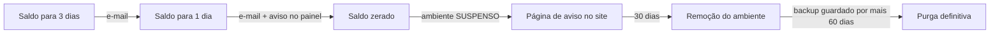

# Operação diária — runbooks

> **Este é o documento que fica aberto num marcador do navegador.**
> Todo runbook tem a mesma forma: **sintoma → diagnóstico → ação → como saber que resolveu**.
> Antes de agir, faça o diagnóstico. Agir sem diagnosticar é como se troca um problema pequeno por
> um grande.

## Regras que valem para todos os runbooks

1. **Nunca aja direto no servidor se der para agir pelo painel.** O painel registra quem fez o quê.
2. **Anote o horário do início.** Vai ser perguntado depois, inclusive por você mesmo.
3. **Antes de qualquer coisa destrutiva, faça backup** — mesmo que pareça óbvio que não precisa.
4. **Avise o cliente antes de ele reclamar.** Um e-mail de "estamos vendo isso" vale mais que a
   solução meia hora mais rápida.
5. **Se você não entendeu a causa, não declare resolvido.** Escreva o que fez no ticket e observe.

## Índice

| # | Situação | Gravidade |
|---|---|---|
| [1](#runbook-1) | Cliente reclamou que o site caiu | Alta |
| [2](#runbook-2) | Nó não responde | **Crítica** |
| [3](#runbook-3) | Disco cheio | Alta |
| [4](#runbook-4) | Cliente pediu mais memória ou CPU | Baixa |
| [5](#runbook-5) | Restaurar backup | **Crítica** |
| [6](#runbook-6) | Cliente inadimplente | Baixa |
| [7](#runbook-7) | Suspeita de invasão | **Crítica** |
| [8](#runbook-8) | Certificado HTTPS não emitiu | Média |
| [9](#runbook-9) | Módulo em estado degradado ou falhou | Média |
| [10](#runbook-10) | Control plane fora do ar | **Crítica** |
| [11](#runbook-11) | Rede WireGuard (túnel/peer) | Média |

---

<a name="runbook-1"></a>
## Runbook 1 — "Meu site caiu"

### Diagnóstico (5 minutos, nesta ordem)

**1.1 O site está mesmo fora?** Abra você. Teste de fora da sua rede também (celular no 4G).
Metade dos "caiu" é DNS do lado do cliente ou cache do navegador dele.

**1.2 Abra o ambiente no painel.** Olhe o **estado**:

| Estado | Significa | Vá para |
|---|---|---|
| `pausado` | o próprio cliente pausou | Diga a ele. Um clique resolve |
| `suspenso` | saldo zerado | [Runbook 6](#runbook-6) |
| `parado` (não deveria) | o processo morreu | passo 1.4 |
| `rodando` | o problema é outro | passo 1.3 |

**1.3 Se está rodando, olhe os gráficos** das últimas 2 horas:

| O que você vê | Causa provável |
|---|---|
| Memória colada no teto, com quedas bruscas | **Falta de memória** — o processo está sendo morto e reiniciado. Vá para 1.5 |
| CPU em 100% constante | Loop no código, ou tráfego anormal. Vá para 1.6 |
| Disco em 100% | [Runbook 3](#runbook-3) |
| Tudo normal, mas sem requisições | O tráfego não está chegando: DNS ou certificado. Vá para 1.7 |
| Tudo normal, com requisições, mas erro 5xx | Erro na aplicação do cliente. Vá para 1.8 |

**1.4 Processo parado:** `Ambiente → Logs → Aplicação`. Procure a **última linha antes de parar**.
Erro de sintaxe depois de um deploy? Falta de variável de ambiente? Banco recusando conexão?

**1.5 Falta de memória:** `Ambiente → Logs → Sistema`, procure `OOM` ou "killed". Confirma o
diagnóstico. Vá para [Runbook 4](#runbook-4).

**1.6 CPU no teto:** veja o log de acesso. Muitas requisições da mesma origem = ataque ou robô.
Poucas requisições e CPU alta = código do cliente.

**1.7 Tráfego não chega:** confira o DNS (`Ambiente → Domínios` mostra o esperado e o observado) e o
certificado (`Ambiente → SSL`, data de validade). Se o certificado venceu, [Runbook 8](#runbook-8).

**1.8 Erro 5xx com tudo normal:** é a aplicação do cliente. O log da aplicação tem a resposta. Se o
último deploy foi há pouco, o problema é o deploy.

### Ação

| Causa | Ação |
|---|---|
| Cliente pausou | Avisar; ele mesmo inicia |
| Sem saldo | [Runbook 6](#runbook-6) |
| Processo morreu por erro de código | Avisar o cliente com **a linha do log**. Não conserte o código dele |
| Falta de memória | Oferecer upgrade ([Runbook 4](#runbook-4)). Se for pico pontual, subir temporariamente e avisar |
| Ataque / robô | Bloquear a origem na borda, avisar o cliente. > ⚠️ PENDENTE Ciclo 3 — tela de bloqueio por IP no painel |
| Certificado vencido | [Runbook 8](#runbook-8) |
| Servidor com problema | [Runbook 2](#runbook-2) |

Reinício rápido, quando a causa já está entendida:

```
Ambiente → Ações → Reiniciar
```

**Nunca reinicie antes de olhar o log.** O reinício apaga o rastro e você perde a causa.

### Como saber que resolveu

Site abre de fora da sua rede · gráficos voltaram ao normal por 15 minutos · sem 5xx no log da borda
· **o cliente confirmou**.

---

<a name="runbook-2"></a>
## Runbook 2 — Nó não responde

**Antes de entrar em pânico:** se o nó está fora do ar mas os sites dele continuam abrindo, você
perdeu a *administração* daquele nó, não os sites. É grave, não é catastrófico.

### Diagnóstico

**2.1 O que exatamente está fora?**

| Teste | Resultado | Significa |
|---|---|---|
| Sites daquele nó abrem? | sim | O nó está vivo; caiu só o agente ou a conexão com o cérebro |
| Sites daquele nó abrem? | não | O servidor caiu ou a rede dele caiu |
| `ping <ip-do-no>` | responde | Rede ok |
| `ssh root@<ip-do-no>` | entra | Servidor vivo |

**2.2 Se você consegue entrar por SSH:**

```bash
systemctl status veloz-agent
journalctl -u veloz-agent -n 100 --no-pager
df -h /              # disco cheio derruba o agente
free -m              # memória
uptime               # reiniciou sozinho?
```

**2.3 Se não consegue entrar por SSH:** abra o console do provedor (KVM/VNC). Se nem por lá, é
problema do provedor: abra chamado **agora** e continue pelo passo 2.6.

### Ação

**Caso A — agente parado, servidor ok:**

```bash
systemctl restart veloz-agent
journalctl -u veloz-agent -f
```

Se voltar, ele se acerta sozinho: pega as tarefas pendentes e entrega as métricas do buffer (até 72
horas). **Nenhum minuto de cobrança é perdido.**

**Caso B — disco cheio:** [Runbook 3](#runbook-3) primeiro. O agente volta sozinho depois.

**Caso C — servidor reiniciou:** confira se tudo subiu:

```bash
velozctl node check node-0X --strict
```

Ambiente que não subiu aparece na lista. Suba pelo painel.

**Caso D — servidor perdido, previsão longa (provedor com incidente):**

1. Avise **todos os clientes daquele nó** — proativamente, com previsão honesta ("não temos previsão"
   é uma resposta aceitável; silêncio não é).
2. Marque o nó como drenado no painel para não receber ambiente novo.
3. Se a previsão passar de algumas horas e o cliente for crítico, restaure em outro nó:
   [Runbook 5](#runbook-5), depois aponte o DNS para o nó novo.

**Caso E — servidor perdido definitivamente:**

1. Restaure **cada ambiente** em outro nó ([Runbook 5](#runbook-5)), começando pelos que mais pagam.
2. Aponte os domínios para o novo IP.
3. Remova o nó: `velozctl node forget node-03 --confirm node-03`.
4. Depois, escreva o que aconteceu. Você vai querer esse texto na próxima vez.

**2.6 Enquanto isso:** os ambientes daquele nó continuam contando consumo? **Não.** Sem heartbeat, o
sistema para de faturar aquele nó após o período de tolerância. Cliente não paga por indisponibilidade.

### Como saber que resolveu

Bolinha verde no painel · `velozctl node check node-0X --strict` limpo · métricas voltando ·
uma tarefa de teste executa (`velozctl node smoke node-0X`).

---

<a name="runbook-3"></a>
## Runbook 3 — Disco cheio

**Por que é urgente:** disco cheio derruba o agente, o banco de dados e todos os ambientes daquele
servidor **ao mesmo tempo**. É a falha com maior raio de destruição da operação.

### Diagnóstico

```bash
df -h                                        # qual partição
du -sh /srv/* 2>/dev/null | sort -h | tail   # onde está o volume
```

No painel: `Admin → Nós → node-0X → Disco` mostra a divisão por ambiente e por sistema.

| Onde está cheio | Causa comum |
|---|---|
| Ambiente de um cliente | Ele encheu a cota dele. **Isso não deveria afetar o servidor** — se afetou, a cota não está ativa: problema sério, veja abaixo |
| `/var/lib/docker` | Imagens antigas acumuladas |
| `/var/log` | Log sem rotação, ou um ambiente cuspindo erro em loop |
| Diretório do banco | Banco crescendo, ou binlog sem limpeza |
| `/tmp` ou dumps | Dump antigo que não foi enviado ao bucket |

### Ação

**Ordem de segurança — do mais seguro para o menos seguro:**

```bash
# 1. Imagens e camadas não usadas (seguro)
docker image prune -a --filter "until=168h"

# 2. Log antigo (seguro)
journalctl --vacuum-time=7d
find /var/log -name "*.gz" -mtime +14 -delete

# 3. Dumps já enviados ao bucket (confira antes!)
ls -lh /srv/veloz/dumps/
find /srv/veloz/dumps -mtime +2 -name "*.sql.gz" -delete

# 4. Binlog do MySQL (confira a replicação antes)
velozctl module task mod-db-mysql purge_binlogs --node node-0X
```

**Nunca apague:** diretório de dados de ambiente, dado de banco, backup local ainda não enviado.

**Se a causa foi um ambiente estourar e afetar o servidor**, a cota de disco não está funcionando.
Isso é um defeito grave da plataforma, não do cliente:

```bash
velozctl node check node-0X --strict     # deve acusar prjquota
```

Corrija a cota **antes** de aceitar novos clientes naquele nó.

**Se a causa foi um ambiente dentro da cota dele**, é o cliente: avise, e ofereça mais disco.

### Prevenção (faça depois de resolver)

- Alerta em **80%** de uso do disco do nó, não em 95%.
- Rotina semanal de `docker image prune`.
- Retenção de log de 7 dias, com limite por ambiente.

### Como saber que resolveu

`df -h` abaixo de 80% · agente e banco de pé · ambientes respondendo · alerta configurado.

---

<a name="runbook-4"></a>
## Runbook 4 — Cliente pediu mais memória ou CPU

### Diagnóstico

**4.1 Ele precisa mesmo?** Olhe os gráficos de 7 dias. Memória colada no teto ou com quedas bruscas
(reinícios por falta de memória) = precisa. Memória em 40% = o problema dele é outro, e dar mais
memória não vai resolver — vai só aumentar a conta dele.

**4.2 Cabe no servidor?** `Admin → Nós → node-0X`: memória livre. Se não couber, o ambiente precisa
migrar para outro nó, e isso é manual (pausa + backup + restauração + DNS).

**4.3 O saldo dele aguenta?** Mais recursos = tarifa por minuto maior. Se o saldo dá para 3 dias no
plano novo, avise **antes** de aplicar.

### Ação

```
Admin → Ambientes → <ambiente> → Recursos → alterar memória/vCPU → Aplicar
```

**A mudança vale a quente**, sem reiniciar o site. A nova tarifa passa a valer no minuto seguinte,
proporcional.

**Cuidado com a redução.** Diminuir a memória **abaixo do que o ambiente está usando agora** é
recusado pelo sistema, com a mensagem explicando. Para reduzir de verdade:

1. peça ao cliente para reduzir o consumo, ou
2. reinicie o ambiente **junto com** a redução (aí o processo nasce menor) — com aviso e janela combinada.

### Como saber que resolveu

O painel mostra o valor novo · o gráfico mostra o teto novo · o extrato mostra a tarifa nova a partir
do minuto certo · o sintoma original (reinícios, lentidão) sumiu em 24 h.

---

<a name="runbook-5"></a>
## Runbook 5 — Restaurar backup

> **Este é o runbook mais importante do documento.** Se você só treinar um, treine este.
> Faça um ensaio a cada trimestre, com cronômetro, **num ambiente de teste**.

### Antes de começar

**Responda por escrito, no ticket:**

1. Restaurar **o quê**: arquivos, banco, ou os dois?
2. Restaurar **para quando**? (o cliente costuma saber a hora aproximada do estrago)
3. Restaurar **por cima** do atual, ou **ao lado** para comparar?
4. O que existe agora **vai ser perdido**? Se sim, o cliente sabe e concorda?

**Regra:** na dúvida, restaure **ao lado**. Comparar e depois trocar é lento; sobrescrever errado é
irreversível.

### Diagnóstico

```
Ambiente → Backup → lista de pontos de restauração
```

Cada ponto mostra data, tamanho, e se inclui banco. Confira que existe um ponto **anterior** ao
problema. Se o problema é antigo e o cliente só percebeu agora, pode não haver.

### Ação

**5.1 Restauração ao lado (recomendada):**

```
Ambiente → Backup → <ponto> → Restaurar → destino: novo ambiente temporário
```

Cria um ambiente novo com o conteúdo do backup, num domínio temporário. O cliente confere. Se estiver
certo, você troca o DNS ou copia por cima.

**5.2 Restauração por cima (quando o cliente confirmou por escrito):**

```
Ambiente → Backup → <ponto> → Restaurar → destino: este ambiente → digitar o nome do ambiente
```

O sistema faz um backup do estado atual **antes** de sobrescrever. Sempre.

**5.3 Só o banco:**

```
Ambiente → Banco de dados → Restaurar dump → escolher o dump por horário
```

Os dumps são horários — dá para voltar a uma hora específica.

**5.4 Pela linha de comando** (quando o painel estiver fora):

```bash
velozctl backup list --environment <id>
velozctl backup restore --snapshot <id> --to-path /srv/veloz/restore-teste --dry-run
velozctl backup restore --snapshot <id> --to-path /srv/veloz/restore-teste
```

`--dry-run` mostra o que seria escrito, sem escrever. **Use sempre primeiro.**

### Como saber que resolveu

O cliente **confirmou** que o conteúdo está certo (não basta você achar) · o site abre · o banco tem
os dados esperados · você **anotou o tempo total** — esse número é o que você pode prometer.

### Ensaio trimestral (na agenda, não na memória)

1. Crie um ambiente de teste com conteúdo reconhecível.
2. Espere o backup.
3. **Apague o ambiente.**
4. Restaure, cronometrando.
5. Anote o tempo e o que deu trabalho.

Se o tempo passar de 60 minutos, ajuste o processo ou a promessa ao cliente. Uma das duas.

---

<a name="runbook-6"></a>
## Runbook 6 — Cliente inadimplente

### O que o sistema faz sozinho



**Suspenso ≠ apagado.** O ambiente para, o site mostra uma página de aviso, mas os dados continuam
lá. Recarregou, volta em segundos.

### Diagnóstico

`Admin → Clientes → <cliente> → Cobrança`:

| O que você vê | Significa |
|---|---|
| Saldo negativo e consumo continuando | O ambiente ainda não suspendeu — confira a política |
| Saldo zerado, ambiente suspenso, cliente reclamando que pagou | Pagamento não creditou. **Vá para 6.2** |
| Saldo zerado há semanas, sem resposta | Caminho da remoção |

**6.2 Pagamento não creditou** — o mais comum, e o mais chato:

```
Admin → Módulos → mod-pagamento-<x> → Webhooks recebidos
```

| Situação | Causa | Ação |
|---|---|---|
| Webhook não chegou | URL errada no PSP, ou o PSP não enviou | Confira a URL configurada no PSP; use "reprocessar" com o id da cobrança |
| Webhook chegou e foi **rejeitado** | Assinatura inválida (token errado) ou valor divergente | Confira o token do webhook nos segredos do módulo |
| Webhook chegou, aceito, saldo não subiu | **Defeito.** Registre e escale | Não credite manualmente sem registrar o motivo |

**Crédito manual**, quando você confirmou o pagamento na conta do PSP:

```
Admin → Clientes → <cliente> → Cobrança → Lançamento manual
```

Exige motivo e fica na auditoria. **Sempre** anote o comprovante do PSP no motivo.

### Ação para inadimplência real

1. **Antes de suspender:** um e-mail humano, não só o automático. Metade resolve aqui.
2. **Suspensão:** automática. Não reverta manualmente "por educação" sem combinar prazo.
3. **Antes de remover** (dia 30): último e-mail, com o aviso de que os dados serão apagados e a
   oferta de enviar um backup para ele.
4. **Remoção:** o backup fica guardado mais 60 dias. Registre a data.
5. **Purga:** só depois dos 60 dias, e com registro.

**Nunca** apague dados de cliente sem os dois avisos e sem backup guardado. Além de ser errado, é a
receita de um processo judicial.

### Como saber que resolveu

Saldo positivo · ambiente rodando · o cliente confirmou · se foi falha de crédito, a **causa** foi
encontrada (não só contornada).

---

<a name="runbook-7"></a>
## Runbook 7 — Suspeita de invasão

> **Regra que muda tudo: preserve as evidências antes de limpar.** A vontade de "resolver logo"
> apagando tudo é o erro mais caro. Sem evidência você não sabe se ele voltou.

### Sinais

| Sinal | Onde aparece |
|---|---|
| CPU no teto sem tráfego correspondente | Gráficos — minerador é o caso clássico |
| Tráfego de saída anormal | Métricas de rede — spam ou ataque partindo de você |
| Arquivo estranho no site do cliente | Log do SFTP, ou o próprio cliente reclamando |
| Login de admin de IP desconhecido | `Admin → Auditoria` |
| E-mails do seu servidor em blacklist | Reclamação do provedor |
| Processo desconhecido no nó | `Admin → Nós → Processos` |

### Ação — nesta ordem exata

**7.1 CONTER (minutos, não horas).**

```
Ambiente → Ações → Suspender (motivo: suspeita de comprometimento)
```

Suspender **para o ambiente sem apagar nada**. Se a suspeita é do nó inteiro, drene o nó (para de
receber ambiente novo) e considere isolar a rede dele.

**7.2 PRESERVAR.**

```bash
velozctl forensics snapshot --environment <id>
```

Congela: imagem do disco do ambiente, lista de processos, conexões de rede, logs de acesso e de
SFTP, e o horário. Vai para o bucket com trava de imutabilidade.

> ⚠️ PENDENTE Ciclo 3 — o comando `forensics snapshot` ainda não está especificado em detalhe
> (o que exatamente coletar e em qual formato). Enquanto não existir: **não apague nada**, e faça um
> backup completo do ambiente antes de qualquer limpeza.

**7.3 AVALIAR o alcance.**

- Foi só o site do cliente (99% dos casos: WordPress desatualizado, plugin com falha, senha fraca)?
- Ou o invasor saiu do container? Sinais: processo estranho **no host**, alteração em `/etc`, novo
  usuário, chave SSH nova, `sudo` no log de auditoria.

**Se saiu do container, o nó inteiro é considerado comprometido.** Isso muda o plano: o nó não é
limpo, ele é **reconstruído do zero** e os ambientes são restaurados de backup **anterior à invasão**
em outro nó.

**7.4 ERRADICAR.**

| Alcance | Ação |
|---|---|
| Só o site do cliente | Restaurar de um backup **anterior** à invasão. Trocar **todas** as senhas dele (SFTP, banco, painel). Atualizar o CMS/plugins antes de subir |
| Nó comprometido | Reconstruir o nó do zero (etapa 4 do `20-INSTALAR-NO-ZERO.md`). Restaurar ambientes em nó limpo. Trocar todos os segredos daquele nó |
| Painel comprometido | Trocar **todas** as chaves (CA, cofre, tokens de API, senhas de admin), invalidar todas as sessões, revisar a auditoria inteira |

**7.5 COMUNICAR.**

- **Ao cliente afetado:** o que aconteceu, o que foi feito, o que ele precisa fazer.
- **Aos demais clientes:** só se houver risco a eles. Não crie pânico sem motivo — e não esconda se houver.
- **LGPD:** se houve acesso a dados pessoais de terceiros, existe dever de comunicação.
  > ⚠️ PENDENTE Ciclo 3 — prazo, formato e destinatário da notificação à ANPD, com o especialista de
  > Segurança & Compliance. **Não improvise isto.**

**7.6 APRENDER.** Escreva: como entrou, o que faltava, o que muda a partir de agora. Um parágrafo já
é infinitamente melhor que nada.

### Como saber que resolveu

Sem processo estranho por 72 h · tráfego normal · IPs do invasor bloqueados · **todas** as
credenciais trocadas · causa de entrada identificada e fechada (se você não sabe como entrou, não
acabou) · evidências guardadas.

---

<a name="runbook-8"></a>
## Runbook 8 — Certificado HTTPS não emitiu

### Diagnóstico

`Ambiente → SSL` mostra o estado e o último erro.

| Erro | Causa | Ação |
|---|---|---|
| `DNS não aponta para nós` | O domínio não resolve para o IP do nó | O cliente precisa corrigir o DNS. A tela mostra o esperado e o observado |
| `rate limit` da autoridade | Muitas tentativas | **Espere.** Nova tentativa em 1 h; não force. Forçar prolonga o bloqueio |
| `desafio falhou` | O site não respondeu no `/.well-known/` | Ambiente pausado ou nginx com problema |
| `CAA` | O domínio tem registro CAA proibindo | O cliente precisa ajustar o CAA no DNS |
| `domínio não existe` | Erro de digitação | Corrigir o domínio |

### Ação

```
Ambiente → SSL → Tentar novamente
```

A emissão entra numa **fila global** — um pedido por vez para toda a plataforma. Isso é proposital:
se cada nó pedisse por conta própria, o limite da autoridade estouraria e **ninguém** conseguiria
emitir, nem renovar.

Se for urgente e o cliente tiver certificado próprio:

```
Ambiente → SSL → Enviar certificado próprio
```

### Como saber que resolveu

Cadeado no navegador, sem aviso · validade correta · `Ambiente → SSL` mostra a data de renovação
automática (30 dias antes do vencimento).

---

<a name="runbook-9"></a>
## Runbook 9 — Módulo degradado ou falhou

### Diagnóstico

`Admin → Módulos → <módulo> → Logs e saúde`. Estado por servidor + último erro.

| Estado | Significa |
|---|---|
| `parcial` | pendente em ≥1 servidor — geralmente servidor offline. [Runbook 2](#runbook-2) |
| `degradado` | a verificação de saúde falha há um tempo |
| `falhou` | instalação/atualização falhou **e o desfazer também** — raro e sério |

### Ação

**Degradado:** abra a aba **Documentação** do módulo — cada módulo traz o próprio runbook, escrito
por quem o construiu. Comece por ele.

Diagnóstico genérico, quando o runbook do módulo não cobrir:

```bash
velozctl module status mod-<x>
velozctl module logs mod-<x> --node node-0X --follow
velozctl node check node-0X --strict
```

**Falhou:** **não reinstale por cima.** Reinstalar por cima de uma falha parcial é como pintar sobre
mofo. Faça:

1. `velozctl module status mod-<x> --json > /tmp/estado.json` (guarde o estado);
2. leia o `last_error` — ele diz em qual dos 14 passos parou;
3. se parou antes das migrações, é seguro desinstalar e instalar de novo;
4. se parou **durante ou depois** das migrações, o banco do módulo pode estar meio migrado.
   Restaure o retrato: `velozctl module rollback mod-<x>` (funciona por 24 h);
5. passadas as 24 h com estado inconsistente: caso para investigação individual, com backup do schema
   do módulo antes de qualquer coisa.

**Módulo pendente em nó que voltou:**

```bash
velozctl module reconcile mod-<x> --node node-03 --wait
```

### Como saber que resolveu

Estado `ativo` em todos os servidores · verificação de saúde verde por 30 min · a funcionalidade
funciona de verdade (teste você mesmo, não confie no verde).

---

<a name="runbook-10"></a>
## Runbook 10 — Control plane fora do ar

**O que continua funcionando:** todos os sites de todos os clientes. O nginx de cada nó não depende
do cérebro.

**O que para:** painel (você e clientes), criação/alteração de ambiente, instalação de módulo,
cobrança (para de contar até voltar), alertas.

### Diagnóstico

```bash
ssh root@<IP-CP>
systemctl status veloz-api veloz-painel postgresql nginx
df -h && free -m
journalctl -u veloz-api -n 100 --no-pager
```

| Sintoma | Ação |
|---|---|
| Um serviço parado | `systemctl restart <serviço>` e leia o log de por que caiu |
| Disco cheio | [Runbook 3](#runbook-3) — no CP, geralmente é log ou WAL do Postgres |
| Sem memória | Confira se algo vazou. O painel tem limite de memória e reinício automático configurados |
| Postgres não sobe | **Pare.** Não tente "consertar" o banco na tentativa e erro. Vá para a recuperação |
| Servidor inacessível | Console do provedor; se não, recuperação em servidor novo |

### Recuperação em servidor novo

Está no fim do `20-INSTALAR-NO-ZERO.md`, seção *"Reconstruir tudo depois de um desastre"*.
Resumo: VPS nova → `install-cp.sh --restore` → restaurar o banco do bucket → recolocar a chave da CA e
a do cofre → `velozctl apply -f veloz.modules.yaml`. Os nós reconectam sozinhos, porque o certificado
deles continua válido.

**Tempo alvo: 60 minutos.** Se você nunca ensaiou, vai levar três horas — por isso o ensaio
trimestral existe.

### Enquanto o cérebro está fora

- **Avise os clientes** que o painel está indisponível e que **os sites estão no ar**. Essa segunda
  frase evita metade dos tickets.
- **Não force nada nos nós.** Eles estão operando sozinhos, corretamente.
- Os agentes guardam métricas por **72 horas**. Voltando dentro desse prazo, nenhum minuto de
  cobrança é perdido. Passando disso, os dados mais antigos se perdem — e o cliente ganha a dúvida.

### Como saber que resolveu

Painel abre · nós todos verdes · uma tarefa de teste executa (`velozctl node smoke node-01`) · o
extrato de um cliente cobre o período de indisponibilidade sem buraco.

---

<a name="runbook-11"></a>

## Runbook 11 — Rede WireGuard (túnel/peer)

**Antes de tudo:** a WireGuard é o caminho de **gerência** e o caminho da **Opção A**. Se a WG cai:
os sites **diretos** (nós com IP público) **continuam no ar**; só os sites em **Opção A** (servidor
sem IP público) caem, mostrando a página "temporariamente indisponível".

### Adicionar um nó à malha

1. `Admin → Módulos → mod-rede-wireguard → Instalar` no nó (ou `Admin → Rede → Adicionar à malha`).
2. Escolha o papel (`público`/`local`). O resto é automático (chave, registro no hub, `wg0`).
3. Confirme handshake verde em `Admin → Rede`. Pronto.

### Remover um peer (nó desativado)

```bash
velozctl node forget node-03 --confirm node-03
# remove o peer no hub (wg set wg0 peer <pubkey> remove), revoga o certificado mTLS,
# e limpa a tabela de peers e o wg-hosts — tudo numa operação.
```

Nunca edite `/etc/wireguard/wg0.conf` do hub à mão para remover — use o comando, senão a tabela e a
config saem de sincronia.

### Diagnosticar túnel caído

No painel `Admin → Rede`, o peer está **vermelho** (handshake > 3 min). No nó:

```bash
wg show wg0                          # 'latest handshake' antigo? 'transfer' parado?
systemctl status wg-quick@wg0
ping -c3 10.77.0.1                    # alcança o hub?
journalctl -u wg-quick@wg0 -n 50 --no-pager
```

| Sintoma | Causa provável | Ação |
|---|---|---|
| `wg0` não existe | módulo do kernel sumiu (upgrade do provedor) | `modprobe wireguard`; rode o node-doctor; reinstale `wireguard` |
| Handshake nunca acontece (nó local) | UDP/51820 de saída bloqueado, ou roteador residencial | teste `nc -u -z wg.velozpanel.com.br 51820`; libere no roteador/provedor |
| Handshake ok, mas site em Opção A dá 503 | link do servidor local caiu, ou nginx do nó local parado | veja o link de casa; `systemctl status nginx` no nó local |
| Cai e volta, pacotes grandes travam | MTU alta demais (PPPoE) | baixe a MTU para 1380 em `Admin → Rede → nó → MTU` |
| Gerência do nó público parou, site no ar | WG do nó caiu; o agente foi para o fallback mTLS público | normal; conserte a WG sem pressa — o nó não ficou cego |

### IP residencial mudou (servidor local)

Não faça nada: o WireGuard reconecta sozinho em ~25 segundos (ele redescobre o novo IP). Se demorar
mais que 2 min, no servidor local: `systemctl restart wg-quick@wg0`. **Não** é preciso DDNS.

### Como saber que resolveu

Handshake verde em `Admin → Rede` · `wg show wg0` com handshake recente e `transfer` subindo ·
site em Opção A abre · `velozctl node check node-0X --strict` limpo.

---

## Rotina — o que fazer e quando

| Frequência | Tarefa |
|---|---|
| **Diária** (5 min) | Olhar o painel de admin: nós verdes? alertas? algum ambiente suspenso sem motivo? |
| **Semanal** (20 min) | Uso de disco de cada nó · atualizações de módulo pendentes · tickets abertos · backups do último dia existem? |
| **Mensal** (1 h) | Atualizar módulos com calma · revisar consumo × faturamento · revisar auditoria de admin · conferir cota de banda de cada provedor |
| **Trimestral** (2 h) | **Ensaio de restauração** ([Runbook 5](#runbook-5)) · **ensaio de recuperação do CP** ([Runbook 10](#runbook-10)) · rodar o diagnóstico em todos os nós · revisar quem tem acesso a quê |
| **Anual** | Rotacionar chaves e segredos · revisar preços contra o custo real · revisar os documentos legais |

> ⚠️ PENDENTE Ciclo 3 — checklist de conformidade LGPD (prazo de resposta a titular, registro de
> tratamento, retenção). O especialista de Segurança & Compliance escreve, e ele entra nesta tabela.
