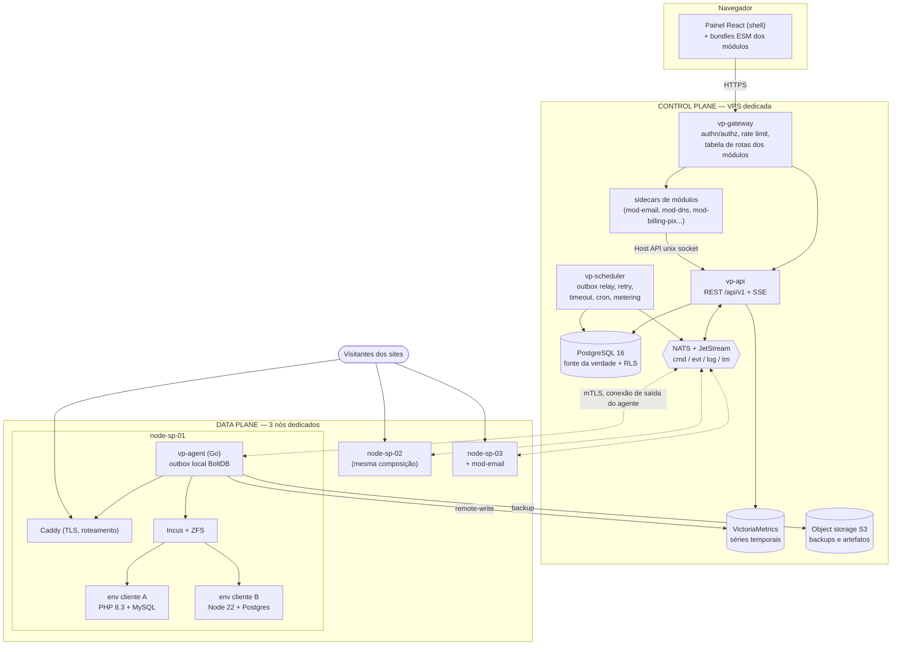
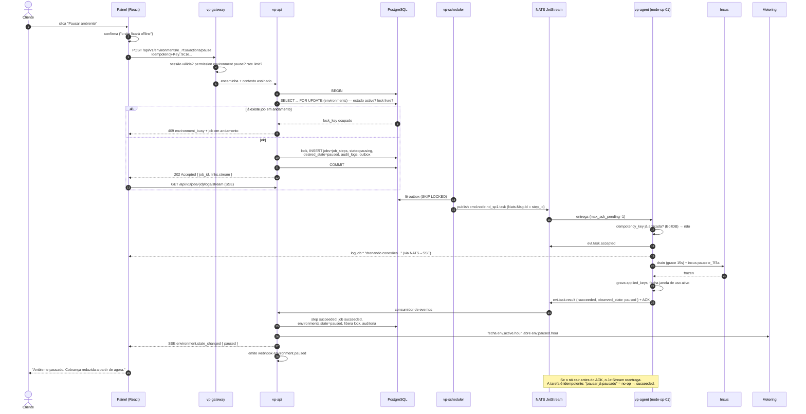
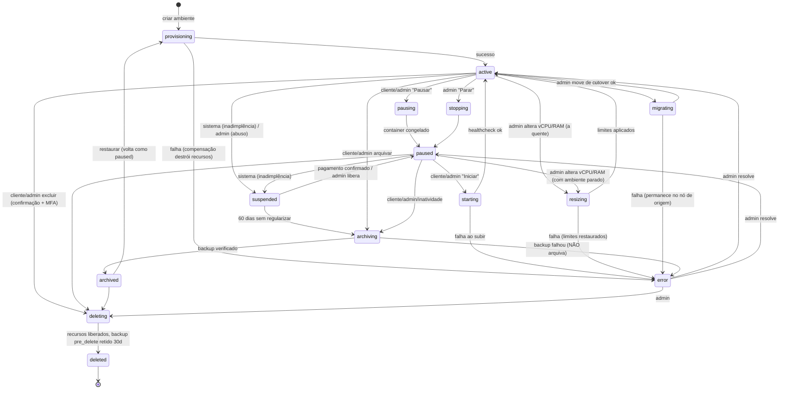
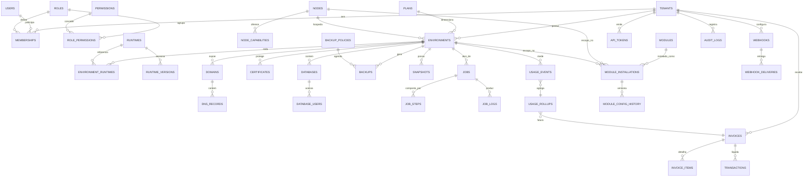

# 03 — Arquitetura de Software (Ciclo 1, rascunho)

> Autor: Arquiteto de Software Principal
> Escopo: desenho, contratos e estruturas. Sem código de produção.
> Premissas do briefing: 2–3 servidores dedicados, 1 dev, PHP + Node.js hoje e outras linguagens depois,
> tudo modular, cobrança por hora, pause/start pelo cliente, resize a quente pelo super admin.

---

## 0. Sumário executivo das decisões

| # | Decisão | Escolha | Descartado |
|---|---------|---------|-----------|
| D1 | Topologia | Control plane em VPS separado; nós dedicados só executam carga | Control plane co-hospedado num nó de produção |
| D2 | Transporte CP↔nó | **NATS JetStream** sobre TLS mútuo, conexão de saída do agente | gRPC bidi, SSH, HTTP polling, RabbitMQ, Redis Streams |
| D3 | Linguagem do control plane e do agente | **Go** (mesmo idioma nos dois lados) | Laravel/PHP, NestJS/Node |
| D4 | Front-end | **React + TypeScript + Vite**, módulos de UI carregados em runtime como ES modules remotos | Blade/Livewire, Module Federation via Webpack, iframe puro |
| D5 | Isolamento de ambiente | **Incus/LXD system container** por ambiente, storage ZFS | Docker por ambiente, VM (KVM), chroot/usuário Unix |
| D6 | Multi-tenant no banco | **Linha única com `tenant_id` + Row Level Security** | Schema por tenant, banco por tenant |
| D7 | Módulo de backend | **Processo separado (sidecar) registrado no gateway do core** | Plugin compilado (`plugin.so`), monolito com feature flag |
| D8 | Motor de jobs | Postgres como fonte da verdade + JetStream como despacho; máquina de estados explícita; lock por ambiente | Fila só em memória, cron+scripts, Temporal |
| D9 | Métricas | VictoriaMetrics single-node para séries temporais; Postgres só para eventos **faturáveis** | Tudo em Postgres, Prometheus+Thanos |
| D10 | API | REST/JSON `/api/v1`, a UI consome exatamente a mesma API (dogfooding) | API interna privada + API pública separada |

Três incertezas maiores estão listadas na seção 10.

---

## 1. Separação Control Plane × Data Plane

### 1.1 Definição das duas metades

**Control plane (CP)** — o cérebro. Sabe *o que deve existir*. Nunca executa comando de sistema
operacional diretamente em nó de produção.

Componentes:
- `vp-api` — API REST/JSON + WebSocket/SSE. Autenticação, autorização, CRUD de recursos, emissão de jobs.
- `vp-scheduler` — decide em qual nó um ambiente nasce, dispara jobs periódicos (renovação de SSL,
  fechamento de fatura, rollup de uso, verificação de saúde), aplica timeout e retry.
- `vp-gateway` — roteador HTTP interno que injeta as rotas dos módulos na superfície `/api/v1/...`
  sem recompilar o core (ver §2.4).
- `postgres` — fonte da verdade transacional.
- `nats` (JetStream) — barramento de comandos, eventos, logs e telemetria.
- `victoriametrics` — séries temporais de CPU/RAM/disco/rede/requisições.
- `minio` ou S3 compatível (Backblaze B2 / Wasabi / object storage do provedor BR) — backups e artefatos.

**Data plane (DP)** — os músculos. Sabe *o que existe de fato* e reconcilia com o desejado.

Componentes por nó:
- `vp-agent` — daemon Go, binário estático, roda como root sob systemd. Único processo autorizado a mexer no nó.
- `incusd` — runtime de containers de sistema (um container por ambiente).
- Reverse proxy de borda (Caddy ou OpenResty) — TLS, roteamento de domínio → container, coleta de métricas de requisição.
- Módulos instalados no nó (dovecot/postfix para `mod-email`, PowerDNS para `mod-dns`, restic para `mod-backup`, ...).

### 1.2 Onde roda o control plane — VPS separado, não co-hospedado

**Decisão: control plane em uma VPS pequena e barata (2 vCPU / 4 GB / 80 GB NVMe), fora dos 3 nós de produção.**

Justificativa:
1. **Blast radius.** Se o CP mora no `node-01` e o `node-01` sofre kernel panic, OOM por causa de um
   cliente, ou um `incus` travado, você perde ao mesmo tempo a produção *e* a capacidade de diagnosticar,
   pausar cliente, ver log, cobrar e comunicar. Separar custa ~R$ 60–120/mês e compra a ferramenta de
   resposta a incidente.
2. **Perfis de carga opostos.** Nó de produção é I/O e CPU burst imprevisível. CP é latência baixa,
   escrita constante em Postgres. Compartilhar página de cache e disco entre os dois degrada os dois.
3. **Segurança.** O CP guarda hash de senha, tokens de API, chaves de pagamento e chaves privadas de
   certificados. Um escape de container em um nó não deve alcançar esse banco.
4. **Manutenção.** Reiniciar/atualizar o painel não deve exigir tocar num nó com 200 sites no ar.

Mitigação de custo (a objeção óbvia: "é mais um servidor"): a VPS do CP também hospeda o site
institucional/marketing e o Postgres é pequeno (uma base de painel com 3 nós e alguns milhares de
ambientes cabe folgada em 20 GB). Backup do Postgres vai para o mesmo object storage dos backups de cliente.

**Alta disponibilidade do CP na fase 1: não.** Um CP single-node com backup contínuo (WAL-G / pgBackRest
com PITR de 15 min) e um runbook de restore em <30 min é o ponto certo para 1 dev. HA (Patroni, 3 nós
NATS em cluster) é fase 3, quando o número de nós passar de ~8. **Isso só é aceitável porque o data plane
continua servindo tráfego com o CP fora do ar** (ver §1.6).

### 1.3 O agente (`vp-agent`) — responsabilidades e limites

Linguagem: **Go**. Compila para um binário estático único (`CGO_ENABLED=0`), sem runtime, sem dependência
de distro, cross-compile trivial, uso de memória previsível (~30–60 MB), goroutines resolvem bem
"manter N streams de log abertos + coletar métricas + executar job". Instalação = copiar 1 arquivo +
1 unit systemd. Para 1 dev isso é decisivo: não existe "instalar PHP/Node/Python no nó só para o agente rodar".

O que o agente **faz**:
- Conecta de saída ao NATS do CP (mTLS) e assina `cmd.node.<node_id>.>`.
- Executa **tarefas declarativas**, não comandos arbitrários. O CP nunca manda `bash -c "..."`;
  manda `{"task":"env.set_runtime","env":"e_123","runtime":"php","version":"8.3"}`.
- Reconcilia estado: a cada 60 s compara estado desejado (recebido do CP) com estado real
  (`incus list`, `systemctl`, arquivos de config) e corrige desvio, ou reporta `drift`.
- Coleta e publica telemetria: métricas de container a cada 15 s, eventos de uso faturável a cada 60 s,
  healthcheck de módulos a cada 30 s.
- Faz streaming de log de job em tempo real para o CP.
- Guarda um **cache local do estado desejado** (BoltDB/SQLite em `/var/lib/vp-agent/state.db`) para
  continuar operando sem CP.
- Aplica/instala **módulos de nó** (pacotes assinados) e faz rollback se o healthcheck falhar.

O que o agente **não faz**:
- Não decide qual nó recebe um ambiente novo (isso é do scheduler).
- Não fala com o Postgres do CP.
- Não expõe porta de entrada para o CP (nenhuma porta administrativa aberta na internet).
- Não executa payload arbitrário vindo de usuário final.

**Registro do nó (bootstrap):** operador roda no nó `vp-agent enroll --url wss://cp.veloz/... --token <token de uso único>`.
O agente gera par de chaves, envia CSR, o CP devolve certificado cliente mTLS com validade de 90 dias e
`CN = node_id`. Renovação automática aos 60 dias. O token de uso único expira em 15 min e é invalidado no primeiro uso.

### 1.4 Comunicação CP ↔ nós: **NATS JetStream** (decisão única)

Alternativas avaliadas e por que caem para o cenário "3 nós, 1 dev":

| Opção | Por que foi descartada |
|---|---|
| **SSH** (o que Ansible/cPanel-like fazem) | CP precisa de chave privada com root em todos os nós; nó precisa de porta 22 alcançável pelo CP; sem entrega durável, sem retry nativo, sem idempotência, sem ordenação; streaming de log vira parsing de stdout; auditoria depende de sudo log. Simples no dia 1, ingovernável no mês 6. |
| **gRPC bidirecional** (nó abre stream para o CP) | Boa latência e mTLS nativo, mas **não tem fila durável**: se o nó cai no meio de um comando ou o CP reinicia, você reimplementa outbox, ack, redelivery, dedup e backpressure à mão. É reescrever metade do JetStream com um dev. |
| **HTTP + polling do agente** | Máximo de simplicidade, mas latência de comando = intervalo de poll; streaming de log em tempo real fica feio (long-poll/chunked); ordenação e ack precisam ser inventados; N nós × poll curto = ruído. |
| **RabbitMQ** | Faz tudo, mas é uma peça operacional a mais (Erlang, mnesia, políticas, DLX), e o barramento de **logs/métricas** ficaria fora dele, exigindo um segundo sistema. |
| **Redis Streams** | Ótimo desempenho, mas durabilidade depende de AOF bem configurado, e reentrega/consumer group tem arestas; acaba virando fila + pub/sub + cache com semânticas diferentes no mesmo processo. |

**Escolhido: NATS Server com JetStream habilitado, um único binário, no CP.**

Razões concretas:
1. **Conexão de saída.** O agente disca para o CP. Nenhum nó precisa expor porta administrativa.
   Isso simplifica firewall (nó só abre 80/443 público) e sobrevive a NAT/mudança de IP do nó.
2. **Um só transporte para 4 necessidades**: comandos (durável, JetStream), eventos (durável),
   logs (efêmero, core NATS pub/sub, alto volume, pode perder) e telemetria (efêmero). Um sistema, não quatro.
3. **mTLS nativo** com verificação de `CN` e mapeamento para conta/permissão de subject.
4. **Idempotência de primeira classe**: header `Nats-Msg-Id` dá dedup de publicação por janela
   (`duplicate_window`), e `AckPolicy: explicit` com `MaxDeliver` + backoff dá retry.
5. **Ordenação onde importa**: consumidor `ordered`/`max_ack_pending=1` por nó garante execução
   serial dos comandos daquele nó, sem serializar nós entre si.
6. **Custo operacional**: 1 binário, ~40 MB de RAM, config em 30 linhas. Não é Kafka.

#### 1.4.1 Mapa de subjects (contrato de barramento)

```text
# Comandos: CP -> nó  (JetStream stream CMD, retenção workqueue, replicas=1)
cmd.node.<node_id>.task                # execução de tarefa em nó
cmd.node.<node_id>.cancel              # pedido de cancelamento de job em andamento
cmd.node.<node_id>.desired_state       # snapshot completo do estado desejado do nó (reconciliação)

# Eventos: nó -> CP  (JetStream stream EVT, retenção limits 7 dias)
evt.node.<node_id>.task.accepted
evt.node.<node_id>.task.progress
evt.node.<node_id>.task.result         # sucesso | falha, com payload estruturado
evt.node.<node_id>.heartbeat           # a cada 10 s
evt.node.<node_id>.drift               # estado real != desejado
evt.node.<node_id>.usage               # amostras faturáveis (idempotentes)

# Logs: nó -> CP  (core NATS, efêmero, sem JetStream — volume alto, perda tolerável)
log.job.<job_id>                       # linhas de log de um job específico
log.env.<env_id>.<stream>              # access/error/app log de um ambiente

# Telemetria: nó -> CP (core NATS, agregado antes de gravar)
tm.node.<node_id>
tm.env.<env_id>
```

Permissões por conta NATS: o certificado do nó só autoriza **subscribe** em `cmd.node.<seu_id>.>` e
**publish** em `evt.node.<seu_id>.>`, `log.>` e `tm.>`. Um nó comprometido não consegue mandar comando
para outro nó nem se passar por outro nó.

#### 1.4.2 Envelope de comando (contrato)

```json
{
  "job_id":        "job_01J8ZQ...",
  "step_id":       "stp_01J8ZQ...",
  "idempotency_key":"env:e_7f3a:runtime:php:8.3:rev:12",
  "issued_at":     "2026-08-20T14:03:11Z",
  "deadline_at":   "2026-08-20T14:13:11Z",
  "node_id":       "nd_sp1",
  "tenant_id":     "tn_9a2",
  "environment_id":"e_7f3a",
  "task":          "env.set_runtime",
  "args": { "runtime": "php", "version": "8.3", "restart_policy": "graceful" },
  "requires_lock": "env:e_7f3a",
  "trace_id":      "4bf92f3577b34da6a3ce929d0e0e4736"
}
```

Resposta (`evt....task.result`):

```json
{
  "job_id": "job_01J8ZQ...", "step_id": "stp_01J8ZQ...",
  "status": "succeeded",             // succeeded | failed | rejected | superseded
  "started_at": "...", "finished_at": "...",
  "observed_state": { "runtime": "php", "version": "8.3", "fpm_pool": "e_7f3a" },
  "error": null,                      // { code, message, retryable: bool, detail }
  "agent_version": "0.4.2"
}
```

#### 1.4.3 Como cada modo de falha é tratado

**Falha de rede (nó perde o CP).** O agente detecta desconexão, entra em modo autônomo (§1.6) e faz
reconexão com backoff exponencial + jitter (1 s → 60 s, teto). Comandos ficam retidos no stream
`CMD` (workqueue) até o consumidor voltar; nada se perde. Eventos gerados offline vão para um
**outbox local** (BoltDB) e são republicados na reconexão, na ordem, com o `Nats-Msg-Id` original.

**Retry.** Duas camadas, e só duas:
- *Camada de transporte* (JetStream): se o agente não deu `ack` em `ack_wait = 2 × deadline`, redelivery
  automática, `MaxDeliver = 4`, backoff `[10s, 1m, 5m]`. Esgotou → mensagem vai para
  `$JS.EVENT.ADVISORY.CONSUMER.MAX_DELIVERIES` e o CP marca o step como `failed(delivery)`.
- *Camada de negócio* (CP): o step tem `retry_policy` própria (ver §5). Erro marcado `retryable:false`
  pelo agente (ex.: "versão 8.3 não existe no catálogo") **nunca** é retentado.
Nunca há retry dentro do agente para a mesma entrega — evita a multiplicação 4×4.

**Idempotência.** Regra dura: **toda tarefa do agente é idempotente por construção**, e além disso
protegida por chave.
- O agente mantém `applied_keys(idempotency_key, result, applied_at)` em BoltDB por 7 dias. Recebeu
  chave já aplicada → responde o resultado memorizado com `status: succeeded` e não reexecuta.
- As tarefas são escritas como *desired state*, não como delta: `env.set_runtime(php,8.3)` aplicado
  duas vezes dá o mesmo resultado; não existe `env.upgrade_php_one_minor`.
- Publicações do agente usam `Nats-Msg-Id = <step_id>:<seq>`, com `duplicate_window = 2m` no stream.

**Ordenação.** Consumidor por nó com `max_ack_pending = 1` → o nó executa uma tarefa por vez, na ordem
de emissão. Isso é intencional: em um painel, "trocar PHP" e "pausar ambiente" chegando fora de ordem é
um bug de produção. Para tarefas longas que não podem bloquear a fila (backup de 40 GB), o agente aceita
o comando, dá `ack` imediato, cria uma *tarefa de fundo* rastreada por `job_id` e reporta progresso por
evento. Só tarefas marcadas `long_running: true` no catálogo podem fazer isso, e elas ainda respeitam
o **lock por ambiente** (§5.5), que é a garantia real de ordem que interessa ao usuário.

**Segurança (mTLS).** CA privada própria (`vp-ca`), curta e simples:
- CA raiz offline (chave em cofre/`age` encriptado, fora do servidor) → CA intermediária no CP.
- Certificado de nó: `CN=nd_sp1`, validade 90 dias, renovação automática aos 60.
- NATS valida cadeia + mapeia `CN` → conta com as permissões de subject da §1.4.1.
- Revogação: lista de `node_id` bloqueados consultada pelo CP a cada conexão (o CP também derruba a
  conexão via `$SYS`), porque CRL/OCSP para 3 nós é overkill.
- Segredos (senha de banco, chave de API do DNS, chave privada de certificado) **nunca** trafegam em
  claro no payload de comando: o CP publica uma referência (`secret_ref`) e o agente busca o valor por
  um endpoint dedicado, autenticado com o mesmo cert mTLS e escopado ao ambiente. Isso mantém segredo
  fora dos streams persistidos do JetStream e fora dos logs.

**"O servidor caiu no meio de um job".** Cenário canônico: job `env.resize` executando quando o nó reinicia.
1. O agente **nunca** faz `ack` antes de terminar. Como não houve ack, o JetStream reentrega ao voltar.
2. Ao subir, o agente executa `recover()`: lê o BoltDB, encontra `step_id` com estado `in_flight`,
   publica `evt.task.result{status:"failed", error:{code:"AGENT_RESTARTED", retryable:true}}` e limpa.
3. O CP, ao receber (ou ao estourar o `deadline_at` sem notícia), coloca o step em `retrying`.
4. Na reentrega, a tarefa é reaplicada em cima do estado real — e como é declarativa e idempotente,
   converge: se o resize já tinha sido aplicado no `incus`, a reaplicação é no-op e vira `succeeded`.
5. Se o job era **não convergente por natureza** (ex.: "restaurar backup por cima do ambiente"), ele é
   marcado `unsafe_retry: true` no catálogo: o CP não retenta sozinho, coloca em `needs_attention` e
   notifica o operador. Melhor um alerta do que restaurar um backup duas vezes.
6. Ambientes que estavam `active` voltam sozinhos porque os containers Incus têm `boot.autostart=true`
   quando o estado desejado é `active`; ambientes `paused`/`suspended` têm autostart desligado, então
   um reboot **não ressuscita cliente inadimplente**.

### 1.5 Como o CP sobrevive à morte de um nó

- **Detecção**: ausência de `heartbeat` por 45 s → nó marcado `degraded`; por 3 min → `unreachable`.
- **Efeito imediato**: o scheduler para de alocar ambientes novos nesse nó; jobs pendentes para ele
  ficam `queued` (não falham); a UI mostra banner "nó X indisponível — operações neste ambiente estão
  pausadas" nos ambientes afetados.
- **Cobrança**: o motor de metering **para de faturar CPU/RAM** dos ambientes daquele nó a partir do
  último evento de uso recebido (a fatura reflete uso observado, não uso presumido). Disco continua
  sendo cobrado se a política assim definir, mas por padrão um nó `unreachable` gera crédito automático
  — é mais barato dar o crédito do que discutir com o cliente depois.
- **Recuperação**: nó volta → agente republica outbox → CP concilia (`drift`) → jobs enfileirados escoam.
- **Perda total do nó**: procedimento manual assistido `node.evacuate`: para cada ambiente do nó morto,
  criar ambiente novo no nó destino a partir do **último backup off-node** e reapontar DNS. Isso exige
  que backup esteja fora do nó (object storage) — requisito não negociável desde o dia 1.
- O CP **não** faz failover automático de ambiente entre nós na fase 1: com 3 nós e sem storage
  compartilhado, failover automático quase sempre acerta o diagnóstico errado e duplica dados. É decisão
  humana com um botão.

### 1.6 Como o nó opera se o control plane cair

Princípio: **o control plane está no caminho do gerenciamento, nunca no caminho do tráfego.**

Com o CP fora do ar:
- Sites continuam servindo normalmente: o proxy de borda tem a configuração em disco no nó; não consulta
  o CP por requisição. Nenhuma resolução de domínio, TLS ou roteamento depende do CP.
- Bancos, cron, filas e e-mail do cliente continuam.
- Renovação de certificado ACME continua: quem fala com a Let's Encrypt é o proxy do nó; o CP só
  registra o resultado. Um CP fora por 3 dias não derruba TLS.
- O agente continua reconciliando contra o **último estado desejado** em cache local e continua
  coletando métricas e eventos de uso no outbox (dimensionado para 72 h; acima disso, downsampling de
  telemetria; eventos faturáveis nunca são descartados, têm prioridade no outbox).
- O que **para**: qualquer mudança (criar ambiente, trocar runtime, pausar, resize), login no painel,
  faturamento, e-mail transacional.
- Watchdog: se o agente ficar >15 min sem CP, ele registra em log local e (se `mod-alerts` estiver
  instalado no nó) dispara um alerta independente do CP — o alerta não pode depender da coisa que caiu.

**Regra de projeto derivada:** nenhuma feature pode ser desenhada exigindo chamada síncrona ao CP em
tempo de request do usuário final. Se um módulo precisar disso (ex.: "bloquear site na hora do
vencimento"), a decisão é materializada em config no nó, não consultada online.

---

## 2. Modelo de módulos

Este é o requisito central do dono do produto ("cada capacidade é um módulo instalável/removível") e é
o que decide se o produto envelhece bem. Tudo abaixo existe para uma frase: **adicionar "Python 3.13"
ou "e-mail" seis meses depois não pode exigir recompilar, redeployar ou reiniciar o core.**

### 2.1 O que é um módulo

> **Módulo = unidade de capacidade versionada e assinada, composta de até quatro artefatos
> (payload de nó, serviço de backend, bundle de UI, migrations), com manifesto declarativo e ciclo de
> vida gerenciado pelo core.**

Um módulo **pode** conter qualquer subconjunto de:

| Artefato | O que é | Onde roda |
|---|---|---|
| `node/` | Scripts/binários idempotentes + templates de config aplicados por `vp-agent` | Nó (data plane) |
| `service/` | Processo HTTP que implementa endpoints do módulo (qualquer linguagem) | CP, sidecar |
| `ui/` | Bundle ESM (`.js` + `.css`) com telas React | Navegador, carregado em runtime |
| `migrations/` | SQL versionado, **restrito ao schema do módulo** | Postgres do CP |

Módulos previstos (o catálogo inicial, não exaustivo):

- **Runtime**: `mod-php`, `mod-nodejs`, `mod-python`, `mod-go`, `mod-ruby`, `mod-bun`, `mod-deno`, `mod-java`
- **Dados**: `mod-mysql`, `mod-postgres`, `mod-redis`, `mod-valkey`
- **Rede/entrega**: `mod-dns`, `mod-ssl`, `mod-cdn`, `mod-redirects`
- **Comunicação**: `mod-email` (SMTP/IMAP), `mod-antispam`, `mod-webmail`, `mod-maillists`
- **Operação**: `mod-backup`, `mod-cron`, `mod-logs`, `mod-metrics`, `mod-ssh`, `mod-ftp`, `mod-files`
- **Produto/negócio**: `mod-billing-pix`, `mod-billing-card`, `mod-apps` (1-click WordPress etc.),
  `mod-git-deploy`, `mod-alerts`, `mod-affiliate`

Três **escopos** de módulo (campo `scope` do manifesto), porque eles têm ciclos de vida diferentes:

- `platform` — instalado uma vez, afeta toda a plataforma (ex.: `mod-billing-pix`). Só super admin.
- `node` — instalado em nós específicos (ex.: `mod-email` só no `node-03`). Só super admin.
- `environment` — habilitado por ambiente do cliente (ex.: `mod-redis` no ambiente do cliente X).
  Cliente pode habilitar se o plano permitir.

O que **não** é módulo: autenticação, RBAC, faturamento (o *motor*; os *meios de pagamento* são
módulos), motor de jobs, catálogo de nós, máquina de estados de ambiente, auditoria. Esse é o **core**.
Regra: se remover a peça deixa o painel sem sentido, é core. Se remover só tira uma capacidade, é módulo.

### 2.2 Manifesto: `module.yaml`

```yaml
# ─── Identidade ────────────────────────────────────────────────────────────────
apiVersion: veloz.panel/v1
kind: Module
metadata:
  name: mod-php                      # slug único, imutável, [a-z0-9-]
  version: 3.2.0                     # semver estrito do MÓDULO
  displayName: "PHP"
  description: "Runtime PHP-FPM com múltiplas versões por ambiente."
  vendor: "VelozPanel"
  license: "Apache-2.0"
  homepage: "https://docs.velozpanel.com.br/modules/php"
  icon: "ui/icon.svg"
  categories: [runtime]
  scope: environment                 # platform | node | environment

# ─── Compatibilidade e dependências ────────────────────────────────────────────
spec:
  core:
    minVersion: "1.4.0"              # versão mínima do core VelozPanel
    maxVersion: "<2.0.0"
    sdk: "1"                         # major do Host SDK de UI e do contrato de tarefas

  requires:                          # dependências duras (bloqueiam install)
    - module: mod-ssl
      version: ">=1.0.0 <2.0.0"
    - capability: http.vhost         # dependência por CAPACIDADE, não por nome
      version: ">=1"
  conflicts:
    - module: mod-php-legacy
  recommends:                        # sugerido na UI, não bloqueia
    - module: mod-logs

  # ─── Capacidades: o que este módulo passa a oferecer ao resto do sistema ──────
  provides:
    capabilities:
      - name: runtime.php
        version: "1"
        attributes:
          versions: ["7.4", "8.0", "8.1", "8.2", "8.3", "8.4"]
          default: "8.3"
          eol: { "7.4": "2022-11-28", "8.0": "2023-11-26" }
      - name: runtime.generic         # implementa o contrato genérico de runtime (§2.6)
        version: "2"
    meters:                           # unidades faturáveis que este módulo pode gerar
      - key: php.workers.hour
        unit: worker-hour
        aggregation: max_per_hour

  # ─── Requisitos de nó ────────────────────────────────────────────────────────
  nodeRequirements:
    os: ["debian>=12", "ubuntu>=22.04"]
    arch: ["amd64", "arm64"]
    minMemoryMB: 512
    minDiskGB: 8
    kernelFeatures: ["cgroup2"]
    ports: []                         # não abre porta pública; fica atrás do proxy
    systemPackages: ["ca-certificates"]
    conflictsWithNodeModules: []

  # ─── Estado desejado / configuração ──────────────────────────────────────────
  configSchema:                        # JSON Schema; gera o formulário da UI automaticamente
    $schema: "https://json-schema.org/draft/2020-12/schema"
    type: object
    properties:
      version:      { type: string, enum: ["7.4","8.0","8.1","8.2","8.3","8.4"], default: "8.3" }
      memory_limit: { type: string, pattern: "^[0-9]+M$", default: "256M" }
      max_children: { type: integer, minimum: 1, maximum: 64, default: 8 }
      extensions:   { type: array, items: { type: string }, default: ["mbstring","curl","gd","pdo_mysql"] }
      opcache:      { type: boolean, default: true }
    required: [version]
  secrets: []                          # chaves que o módulo lê do cofre (nunca do config)

  # ─── Hooks do ciclo de vida (executados pelo agente, no nó) ───────────────────
  hooks:
    preflight:  { run: "node/preflight.sh",  timeout: 60s,   mustBeIdempotent: true }
    install:    { run: "node/install.sh",    timeout: 900s,  retries: 2 }
    postInstall:{ run: "node/post-install.sh", timeout: 120s }
    enable:     { run: "node/enable.sh",     timeout: 120s }
    configure:  { run: "node/configure.sh",  timeout: 300s }   # recebe config no stdin (JSON)
    upgrade:    { run: "node/upgrade.sh",    timeout: 900s, args: ["--from", "$FROM_VERSION"] }
    disable:    { run: "node/disable.sh",    timeout: 120s }
    uninstall:  { run: "node/uninstall.sh",  timeout: 600s }
    rollback:   { run: "node/rollback.sh",   timeout: 600s }   # obrigatório se houver upgrade
  # Contrato dos hooks: exit 0 = ok; exit 10 = falha retentável; qualquer outro = falha fatal.
  # stdout = log (streamado). stderr = log. Estado estruturado sai em /dev/fd/3 como JSON.

  # ─── Tarefas que o módulo expõe ao motor de jobs ──────────────────────────────
  tasks:
    - name: php.set_version
      run: "node/tasks/set_version.sh"
      argsSchema: { type: object, properties: { version: {type: string} }, required: [version] }
      idempotent: true
      unsafeRetry: false
      longRunning: false
      lock: environment               # environment | node | none
      timeout: 300s
      requiredPermission: "environment.runtime.update"
    - name: php.restart_pool
      run: "node/tasks/restart_pool.sh"
      idempotent: true
      lock: environment
      timeout: 60s
      requiredPermission: "environment.runtime.restart"

  # ─── Migrations (schema próprio no Postgres do CP) ────────────────────────────
  database:
    schema: mod_php                   # o core cria e concede; módulo NUNCA toca em outro schema
    migrations: "migrations/"         # 0001_init.up.sql / 0001_init.down.sql ...
    maxSchemaSizeMB: 512              # cota; ultrapassar gera alerta

  # ─── Backend do módulo (opcional) ─────────────────────────────────────────────
  service:
    image: "ghcr.io/velozpanel/mod-php:3.2.0"   # OCI; ou type: none
    listen: "unix:///run/vp/mod-php.sock"
    healthcheck: { path: "/healthz", intervalSeconds: 15, timeoutSeconds: 3, failureThreshold: 3 }
    resources: { cpu: "0.25", memoryMB: 128 }
    env: []                                      # segredos injetados por referência ao cofre

  # ─── Rotas de API injetadas no gateway do core ────────────────────────────────
  api:
    basePath: "/api/v1/modules/php"
    routes:
      - method: GET
        path: "/environments/{environment_id}/config"
        permission: "environment.runtime.read"
        rateLimit: "60/min"
      - method: PUT
        path: "/environments/{environment_id}/config"
        permission: "environment.runtime.update"
        audit: true
        rateLimit: "10/min"
      - method: POST
        path: "/environments/{environment_id}/restart"
        permission: "environment.runtime.restart"
        audit: true
        rateLimit: "6/min"

  # ─── UI plugável ──────────────────────────────────────────────────────────────
  ui:
    entry: "ui/index.js"              # ES module, default export = registro (ver §2.4)
    styles: "ui/index.css"
    integrity: "sha384-..."           # SRI, verificado pelo core ao servir
    mounts:
      - slot: "environment.sidebar"   # slot nomeado do shell
        id: "php"
        label: "PHP"
        icon: "code"
        order: 30
        route: "/env/:environmentId/php"
        component: "PhpSettingsPage"
        visibleWhen: "env.capabilities includes 'runtime.php'"
        permission: "environment.runtime.read"
      - slot: "environment.overview.card"
        id: "php-version-card"
        component: "PhpVersionCard"
        order: 20
      - slot: "admin.settings"
        id: "php-global"
        label: "PHP (global)"
        component: "PhpAdminPage"
        permission: "admin.modules.manage"

  # ─── Permissões que o módulo declara (entram no RBAC do core) ─────────────────
  permissions:
    - key: "environment.runtime.read"
      label: "Ver configuração de runtime"
      defaultRoles: ["owner","admin","developer","viewer"]
    - key: "environment.runtime.update"
      label: "Alterar versão/config de runtime"
      defaultRoles: ["owner","admin","developer"]
    - key: "environment.runtime.restart"
      label: "Reiniciar runtime"
      defaultRoles: ["owner","admin","developer"]

  # ─── Saúde do módulo ─────────────────────────────────────────────────────────
  healthcheck:
    node:    { run: "node/health.sh", intervalSeconds: 30, timeoutSeconds: 10, failureThreshold: 3 }
    service: { httpPath: "/healthz", intervalSeconds: 15 }
    degradedPolicy: "disable_ui_writes"   # disable_ui_writes | hide_ui | alert_only

  # ─── Desinstalação ───────────────────────────────────────────────────────────
  uninstall:
    dataPolicy: "retain_then_purge"    # purge_immediately | retain_then_purge | never_purge
    retentionDays: 30
    blockIf:
      - "environments_using > 0"       # não desinstala com ambiente usando
      - "capability_consumers > 0"     # não desinstala se outro módulo depende da capability
    dropSchema: false                  # schema só cai no purge, depois da retenção

  # ─── Observabilidade e docs ──────────────────────────────────────────────────
  telemetry:
    metrics: ["php_fpm_active_children", "php_fpm_slow_requests_total"]
    logs: ["php-fpm.error", "php-fpm.slow"]
  docs:
    operator: "docs/operator.md"       # obrigatório: como o DONO opera este módulo
    user: "docs/user.md"
    runbook: "docs/runbook.md"         # obrigatório: o que fazer quando quebra

# ─── Assinatura (fora do spec, gerado no empacotamento) ─────────────────────────
signature:
  algorithm: "cosign/sigstore"
  keyId: "velozpanel-modules-2026"
```

**Empacotamento**: `mod-php-3.2.0.vpm` = tarball (`module.yaml`, `node/`, `ui/`, `migrations/`, `docs/`)
+ `SHA256SUMS` + assinatura. O core **recusa** módulo não assinado por chave confiável, salvo em modo
`--dev` explícito de um super admin (registrado em auditoria).

### 2.3 Ciclo de vida

```text
                    ┌──────────────┐
                    │  available   │  (no catálogo, não instalado)
                    └──────┬───────┘
                    install │  (resolve deps → preflight → baixa → verifica assinatura →
                            │   migrations up → sobe service → hook install → postInstall)
                    ┌──────▼───────┐
              ┌────►│  installed   │  (presente, inativo: sem rota, sem UI, sem tarefa)
              │     └──────┬───────┘
     disable  │     enable │
              │     ┌──────▼───────┐   configure    ┌──────────────┐
              └─────┤   enabled    │◄──────────────►│  configuring │
                    └──┬────────┬──┘                └──────────────┘
             upgrade   │        │  healthcheck falha N vezes
                    ┌──▼─────┐  └──────────────► ┌──────────┐
                    │upgrading│                  │ degraded │──recupera──► enabled
                    └──┬───┬──┘                  └──────────┘
              sucesso  │   │ falha
                       │   └──► rollback ──► enabled (versão anterior)
                       ▼
                    enabled (nova versão)

     installed ──uninstall──► uninstalling ──► removed(retained) ──purge──► purged
```

Regras por transição:

| Transição | Pré-condições | Ações | Rollback |
|---|---|---|---|
| `install` | deps satisfeitas, `nodeRequirements` ok, assinatura válida, cota de disco | cria schema, roda migrations `up`, sobe `service`, hooks `preflight`→`install`→`postInstall` | reverte migrations `down` na ordem inversa, remove schema, para service, roda `uninstall` |
| `enable` | instalado e saudável | registra rotas no gateway, publica manifesto de UI, ativa tarefas, aplica `desired_state` nos nós alvo | `disable` |
| `configure` | habilitado | valida contra `configSchema`, grava `module_config` (versionado, `revision++`), emite job `module.configure` por nó/ambiente | reaplica revisão anterior |
| `upgrade` | nova versão compatível com `core.minVersion`; migrations forward-only | **snapshot** (dump do schema do módulo + cópia da config) → migrations `up` → troca imagem do service → hook `upgrade` → healthcheck | hook `rollback` + restaura snapshot do schema + volta imagem; janela de rollback = 24 h |
| `disable` | nenhum job em execução usando o módulo | desregistra rotas, esconde UI, para de aceitar tarefas; **dados e estado no nó permanecem** | `enable` |
| `uninstall` | `blockIf` todas falsas | `disable` → hook `uninstall` no nó → service parado → dados marcados para retenção | reinstalar a mesma versão dentro da retenção restaura |
| `purge` | passou `retentionDays` ou super admin forçou (confirmação por digitação do nome) | `DROP SCHEMA mod_x CASCADE`, apaga artefatos no nó | **irreversível** — só backup |

Notas duras:
- **Migrations são forward-only por padrão**; `down` existe apenas para rollback de instalação/upgrade
  dentro da janela de 24 h. Depois disso, corrigir é com nova migration.
- Todo upgrade é **transacional por nó**, não global: sobe em `node-03` (canário), verifica healthcheck
  por 10 min, depois nos demais. Com 3 nós isso é barato e evita apagão total.
- `disable` **não** derruba tráfego do cliente: desabilitar `mod-php` não mata os PHP-FPM existentes;
  apenas impede novas mudanças. Derrubar carga é `uninstall`, e ele é bloqueado se houver ambiente usando.

### 2.4 Como um módulo injeta telas e endpoints sem recompilar o core

#### Backend: gateway + sidecar

O core **não** carrega código do módulo no seu processo. Nada de `plugin.so` (Go plugins exigem build
idêntico, quebram com qualquer divergência de versão e um panic derruba o host). O modelo é:

```text
Browser ──HTTPS──► vp-gateway ──┬──► vp-api (core)                 rotas /api/v1/{auth,envs,jobs,...}
                                │
                                └──► sidecar do módulo (unix socket) rotas /api/v1/modules/{slug}/...
```

`vp-gateway` mantém uma **tabela de rotas em memória** construída a partir dos manifestos dos módulos
`enabled`. Ao habilitar/desabilitar um módulo, a tabela é recarregada a quente (sem reinício, sem
recompilação). Antes de encaminhar, o gateway já:

1. autenticou o chamador e resolveu `tenant_id`, `user_id`, papéis;
2. checou a `permission` declarada na rota;
3. resolveu e validou `{environment_id}` (existe? pertence ao tenant? estado permite escrita?);
4. aplicou rate limit;
5. injetou headers assinados de contexto:
   `X-VP-Tenant`, `X-VP-User`, `X-VP-Env`, `X-VP-Perms`, `X-VP-Request-Id`, `X-VP-Signature` (HMAC).

O sidecar **confia apenas** nesses headers (valida a assinatura) e nunca implementa autenticação
própria. Isso mantém autorização centralizada no core — o erro clássico de sistemas de plugin é deixar
cada plugin decidir quem pode o quê.

O sidecar fala com o resto do mundo por um **Host API** local (`unix:///run/vp/host.sock`), com escopo
por módulo: `emitJob()`, `readConfig()`, `writeConfig()`, `emitEvent()`, `emitUsage()`, `readSecret()`,
`db()` (conexão já fixada em `search_path = mod_php`, com role sem permissão nos schemas alheios).
Um módulo **não** tem credencial do Postgres principal, nem publica direto no NATS.

Módulo sem lógica de servidor (`service.type: none`) usa apenas `tasks` + `ui`, e o gateway roteia suas
chamadas para um handler genérico do core que traduz `PUT config` → validação por `configSchema` →
job `module.configure`. **A maioria dos módulos deve caber nesse formato** — é o caminho barato.

#### Front-end: shell + slots + ESM remoto

O painel é um **shell** React que conhece apenas:
- rotas do core;
- uma lista de **slots** nomeados (`environment.sidebar`, `environment.overview.card`, `admin.settings`,
  `environment.tabs`, `domain.actions`, `billing.section`, `onboarding.step`, ...);
- um **Host SDK** versionado (`@velozpanel/host-sdk`, major = `spec.core.sdk`).

No boot, o shell chama `GET /api/v1/ui/manifest`, que devolve os mounts dos módulos habilitados
*visíveis para aquele usuário/tenant/ambiente*. Para cada mount, o shell faz `import(/* @vite-ignore */ url)`
sob demanda (quando o usuário abre a rota), valida SRI, e registra o componente no slot.

```ts
// contrato do bundle de UI de um módulo (ui/index.js)
import type { HostSDK, ModuleRegistration } from "@velozpanel/host-sdk@1";

export default function register(host: HostSDK): ModuleRegistration {
  return {
    sdk: 1,
    components: {
      PhpSettingsPage: () => import("./PhpSettingsPage.js"),
      PhpVersionCard:  () => import("./PhpVersionCard.js"),
    },
  };
}
```

O que o Host SDK entrega (e o módulo **não** reimplementa): `host.api` (cliente HTTP já autenticado e
escopado ao `basePath` do módulo), `host.ui` (design system: Button, Card, Table, Form, Toast, Modal —
para todo módulo parecer parte do mesmo produto), `host.jobs.watch(jobId)` (stream de log pronto),
`host.i18n`, `host.can(permission)`, `host.env` (ambiente atual), `host.navigate`.

Regras que tornam isso seguro:
- **React, Router e o design system são singletons fornecidos pelo shell** via import map; o bundle do
  módulo os declara como externals. Sem isso, dois Reacts no mesmo documento = hooks quebrados.
- Cada mount é envolvido por `<ErrorBoundary>` + `<Suspense>`. Erro de render do módulo pinta um card
  "Módulo PHP indisponível — ver detalhes" e **não** desmonta o shell.
- Falha de `import()` (bundle 404, SRI inválido, timeout de 10 s) → o slot é omitido, evento
  `ui.module_load_failed` vai para o CP, badge de alerta para o super admin.
- Módulos de terceiros (fora do catálogo oficial), quando existirem, montam em **iframe sandbox** com
  `postMessage` tipado em vez de ESM direto. Pior UX, isolamento real. O critério é a origem da
  confiança, não a capacidade técnica.

### 2.5 Isolamento de falha — o painel não cai por causa de módulo

Camadas, da mais externa para a mais interna:

| Camada | Falha possível | Contenção |
|---|---|---|
| UI | módulo quebra ao renderizar / bundle não carrega | ErrorBoundary por slot; import dinâmico; SRI; timeout |
| Gateway | sidecar lento ou travado | timeout de 5 s (30 s em rotas `longRunning`), circuit breaker (5 falhas/30 s → aberto por 60 s), bulkhead de 16 conexões por módulo |
| Sidecar | crash, memory leak | processo separado com `MemoryMax`/`CPUQuota`; restart com backoff; 3 crashes em 5 min → módulo vai a `degraded` e o core aplica `degradedPolicy` |
| Banco | migration ruim, query pesada | schema próprio + role sem acesso cruzado; `statement_timeout = 10s` e `idle_in_transaction_session_timeout = 30s` no role do módulo; pool separado por módulo (máx. 5 conexões) para não esgotar o pool do core |
| Nó | hook de instalação destrutivo | hooks rodam com usuário dedicado + capabilities mínimas; `preflight` em dry-run; snapshot ZFS antes de `install`/`upgrade` em nó, com rollback automático se healthcheck falhar |
| Jobs | tarefa de módulo em loop | timeout obrigatório no manifesto; teto global de tarefas concorrentes por módulo; kill em `deadline_at` |
| Segurança | módulo tentando ler dado de outro tenant | toda query passa por RLS com `tenant_id` do contexto assinado; o módulo não escolhe o tenant, o gateway escolhe |

Métrica de aceitação: **derrubar propositalmente qualquer módulo em staging não pode impedir login,
listagem de ambientes, pause/start, nem faturamento.** Isso vira teste automatizado ("chaos de módulo")
antes do primeiro cliente pagante.

### 2.6 Caso especial: módulo de runtime de linguagem

Requisitos 1 e 7 do briefing: PHP e Node hoje; Python 3.13 depois **sem tocar no core**; cada cliente
numa versão diferente; troca fácil.

O core não conhece "PHP". Conhece a capability **`runtime.generic` v2**, um contrato de 6 operações:

```yaml
capability: runtime.generic
version: "2"
operations:
  detect:      # inspeciona o código do ambiente e sugere runtime+versão (composer.json, package.json, pyproject.toml)
    returns: { runtime: string, version: string, confidence: float }
  list_versions:
    returns: [{ version, status: "supported|deprecated|eol", eol_date, default: bool }]
  provision:   { args: { version, config } }        # instala/garante a versão no ambiente
  switch:      { args: { from_version, to_version, strategy: "graceful|immediate" } }
  status:      { returns: { version, running: bool, workers: int, uptime_s: int } }
  teardown:    { args: { version } }                # remove versão não usada, libera disco
contract:
  - "provision e switch são idempotentes"
  - "switch com strategy=graceful não pode derrubar requisição em voo por mais que drain_timeout"
  - "todo runtime expõe processo(s) atrás de um socket em /run/vp/env/<env_id>/app.sock"
  - "todo runtime publica métricas com os labels padrão: env_id, runtime, version"
```

O core armazena em `environment_runtimes` apenas `(environment_id, runtime_key, version, state)`.
A UI de "trocar versão" é **genérica**: lê `list_versions` da capability e desenha um select. O botão
"Trocar PHP 8.2 → 8.3" e "Trocar Python 3.12 → 3.13" são **a mesma tela**, servida pelo core; o módulo
só contribui com telas de configuração específicas (`php.ini`, extensões) via slot.

**Adicionar Python 3.13 seis meses depois, passo a passo, sem deploy do core:**
1. Super admin abre *Módulos → Catálogo*, instala `mod-python@1.0.0` (declara `provides.capabilities:
   runtime.python` + `runtime.generic v2`, com `versions: ["3.11","3.12","3.13"]`).
2. `install` roda nos nós escolhidos: baixa os builds das versões (via `uv`/`pyenv`/pacote próprio),
   valida checksum, registra o handler de runtime no agente.
3. `enable` publica as rotas `/api/v1/modules/python/...` e o mount de UI.
4. O catálogo de planos ganha a opção "Python" (o core lê `provides.capabilities` — nada hardcoded).
5. Cliente cria ambiente e escolhe Python 3.13 no mesmo select genérico. Zero linha no core.
6. Sai o Python 3.14 no ano seguinte: sobe `mod-python@1.1.0` com a versão nova no manifesto. Isso é
   um `upgrade` de módulo — nem instalação nova.

**EOL e desativação de versão**: `attributes.eol` no manifesto alimenta banner na UI ("PHP 7.4 sem
suporte de segurança"), e-mail automático em D-90/D-30/D-7, e bloqueio de *novas* criações naquela
versão. Ambiente existente **nunca** é migrado à força sem consentimento — migração forçada de versão
de runtime é o jeito mais rápido de perder cliente. Existe, sim, o botão de super admin para forçar,
com auditoria e aviso.

**Múltiplas versões coexistindo**: como cada ambiente é um container Incus, a versão vive dentro do
container. Não há conflito global de `/usr/bin/php`. Cliente A em 7.4 e cliente B em 8.4 no mesmo nó é
o caso normal, não a exceção. Cache de imagem: o módulo mantém as versões como camadas/imagens base no
nó, então "trocar de versão" é montar outra e reiniciar o pool, não compilar nada — alvo de <30 s.

---

## 3. Stack recomendada

Critério de decisão, nesta ordem: (1) 1 dev consegue manter aos domingos; (2) ecossistema de hospedagem
maduro; (3) menos linguagens/runtimes no total; (4) operação previsível em servidor pequeno.

| Camada | Escolha | Justificativa | Descartado e por quê |
|---|---|---|---|
| **API / control plane** | **Go 1.23+**, `net/http` + `chi`, `sqlc` (SQL tipado, sem ORM mágico), `river` ou motor próprio de jobs sobre Postgres, `nats.go` | Mesma linguagem do agente → 1 dev mantém *um* idioma para os dois lados; binário único, deploy = `scp` + `systemctl restart`; concorrência nativa resolve streaming de log/SSE/telemetria sem stack extra; consumo de RAM previsível; erros explícitos reduzem surpresa em produção não supervisionada | **Laravel/PHP**: produtividade inicial imbatível (Nova, Cashier, Horizon, Filament) e é o ecossistema natural de hospedagem — mas obrigaria uma **segunda** linguagem para o agente (nenhum dev vai rodar PHP-FPM como daemon de sistema em 3 nós), trocaria NATS por Redis+Horizon (mais uma peça), e long-polling/SSE em PHP-FPM come worker por conexão aberta — exatamente o padrão de uso do painel (todo mundo com a aba de log aberta). **NestJS/Node**: bom DX e um só idioma com o front, mas o agente em Node exige runtime instalado no nó, uso de memória menos previsível, e a árvore de dependências (supply chain) num daemon root é risco desproporcional |
| **Agente (data plane)** | **Go**, binário estático, systemd, BoltDB local | Ver §1.3. Zero dependência no nó; cross-compile amd64/arm64; upgrade = substituir 1 arquivo | **Python/Ansible pull**: exige interpretador e libs no nó, e o modelo push/pull de Ansible não dá streaming de log nem idempotência com estado local. **Rust**: excelente tecnicamente, curva e tempo de compilação ruins para 1 dev sem experiência prévia |
| **Front-end** | **React 18 + TypeScript + Vite**, TanStack Router + TanStack Query, Tailwind + shadcn/ui, Recharts para os gráficos | Módulos precisam entregar UI em runtime: ESM + import map + externals é bem suportado no Vite; TS dá contrato real entre shell e módulos; shadcn/ui é código no repo (não dependência opaca) e casa com o Host SDK; maior mercado de exemplos/IA para 1 dev | **Blade/Livewire/HTMX**: menos JS e ótimo para CRUD, mas o requisito de UI plugável em runtime + gráficos ao vivo + terminal/log streaming empurra para SPA. **Module Federation (Webpack)**: resolve o mesmo problema com muito mais configuração e acoplamento de build entre core e módulos; ESM remoto + import map faz o suficiente com um décimo da complexidade. **Vue/Svelte**: sem objeção técnica, perdem no tamanho de ecossistema de componentes de painel |
| **Banco (CP)** | **PostgreSQL 16** | RLS para multi-tenant, JSONB para config de módulo, `LISTEN/NOTIFY` e advisory locks para o motor de jobs, particionamento nativo para uso/auditoria, extensões (`pg_partman`, `pgcrypto`) | **MySQL**: sem RLS, JSON mais fraco, sem advisory lock equivalente. **SQLite**: tentador para 1 dev, mas concorrência de escrita do metering e acesso de sidecars de módulo pedem servidor |
| **Barramento** | **NATS + JetStream** | §1.4 | RabbitMQ, Kafka, Redis Streams — §1.4 |
| **Séries temporais** | **VictoriaMetrics single-node** (ingest via protocolo Prometheus remote-write pelo agente) | Gráficos de CPU/RAM/disco/rede/requisições por ambiente em retenção de 13 meses cabem em poucos GB; 1 binário, sem cluster; PromQL | **Tudo em Postgres**: escreve muito e degrada o banco transacional. **Prometheus puro**: modelo pull exigiria abrir porta no nó (contra §1.3) e retenção longa exige Thanos |
| **Object storage** | S3 compatível (MinIO no CP na fase 1; provedor externo BR/Backblaze na fase 2) | Backups fora do nó são requisito de sobrevivência (§1.5) | Backup em disco local do nó — inútil quando o nó morre |
| **Runtime de ambiente** | **Incus (fork do LXD) + ZFS** | `incus config set limits.cpu/limits.memory` a quente atende o requisito 9 (super admin muda RAM/vCPU sem recriar); `incus pause` congela o cgroup em ~1 s e atende o requisito 4 (pause/start instantâneo, disco preservado); container de sistema dá SSH, cron, systemd e múltiplos processos — o que um cliente de hospedagem espera; snapshot ZFS instantâneo e barato viabiliza rollback e backup incremental | **Docker por ambiente**: ótimo para app stateless, ruim para "hospedagem" (um processo, sem cron/ssh nativos, resize a quente mais limitado, storage sem snapshot equivalente). **VM/KVM**: isolamento superior (e é o que eu recomendaria em multi-tenant hostil), mas overhead de RAM por ambiente inviabiliza densidade em 3 servidores e pause/resume é bem mais pesado. **Usuário Unix + chroot (modelo cPanel)**: densidade máxima, mas resize por cliente, pause real e versões de runtime independentes viram gambiarra |
| **Proxy de borda** | **Caddy** (ou OpenResty se `mod-waf` exigir Lua) | ACME automático, config por API (o agente reescreve por ambiente), HTTP/3, logs em JSON prontos para métricas de requisição | **Nginx puro**: precisa de certbot + reload manual + templates; funciona, mas é mais peça móvel para 1 dev |
| **Observabilidade do painel** | OpenTelemetry (traces) → Grafana Tempo *ou* apenas logs estruturados + Grafana; Grafana lendo VictoriaMetrics e Loki | Um `trace_id` do clique da UI até o `exec` no nó é o que salva o suporte | APM pago: custo desproporcional na fase 1 |
| **Deploy do CP** | `docker compose` no VPS do CP (api, gateway, sidecars de módulo, nats, postgres, victoriametrics, minio, caddy) | Um arquivo descreve a plataforma inteira; rollback = tag anterior | Kubernetes: explicitamente vetado pelo briefing na fase 1, e com razão |

**Gatilho de revisão da escolha de Go**: se, após 4 semanas de protótipo, a velocidade de entrega das
telas de CRUD estiver claramente abaixo do necessário, a alternativa é manter Go no agente e no
gateway e mover **apenas** o CRUD/faturamento para Laravel. Não é a recomendação — é o plano B escrito
antes de precisar dele, para a decisão não ser tomada no desespero.

---

## 4. Modelo de dados (control plane)

### 4.1 Estratégia multi-tenant: **linha única com `tenant_id` + Row Level Security**

| Estratégia | Prós | Contras | Veredito |
|---|---|---|---|
| **Linha única + `tenant_id` (+RLS)** | Uma migration para todo mundo; consultas cross-tenant (relatório, cobrança, capacidade) triviais; menor custo operacional; RLS transforma o isolamento em regra do banco, não em disciplina do dev | Erro de código pode vazar dado se RLS não estiver ativa; tabelas grandes exigem índice com `tenant_id` à esquerda | **ESCOLHIDA** |
| Schema por tenant | Isolamento visível; backup/restore por cliente fácil | 500 clientes = 500 schemas × N tabelas × M módulos; migration vira job de horas; `pg_dump` e catálogo do Postgres sofrem; módulos teriam de migrar N vezes | Descartada |
| Banco por tenant | Isolamento máximo, ruído zero entre clientes | Inviável com 1 dev; conexões, backup, upgrade e métricas multiplicam por cliente | Descartada |

Implementação da RLS (padrão aplicado a **todas** as tabelas com `tenant_id`, inclusive as de módulo):

```sql
ALTER TABLE environments ENABLE ROW LEVEL SECURITY;
ALTER TABLE environments FORCE ROW LEVEL SECURITY;

CREATE POLICY tenant_isolation ON environments
  USING (tenant_id = current_setting('vp.tenant_id', true)::uuid);

-- super admin usa um role separado com BYPASSRLS, e toda query desse role
-- é obrigatoriamente registrada em audit_logs pela camada de aplicação.
```

A aplicação executa `SET LOCAL vp.tenant_id = '...'` no início de **toda** transação, a partir do
contexto autenticado — nunca a partir de parâmetro vindo do cliente. Módulos recebem conexão já com o
`SET LOCAL` aplicado, sem poder trocá-lo.

**Isolamento dos dados do cliente (fora do CP)** é outra história e é o que realmente importa para LGPD:
container por ambiente, usuário Unix próprio, e **um servidor MySQL/Postgres por ambiente** (dentro do
container) em vez de um servidor compartilhado com N bases. Custa RAM, mas elimina a classe inteira de
"cliente A enxergou base do cliente B" e permite dump/restore por ambiente sem coordenação.

### 4.2 DDL resumido (PostgreSQL 16)

```sql
-- ═══ Convenções ═══
-- ids: TEXT com prefixo legível (tn_, usr_, env_...) OU uuid v7. Aqui: uuid v7 + coluna slug pública.
-- toda tabela: created_at, updated_at; soft delete só onde faturamento exige histórico.
-- toda tabela multi-tenant: tenant_id NOT NULL + RLS + índice com tenant_id à esquerda.

CREATE EXTENSION IF NOT EXISTS pgcrypto;
CREATE SCHEMA core;
SET search_path = core;

-- ─── Tenancy, identidade e autorização ────────────────────────────────────────
CREATE TABLE tenants (
  id              uuid PRIMARY KEY DEFAULT gen_random_uuid(),
  slug            citext UNIQUE NOT NULL,
  legal_name      text NOT NULL,
  tax_id          text,                       -- CPF/CNPJ (criptografado em repouso)
  billing_email   citext NOT NULL,
  status          text NOT NULL DEFAULT 'active'
                  CHECK (status IN ('trial','active','past_due','suspended','closed')),
  plan_id         uuid REFERENCES plans(id),
  credit_cents    bigint NOT NULL DEFAULT 0,
  currency        char(3) NOT NULL DEFAULT 'BRL',
  created_at      timestamptz NOT NULL DEFAULT now(),
  updated_at      timestamptz NOT NULL DEFAULT now()
);

CREATE TABLE users (
  id              uuid PRIMARY KEY DEFAULT gen_random_uuid(),
  email           citext UNIQUE NOT NULL,
  password_hash   text,                        -- argon2id; NULL se só SSO
  full_name       text NOT NULL,
  totp_secret_enc bytea,
  mfa_enabled     boolean NOT NULL DEFAULT false,
  is_superadmin   boolean NOT NULL DEFAULT false,   -- staff da plataforma
  locale          text NOT NULL DEFAULT 'pt-BR',
  last_login_at   timestamptz,
  status          text NOT NULL DEFAULT 'active' CHECK (status IN ('active','locked','disabled')),
  created_at      timestamptz NOT NULL DEFAULT now(),
  updated_at      timestamptz NOT NULL DEFAULT now()
);

CREATE TABLE roles (
  id           uuid PRIMARY KEY DEFAULT gen_random_uuid(),
  tenant_id    uuid REFERENCES tenants(id) ON DELETE CASCADE,  -- NULL = papel de sistema
  key          text NOT NULL,                 -- owner|admin|developer|billing|viewer|support|superadmin
  label        text NOT NULL,
  is_system    boolean NOT NULL DEFAULT false,
  UNIQUE (tenant_id, key)
);

CREATE TABLE permissions (                     -- populada pelo core + manifestos de módulo
  key          text PRIMARY KEY,               -- 'environment.runtime.update'
  label        text NOT NULL,
  module_slug  text,                           -- NULL = core
  created_at   timestamptz NOT NULL DEFAULT now()
);

CREATE TABLE role_permissions (
  role_id        uuid REFERENCES roles(id) ON DELETE CASCADE,
  permission_key text REFERENCES permissions(key) ON DELETE CASCADE,
  PRIMARY KEY (role_id, permission_key)
);

CREATE TABLE memberships (                     -- usuário ↔ tenant ↔ papel (+escopo opcional)
  id             uuid PRIMARY KEY DEFAULT gen_random_uuid(),
  tenant_id      uuid NOT NULL REFERENCES tenants(id) ON DELETE CASCADE,
  user_id        uuid NOT NULL REFERENCES users(id) ON DELETE CASCADE,
  role_id        uuid NOT NULL REFERENCES roles(id),
  environment_id uuid REFERENCES environments(id) ON DELETE CASCADE, -- NULL = todo o tenant
  invited_by     uuid REFERENCES users(id),
  accepted_at    timestamptz,
  created_at     timestamptz NOT NULL DEFAULT now(),
  UNIQUE (tenant_id, user_id, role_id, environment_id)
);
CREATE INDEX ON memberships (user_id);
CREATE INDEX ON memberships (tenant_id, user_id);

-- ─── Infraestrutura ───────────────────────────────────────────────────────────
CREATE TABLE nodes (
  id                uuid PRIMARY KEY DEFAULT gen_random_uuid(),
  slug              text UNIQUE NOT NULL,      -- node-sp-01
  region            text NOT NULL DEFAULT 'br-sp',
  public_ipv4       inet NOT NULL,
  public_ipv6       inet,
  private_ipv4      inet,
  hostname          text NOT NULL,
  agent_version     text,
  os                text, kernel text, arch text NOT NULL DEFAULT 'amd64',
  cpu_cores         int  NOT NULL,
  memory_mb         int  NOT NULL,
  disk_gb           int  NOT NULL,
  -- capacidade alocável (após reserva do sistema); usada pelo scheduler
  allocatable_cpu   numeric(6,2) NOT NULL,
  allocatable_mem_mb int NOT NULL,
  allocatable_disk_gb int NOT NULL,
  oversubscribe_cpu numeric(3,1) NOT NULL DEFAULT 3.0,   -- fator de overcommit de vCPU
  status            text NOT NULL DEFAULT 'provisioning'
                    CHECK (status IN ('provisioning','online','degraded','unreachable','draining','maintenance','retired')),
  scheduling_enabled boolean NOT NULL DEFAULT true,
  last_heartbeat_at timestamptz,
  cert_fingerprint  text,
  labels            jsonb NOT NULL DEFAULT '{}',   -- {"email":"true","ssd":"nvme"}
  created_at        timestamptz NOT NULL DEFAULT now(),
  updated_at        timestamptz NOT NULL DEFAULT now()
);
CREATE INDEX ON nodes (status) WHERE status <> 'retired';

CREATE TABLE node_capabilities (              -- derivado dos módulos instalados no nó
  node_id      uuid NOT NULL REFERENCES nodes(id) ON DELETE CASCADE,
  capability   text NOT NULL,                 -- 'runtime.php'
  version      text NOT NULL,
  attributes   jsonb NOT NULL DEFAULT '{}',
  PRIMARY KEY (node_id, capability)
);

-- ─── Planos e ambientes ───────────────────────────────────────────────────────
CREATE TABLE plans (
  id             uuid PRIMARY KEY DEFAULT gen_random_uuid(),
  slug           text UNIQUE NOT NULL,
  name           text NOT NULL,
  cpu_millicores int NOT NULL,
  memory_mb      int NOT NULL,
  disk_gb        int NOT NULL,
  price_hour_cents      int NOT NULL,          -- preço por hora ATIVA
  paused_price_hour_cents int NOT NULL DEFAULT 0, -- preço por hora PAUSADA (só disco)
  included_capabilities  text[] NOT NULL DEFAULT '{}',
  max_environments int,
  visible         boolean NOT NULL DEFAULT true,
  created_at      timestamptz NOT NULL DEFAULT now()
);

CREATE TABLE environments (
  id             uuid PRIMARY KEY DEFAULT gen_random_uuid(),
  tenant_id      uuid NOT NULL REFERENCES tenants(id) ON DELETE RESTRICT,
  node_id        uuid REFERENCES nodes(id) ON DELETE RESTRICT,
  plan_id        uuid NOT NULL REFERENCES plans(id),
  slug           text NOT NULL,                -- meusite (único por tenant)
  display_name   text NOT NULL,
  container_name text UNIQUE,                  -- nome no Incus, ex.: vp-env-7f3a
  state          text NOT NULL DEFAULT 'provisioning'
                 CHECK (state IN ('provisioning','starting','active','pausing','paused','stopping',
                                  'suspended','migrating','resizing','error','archiving','archived','deleting','deleted')),
  desired_state  text NOT NULL DEFAULT 'active'
                 CHECK (desired_state IN ('active','paused','suspended','archived','deleted')),
  state_reason   text,
  -- recursos EFETIVOS (podem divergir do plano após ajuste do super admin)
  cpu_millicores int NOT NULL,
  memory_mb      int NOT NULL,
  disk_gb        int NOT NULL,
  primary_domain text,
  ssh_enabled    boolean NOT NULL DEFAULT true,
  lock_key       text,                          -- job que detém o lock (NULL = livre)
  lock_job_id    uuid,
  lock_expires_at timestamptz,
  state_version  bigint NOT NULL DEFAULT 1,     -- optimistic concurrency
  paused_at      timestamptz,
  suspended_at   timestamptz,
  last_active_at timestamptz,
  created_at     timestamptz NOT NULL DEFAULT now(),
  updated_at     timestamptz NOT NULL DEFAULT now(),
  deleted_at     timestamptz,
  UNIQUE (tenant_id, slug)
);
CREATE INDEX ON environments (tenant_id, state);
CREATE INDEX ON environments (node_id, state);
CREATE INDEX ON environments (state) WHERE state IN ('provisioning','migrating','resizing','error');

-- ─── Runtimes ─────────────────────────────────────────────────────────────────
CREATE TABLE runtimes (                        -- catálogo, alimentado por manifesto de módulo
  key          text PRIMARY KEY,               -- 'php','nodejs','python'
  label        text NOT NULL,
  module_slug  text NOT NULL,
  capability   text NOT NULL DEFAULT 'runtime.generic'
);

CREATE TABLE runtime_versions (
  runtime_key  text NOT NULL REFERENCES runtimes(key) ON DELETE CASCADE,
  version      text NOT NULL,                  -- '8.3'
  status       text NOT NULL DEFAULT 'supported'
               CHECK (status IN ('preview','supported','deprecated','eol')),
  eol_date     date,
  is_default   boolean NOT NULL DEFAULT false,
  PRIMARY KEY (runtime_key, version)
);

CREATE TABLE environment_runtimes (
  environment_id uuid NOT NULL REFERENCES environments(id) ON DELETE CASCADE,
  runtime_key    text NOT NULL REFERENCES runtimes(key),
  version        text NOT NULL,
  is_primary     boolean NOT NULL DEFAULT true,
  config         jsonb NOT NULL DEFAULT '{}',  -- validado contra configSchema do módulo
  state          text NOT NULL DEFAULT 'active'
                 CHECK (state IN ('provisioning','active','switching','error')),
  tenant_id      uuid NOT NULL,
  updated_at     timestamptz NOT NULL DEFAULT now(),
  PRIMARY KEY (environment_id, runtime_key)
);
CREATE UNIQUE INDEX ON environment_runtimes (environment_id) WHERE is_primary;

-- ─── Domínios e certificados ──────────────────────────────────────────────────
CREATE TABLE domains (
  id             uuid PRIMARY KEY DEFAULT gen_random_uuid(),
  tenant_id      uuid NOT NULL REFERENCES tenants(id) ON DELETE CASCADE,
  environment_id uuid NOT NULL REFERENCES environments(id) ON DELETE CASCADE,
  fqdn           citext NOT NULL UNIQUE,
  kind           text NOT NULL CHECK (kind IN ('primary','alias','subdomain','redirect','wildcard')),
  redirect_to    text,
  dns_managed    boolean NOT NULL DEFAULT false,  -- true se mod-dns é autoritativo
  verification_state text NOT NULL DEFAULT 'pending'
                 CHECK (verification_state IN ('pending','verified','failed')),
  verified_at    timestamptz,
  created_at     timestamptz NOT NULL DEFAULT now()
);
CREATE INDEX ON domains (environment_id);
CREATE INDEX ON domains (tenant_id);

CREATE TABLE dns_records (                     -- só quando mod-dns está instalado
  id          uuid PRIMARY KEY DEFAULT gen_random_uuid(),
  tenant_id   uuid NOT NULL,
  domain_id   uuid NOT NULL REFERENCES domains(id) ON DELETE CASCADE,
  name        text NOT NULL, type text NOT NULL, content text NOT NULL,
  ttl         int NOT NULL DEFAULT 3600, priority int,
  managed_by  text NOT NULL DEFAULT 'user'     -- user | system (não editável)
);
CREATE INDEX ON dns_records (domain_id);

CREATE TABLE certificates (
  id             uuid PRIMARY KEY DEFAULT gen_random_uuid(),
  tenant_id      uuid NOT NULL,
  environment_id uuid NOT NULL REFERENCES environments(id) ON DELETE CASCADE,
  sans           text[] NOT NULL,
  issuer         text NOT NULL DEFAULT 'letsencrypt',  -- letsencrypt | zerossl | custom
  status         text NOT NULL DEFAULT 'pending'
                 CHECK (status IN ('pending','issued','renewing','expired','failed','revoked')),
  not_before     timestamptz, not_after timestamptz,
  private_key_ref text,                        -- ponteiro para o cofre; NUNCA a chave em si
  last_error     text,
  auto_renew     boolean NOT NULL DEFAULT true,
  created_at     timestamptz NOT NULL DEFAULT now()
);
CREATE INDEX ON certificates (not_after) WHERE status = 'issued' AND auto_renew;

-- ─── Bancos de dados do cliente ───────────────────────────────────────────────
CREATE TABLE databases (
  id             uuid PRIMARY KEY DEFAULT gen_random_uuid(),
  tenant_id      uuid NOT NULL,
  environment_id uuid NOT NULL REFERENCES environments(id) ON DELETE CASCADE,
  engine         text NOT NULL CHECK (engine IN ('mysql','postgres')),
  engine_version text NOT NULL,                -- '8.0' | '16'
  name           text NOT NULL,
  charset        text, collation text,
  size_bytes     bigint NOT NULL DEFAULT 0,
  state          text NOT NULL DEFAULT 'creating'
                 CHECK (state IN ('creating','active','error','deleting','deleted')),
  created_at     timestamptz NOT NULL DEFAULT now(),
  UNIQUE (environment_id, engine, name)
);

CREATE TABLE database_users (
  id           uuid PRIMARY KEY DEFAULT gen_random_uuid(),
  database_id  uuid NOT NULL REFERENCES databases(id) ON DELETE CASCADE,
  tenant_id    uuid NOT NULL,
  username     text NOT NULL,
  password_ref text NOT NULL,                  -- ponteiro para o cofre
  privileges   text NOT NULL DEFAULT 'all',
  host_pattern text NOT NULL DEFAULT 'localhost',
  UNIQUE (database_id, username)
);
```

```sql
-- ─── Jobs ─────────────────────────────────────────────────────────────────────
CREATE TABLE jobs (
  id             uuid PRIMARY KEY DEFAULT gen_random_uuid(),
  tenant_id      uuid REFERENCES tenants(id) ON DELETE SET NULL,  -- NULL = job de plataforma
  environment_id uuid REFERENCES environments(id) ON DELETE CASCADE,
  node_id        uuid REFERENCES nodes(id),
  kind           text NOT NULL,                -- 'environment.create','environment.pause','runtime.switch'
  state          text NOT NULL DEFAULT 'queued'
                 CHECK (state IN ('queued','scheduled','running','succeeded','failed',
                                  'cancelling','cancelled','timed_out','needs_attention')),
  priority       smallint NOT NULL DEFAULT 100, -- menor = mais urgente
  input          jsonb NOT NULL DEFAULT '{}',
  output         jsonb,
  error          jsonb,                         -- {code,message,retryable,step_id}
  idempotency_key text UNIQUE,                  -- dedup de requisição da API
  lock_key       text,                          -- 'env:<uuid>' | 'node:<uuid>' | NULL
  attempt        int NOT NULL DEFAULT 0,
  max_attempts   int NOT NULL DEFAULT 3,
  progress_pct   smallint NOT NULL DEFAULT 0,
  created_by      uuid REFERENCES users(id),
  created_by_kind text NOT NULL DEFAULT 'user' CHECK (created_by_kind IN ('user','system','api','module')),
  parent_job_id  uuid REFERENCES jobs(id) ON DELETE CASCADE,
  trace_id       text,
  scheduled_at   timestamptz NOT NULL DEFAULT now(),
  started_at     timestamptz,
  finished_at    timestamptz,
  deadline_at    timestamptz NOT NULL,
  created_at     timestamptz NOT NULL DEFAULT now(),
  updated_at     timestamptz NOT NULL DEFAULT now()
);
CREATE INDEX ON jobs (state, scheduled_at) WHERE state IN ('queued','scheduled');
CREATE INDEX ON jobs (environment_id, created_at DESC);
CREATE INDEX ON jobs (tenant_id, created_at DESC);
CREATE INDEX ON jobs (node_id, state);
CREATE INDEX ON jobs (deadline_at) WHERE state = 'running';

CREATE TABLE job_steps (
  id           uuid PRIMARY KEY DEFAULT gen_random_uuid(),
  job_id       uuid NOT NULL REFERENCES jobs(id) ON DELETE CASCADE,
  seq          int NOT NULL,
  task         text NOT NULL,                  -- 'php.set_version'
  module_slug  text,
  args         jsonb NOT NULL DEFAULT '{}',
  state        text NOT NULL DEFAULT 'pending'
               CHECK (state IN ('pending','dispatched','running','succeeded','failed','skipped','compensated')),
  idempotency_key text NOT NULL,
  attempt      int NOT NULL DEFAULT 0,
  max_attempts int NOT NULL DEFAULT 3,
  compensation text,                            -- tarefa de compensação (saga)
  result       jsonb, error jsonb,
  dispatched_at timestamptz, started_at timestamptz, finished_at timestamptz,
  UNIQUE (job_id, seq)
);
CREATE INDEX ON job_steps (job_id, seq);

CREATE TABLE job_logs (                         -- particionada por dia; retenção 30 dias
  job_id     uuid NOT NULL,
  seq        bigint NOT NULL,
  ts         timestamptz NOT NULL DEFAULT now(),
  stream     text NOT NULL DEFAULT 'stdout',    -- stdout|stderr|system
  level      text NOT NULL DEFAULT 'info',
  line       text NOT NULL,
  PRIMARY KEY (job_id, seq)
) PARTITION BY RANGE (ts);

-- ─── Metering, faturamento ────────────────────────────────────────────────────
CREATE TABLE usage_events (                     -- amostras cruas, particionada por mês
  id             bigserial,
  tenant_id      uuid NOT NULL,
  environment_id uuid NOT NULL,
  node_id        uuid NOT NULL,
  meter          text NOT NULL,                 -- 'env.active.hour','env.paused.hour','disk.gb.hour',
                                                -- 'egress.gb','backup.gb.hour','email.mailbox.hour'
  quantity       numeric(18,6) NOT NULL,
  unit           text NOT NULL,
  window_start   timestamptz NOT NULL,
  window_end     timestamptz NOT NULL,
  -- idempotência de metering: reenvio do agente NUNCA duplica cobrança
  source_id      text NOT NULL,                 -- '<env_id>:<meter>:<window_start>'
  observed_at    timestamptz NOT NULL DEFAULT now(),
  PRIMARY KEY (id, window_start)
) PARTITION BY RANGE (window_start);
CREATE UNIQUE INDEX ON usage_events (source_id, window_start);
CREATE INDEX ON usage_events (tenant_id, window_start);
CREATE INDEX ON usage_events (environment_id, meter, window_start);

CREATE TABLE usage_rollups (                    -- agregação horária → base da fatura
  tenant_id      uuid NOT NULL,
  environment_id uuid NOT NULL,
  meter          text NOT NULL,
  hour           timestamptz NOT NULL,
  quantity       numeric(18,6) NOT NULL,
  unit_price_cents numeric(12,4) NOT NULL,
  amount_cents   numeric(14,4) NOT NULL,
  invoice_id     uuid,                          -- NULL enquanto não faturado
  PRIMARY KEY (environment_id, meter, hour)
);
CREATE INDEX ON usage_rollups (tenant_id, hour) WHERE invoice_id IS NULL;

CREATE TABLE invoices (
  id            uuid PRIMARY KEY DEFAULT gen_random_uuid(),
  tenant_id     uuid NOT NULL REFERENCES tenants(id),
  number        text UNIQUE NOT NULL,           -- VP-2026-000123
  period_start  timestamptz NOT NULL,
  period_end    timestamptz NOT NULL,
  subtotal_cents bigint NOT NULL DEFAULT 0,
  discount_cents bigint NOT NULL DEFAULT 0,
  tax_cents      bigint NOT NULL DEFAULT 0,
  total_cents    bigint NOT NULL DEFAULT 0,
  currency       char(3) NOT NULL DEFAULT 'BRL',
  status         text NOT NULL DEFAULT 'draft'
                 CHECK (status IN ('draft','open','paid','past_due','void','refunded','uncollectible')),
  due_at         timestamptz,
  paid_at        timestamptz,
  nfe_ref        text,                          -- nota fiscal, quando emitida
  created_at     timestamptz NOT NULL DEFAULT now(),
  UNIQUE (tenant_id, period_start, period_end)
);
CREATE INDEX ON invoices (status, due_at) WHERE status IN ('open','past_due');

CREATE TABLE invoice_items (
  id             uuid PRIMARY KEY DEFAULT gen_random_uuid(),
  invoice_id     uuid NOT NULL REFERENCES invoices(id) ON DELETE CASCADE,
  environment_id uuid,
  meter          text NOT NULL,
  description    text NOT NULL,
  quantity       numeric(18,6) NOT NULL,
  unit           text NOT NULL,
  unit_price_cents numeric(12,4) NOT NULL,
  amount_cents   bigint NOT NULL
);
CREATE INDEX ON invoice_items (invoice_id);

CREATE TABLE transactions (
  id            uuid PRIMARY KEY DEFAULT gen_random_uuid(),
  tenant_id     uuid NOT NULL REFERENCES tenants(id),
  invoice_id    uuid REFERENCES invoices(id),
  kind          text NOT NULL CHECK (kind IN ('charge','refund','credit','chargeback','adjustment')),
  method        text NOT NULL,                  -- pix | card | boleto | manual | credit
  provider      text,                           -- módulo de pagamento que processou
  provider_ref  text,                           -- id no PSP (idempotência externa)
  amount_cents  bigint NOT NULL,
  currency      char(3) NOT NULL DEFAULT 'BRL',
  status        text NOT NULL DEFAULT 'pending'
                CHECK (status IN ('pending','authorized','succeeded','failed','refunded','disputed')),
  failure_reason text,
  payload       jsonb,                          -- resposta do PSP (sem PAN, sem CVV)
  created_at    timestamptz NOT NULL DEFAULT now(),
  UNIQUE (provider, provider_ref)
);
CREATE INDEX ON transactions (tenant_id, created_at DESC);

-- ─── Módulos ──────────────────────────────────────────────────────────────────
CREATE TABLE modules (                          -- catálogo conhecido
  slug         text PRIMARY KEY,
  latest_version text,
  source       text NOT NULL DEFAULT 'official', -- official | private | dev
  manifest     jsonb NOT NULL,
  signature_ok boolean NOT NULL DEFAULT false,
  created_at   timestamptz NOT NULL DEFAULT now()
);

CREATE TABLE module_installations (
  id           uuid PRIMARY KEY DEFAULT gen_random_uuid(),
  module_slug  text NOT NULL REFERENCES modules(slug),
  version      text NOT NULL,
  scope        text NOT NULL CHECK (scope IN ('platform','node','environment')),
  node_id      uuid REFERENCES nodes(id) ON DELETE CASCADE,
  environment_id uuid REFERENCES environments(id) ON DELETE CASCADE,
  tenant_id    uuid REFERENCES tenants(id) ON DELETE CASCADE,
  state        text NOT NULL DEFAULT 'installing'
               CHECK (state IN ('installing','installed','enabling','enabled','configuring','upgrading',
                                'degraded','disabling','installed_disabled','uninstalling','removed','purged','failed')),
  config       jsonb NOT NULL DEFAULT '{}',
  config_revision int NOT NULL DEFAULT 1,
  health       text NOT NULL DEFAULT 'unknown' CHECK (health IN ('unknown','healthy','degraded','down')),
  last_health_at timestamptz,
  last_error   text,
  installed_at timestamptz, enabled_at timestamptz, purge_after timestamptz,
  updated_at   timestamptz NOT NULL DEFAULT now(),
  CHECK ( (scope='platform' AND node_id IS NULL AND environment_id IS NULL)
       OR (scope='node' AND node_id IS NOT NULL)
       OR (scope='environment' AND environment_id IS NOT NULL) )
);
CREATE UNIQUE INDEX ON module_installations (module_slug, COALESCE(node_id,'00000000-0000-0000-0000-000000000000'),
                                             COALESCE(environment_id,'00000000-0000-0000-0000-000000000000'));
CREATE INDEX ON module_installations (state) WHERE state <> 'enabled';

CREATE TABLE module_config_history (
  id            uuid PRIMARY KEY DEFAULT gen_random_uuid(),
  installation_id uuid NOT NULL REFERENCES module_installations(id) ON DELETE CASCADE,
  revision      int NOT NULL,
  config        jsonb NOT NULL,
  changed_by    uuid REFERENCES users(id),
  created_at    timestamptz NOT NULL DEFAULT now(),
  UNIQUE (installation_id, revision)
);

-- ─── Backups e snapshots ──────────────────────────────────────────────────────
CREATE TABLE backup_policies (
  id             uuid PRIMARY KEY DEFAULT gen_random_uuid(),
  tenant_id      uuid NOT NULL,
  environment_id uuid NOT NULL REFERENCES environments(id) ON DELETE CASCADE,
  schedule_cron  text NOT NULL DEFAULT '0 4 * * *',
  retention_daily int NOT NULL DEFAULT 7,
  retention_weekly int NOT NULL DEFAULT 4,
  retention_monthly int NOT NULL DEFAULT 3,
  includes       text[] NOT NULL DEFAULT '{files,databases}',
  destination    text NOT NULL DEFAULT 'primary_object_store',
  enabled        boolean NOT NULL DEFAULT true
);

CREATE TABLE backups (
  id             uuid PRIMARY KEY DEFAULT gen_random_uuid(),
  tenant_id      uuid NOT NULL,
  environment_id uuid NOT NULL REFERENCES environments(id) ON DELETE CASCADE,
  policy_id      uuid REFERENCES backup_policies(id) ON DELETE SET NULL,
  kind           text NOT NULL CHECK (kind IN ('scheduled','manual','pre_change','pre_delete')),
  scope          text[] NOT NULL,
  state          text NOT NULL DEFAULT 'running'
                 CHECK (state IN ('running','completed','failed','expired','deleted')),
  size_bytes     bigint, object_key text, checksum text,
  encryption_key_ref text,
  restore_tested_at timestamptz,               -- prova de que o backup presta
  started_at     timestamptz NOT NULL DEFAULT now(),
  completed_at   timestamptz,
  expires_at     timestamptz,
  job_id         uuid REFERENCES jobs(id)
);
CREATE INDEX ON backups (environment_id, started_at DESC);
CREATE INDEX ON backups (expires_at) WHERE state = 'completed';

CREATE TABLE snapshots (                       -- ZFS local no nó, barato e rápido, NÃO substitui backup
  id             uuid PRIMARY KEY DEFAULT gen_random_uuid(),
  tenant_id      uuid NOT NULL,
  environment_id uuid NOT NULL REFERENCES environments(id) ON DELETE CASCADE,
  node_id        uuid NOT NULL REFERENCES nodes(id) ON DELETE CASCADE,
  zfs_name       text NOT NULL,
  reason         text NOT NULL,                -- 'pre_runtime_switch','pre_module_upgrade','manual'
  size_bytes     bigint,
  expires_at     timestamptz NOT NULL,
  created_at     timestamptz NOT NULL DEFAULT now()
);
CREATE INDEX ON snapshots (expires_at);

-- ─── Auditoria e eventos ──────────────────────────────────────────────────────
CREATE TABLE audit_logs (                       -- append-only, particionada por mês, retenção 24 meses
  id           bigserial,
  ts           timestamptz NOT NULL DEFAULT now(),
  tenant_id    uuid,
  actor_id     uuid,
  actor_kind   text NOT NULL CHECK (actor_kind IN ('user','superadmin','api_token','system','module')),
  actor_ip     inet,
  user_agent   text,
  action       text NOT NULL,                   -- 'environment.pause'
  resource_type text NOT NULL, resource_id text,
  before       jsonb, after jsonb,
  result       text NOT NULL CHECK (result IN ('allowed','denied','error')),
  job_id       uuid, trace_id text,
  PRIMARY KEY (id, ts)
) PARTITION BY RANGE (ts);
CREATE INDEX ON audit_logs (tenant_id, ts DESC);
CREATE INDEX ON audit_logs (resource_type, resource_id, ts DESC);
CREATE INDEX ON audit_logs (actor_id, ts DESC);

-- ─── API, integrações ─────────────────────────────────────────────────────────
CREATE TABLE api_tokens (
  id           uuid PRIMARY KEY DEFAULT gen_random_uuid(),
  tenant_id    uuid REFERENCES tenants(id) ON DELETE CASCADE,
  user_id      uuid REFERENCES users(id) ON DELETE CASCADE,
  name         text NOT NULL,
  token_prefix text NOT NULL,                   -- 'vp_pat_9f2a' (exibido na UI)
  token_hash   bytea NOT NULL,                  -- sha256 do token completo
  scopes       text[] NOT NULL DEFAULT '{}',
  environment_ids uuid[],                       -- NULL = todos do tenant
  rate_limit_tier text NOT NULL DEFAULT 'standard',
  last_used_at timestamptz, last_used_ip inet,
  expires_at   timestamptz,
  revoked_at   timestamptz,
  created_at   timestamptz NOT NULL DEFAULT now()
);
CREATE UNIQUE INDEX ON api_tokens (token_hash);

CREATE TABLE webhooks (
  id           uuid PRIMARY KEY DEFAULT gen_random_uuid(),
  tenant_id    uuid NOT NULL REFERENCES tenants(id) ON DELETE CASCADE,
  url          text NOT NULL,
  events       text[] NOT NULL,                 -- ['environment.paused','invoice.paid']
  secret_ref   text NOT NULL,
  active       boolean NOT NULL DEFAULT true,
  failure_count int NOT NULL DEFAULT 0,
  disabled_at  timestamptz,
  created_at   timestamptz NOT NULL DEFAULT now()
);

CREATE TABLE webhook_deliveries (
  id           uuid PRIMARY KEY DEFAULT gen_random_uuid(),
  webhook_id   uuid NOT NULL REFERENCES webhooks(id) ON DELETE CASCADE,
  event_id     uuid NOT NULL,
  event_type   text NOT NULL,
  payload      jsonb NOT NULL,
  attempt      int NOT NULL DEFAULT 0,
  status_code  int, response_ms int, error text,
  state        text NOT NULL DEFAULT 'pending'
               CHECK (state IN ('pending','delivered','failed','exhausted')),
  next_retry_at timestamptz,
  created_at   timestamptz NOT NULL DEFAULT now()
);
CREATE INDEX ON webhook_deliveries (state, next_retry_at) WHERE state = 'pending';
```

**Notas de modelagem que valem discussão no ciclo de crítica:**
- `usage_events.source_id` único por janela é o que garante que reenvio do agente (§1.4.3) **não**
  gere cobrança dupla. É a única defesa real contra "cobrei o cliente duas vezes", e ela vive no banco.
- `environments.state` (real) e `desired_state` (desejado) são colunas separadas de propósito: o painel
  mostra a verdade, o reconciliador persegue o desejo. Fundir as duas é o erro clássico.
- `lock_key/lock_job_id/lock_expires_at` em `environments` implementa o lock de negócio (§5.5). Advisory
  lock do Postgres serve para o worker, não para a UI — a UI precisa saber *por que* está bloqueado.
- Métricas de gráfico (CPU/RAM/rede) **não** estão no Postgres: vão para VictoriaMetrics. No Postgres
  fica só o que vira dinheiro ou prova.
- Particionamento: `usage_events`, `audit_logs` (mensal) e `job_logs` (diário) via `pg_partman`, com
  detach + drop automático conforme retenção.

---

## 5. Motor de Jobs e orquestração

Toda mutação de infraestrutura no VelozPanel é um **job**. Não existe "a API mudou direto no nó". Isso
dá, de graça: histórico, auditoria, retry, log ao vivo, cancelamento e a mesma experiência para o
cliente e para o super admin.

### 5.1 Do clique ao nó

```text
UI  ──POST /api/v1/environments/{id}/actions/pause  (Idempotency-Key: uuid)
     │
vp-api
     ├─ 1. autentica + autoriza (permission 'environment.pause')
     ├─ 2. valida transição na máquina de estados do ambiente (§7)
     ├─ 3. TRANSAÇÃO única:
     │       - adquire lock de negócio no ambiente (UPDATE ... WHERE lock_key IS NULL)
     │       - INSERT jobs (kind, input, deadline_at, idempotency_key)
     │       - INSERT job_steps (o plano, expandido a partir do catálogo de kinds)
     │       - UPDATE environments SET state='pausing', desired_state='paused', state_version=state_version+1
     │       - INSERT audit_logs
     │       - INSERT outbox (mensagem NATS a publicar)          ← padrão transactional outbox
     │    COMMIT
     └─ 4. devolve 202 Accepted + { job_id, links.stream }
     │
vp-scheduler (relay do outbox)
     └─ publica cmd.node.<node_id>.task com o step 1
     │
vp-agent (nó)
     ├─ verifica applied_keys (idempotência local)
     ├─ executa a tarefa declarativa (incus pause + flush de sessão + snapshot de uso)
     ├─ streama stdout → log.job.<job_id>   (o browser vê ao vivo)
     └─ publica evt.task.result → ack no JetStream
     │
vp-api (consumidor de eventos)
     ├─ marca step succeeded; se houver próximo step, publica o próximo
     ├─ no último: jobs.state='succeeded', environments.state='paused', libera lock
     ├─ fecha a janela de metering ('env.active.hour' para; 'env.paused.hour' começa)
     ├─ emite evento de domínio 'environment.paused' → webhooks + e-mail + SSE para a UI
     └─ registra auditoria final
```

**Transactional outbox** é obrigatório: publicar no NATS *fora* da transação do Postgres cria o par
clássico de bugs "job no banco que nunca foi despachado" e "comando despachado de transação que deu
rollback". A tabela `outbox(id, subject, headers, payload, published_at)` é lida por um relay com
`FOR UPDATE SKIP LOCKED` a cada 200 ms (e acordado por `LISTEN/NOTIFY` para latência de ~10 ms).

### 5.2 Máquina de estados do job

```text
        create
          │
          ▼
      ┌────────┐   scheduled_at futuro   ┌───────────┐
      │ queued │◄────────────────────────│ scheduled │
      └───┬────┘                         └───────────┘
          │ dispatch (lock adquirido, nó online)
          ▼
      ┌─────────┐──── evt.result(ok, último step) ────►┌───────────┐
      │ running │                                       │ succeeded │
      └──┬───┬──┘                                       └───────────┘
         │   │
         │   ├── evt.result(erro retryable) & attempt<max ──► queued (backoff 10s,1m,5m,15m + jitter)
         │   ├── evt.result(erro fatal) ─────────────────────► failed ──(compensações)──► failed
         │   ├── deadline_at estourado ─────────────────────► timed_out ─► (retry ou failed)
         │   └── task com unsafeRetry e falhou ─────────────► needs_attention  (só humano tira daqui)
         │
         └── DELETE /jobs/{id} ──► cancelling ──(agente confirma)──► cancelled
                                          └──(agente já terminou)──► succeeded (cancelamento perdeu a corrida)
```

Estados terminais: `succeeded`, `failed`, `cancelled`, `timed_out`. `needs_attention` é terminal do
ponto de vista do motor, mas aparece como alerta vermelho no painel do super admin com botões
"retentar", "compensar", "marcar resolvido".

Jobs compostos por `job_steps` executados em sequência. Cada step pode declarar `compensation`; em caso
de falha, o motor executa as compensações dos steps já concluídos **na ordem inversa** (padrão saga).
Exemplo em `environment.create`: `[node.allocate, container.create, runtime.provision, domain.bind,
cert.issue]` — se `cert.issue` falhar de forma fatal, compensa `domain.bind` e `container.create`, e o
ambiente cai em `error` em vez de virar lixo consumindo disco.

### 5.3 Log em tempo real na UI

- Agente publica cada linha em `log.job.<job_id>` (core NATS, fire-and-forget, sem custo de persistência).
- `vp-api` mantém um `EventSource`/SSE por espectador em `GET /api/v1/jobs/{id}/logs/stream`, assinando
  o subject e repassando. Também grava em `job_logs` (buffer de 200 linhas ou 1 s, o que vier primeiro)
  para quem abrir depois.
- Reconexão do browser usa `Last-Event-ID` → o backend completa a lacuna a partir de `job_logs`.
  Sem isso, todo F5 perde log e o suporte fica cego.
- Backpressure: se um job cospe >5.000 linhas/s (hook maluco), o agente aplica sampling e injeta uma
  linha `[log truncado: N linhas suprimidas]`. O log completo fica no arquivo do nó, acessível por
  `job artifact` sob demanda.

### 5.4 Timeout e cancelamento

- Todo job tem `deadline_at` obrigatório, calculado como `now() + soma(timeouts dos steps) × 1.5`.
- O `vp-scheduler` varre `jobs WHERE state='running' AND deadline_at < now()` a cada 10 s → `timed_out`,
  publica `cmd.node.<id>.cancel`, libera o lock.
- Cancelamento é **cooperativo**: o agente propaga `SIGTERM` ao processo do hook, espera `grace = 20 s`,
  depois `SIGKILL`. Tarefas marcadas `cancellable: false` no manifesto (ex.: `container.create` no meio
  da cópia de disco) recusam o cancelamento e respondem `rejected`, e a UI mostra "esta operação não
  pode ser cancelada; aguarde o término".
- Após cancelamento/timeout, o motor roda as compensações. Ambiente nunca fica no estado intermediário
  (`pausing`, `resizing`) permanentemente: um *janitor* varre ambientes em estado transitório há mais
  de 30 min sem job vivo e os move para `error` com `state_reason`.

### 5.5 Concorrência e locks

Dois níveis:

1. **Lock de negócio por ambiente** (visível ao usuário). `environments.lock_key = 'job:<id>'` com TTL
   (`lock_expires_at`, renovado por heartbeat do job). Enquanto existe, a API rejeita novas ações
   mutantes naquele ambiente com `409 Conflict` e um corpo útil:
   ```json
   { "error":"environment_busy", "message":"Uma operação já está em andamento neste ambiente.",
     "job":{"id":"job_01J...","kind":"runtime.switch","progress_pct":40,"started_at":"..."} }
   ```
   A UI, em vez de dar erro seco, mostra o job em andamento e o botão "acompanhar". Ações **de leitura**
   e ações de emergência (`environment.stop` pelo super admin) ignoram o lock.
2. **Lock de execução no worker**: `pg_advisory_xact_lock(hashtext(lock_key))` garante que dois
   workers do CP não despachem o mesmo step. É invisível ao usuário e serve só para correção interna.

Regras de concorrência:
- Jobs de ambientes **diferentes** rodam em paralelo, inclusive no mesmo nó (limite: `max_concurrent_jobs`
  por nó, padrão 4, configurável; evita 20 backups simultâneos matando o I/O de um nó).
- Jobs de **nó** (`lock_key='node:<id>'`, ex.: upgrade de módulo no nó) esperam os jobs de ambiente
  daquele nó drenarem, e bloqueiam novos. Modo `draining`.
- Enfileiramento em vez de rejeição para ações do sistema (renovação de SSL, backup agendado): elas
  entram com `priority=200` e esperam o lock.
- Deduplicação de intenção: se o cliente clica "Pausar" 3 vezes, o `Idempotency-Key` da UI (uuid por
  clique) não ajuda — então há também dedup semântica: job `queued/running` com mesmo
  `(environment_id, kind)` faz a segunda chamada retornar **o job existente** com `200 OK`, não um novo.

### 5.6 Catálogo de jobs (kinds) — fase 1

| Kind | Steps | Lock | Timeout | Retryable | Compensação |
|---|---|---|---|---|---|
| `environment.create` | allocate → container.create → runtime.provision → db.provision → domain.bind → cert.issue | env | 15 min | sim | destrói container |
| `environment.pause` | drain → container.pause → meter.close | env | 2 min | sim | resume |
| `environment.start` | precheck.billing → container.start → health.wait → meter.open | env | 5 min | sim | pause |
| `environment.resize` | snapshot → limits.apply → health.wait | env | 5 min | sim | limits.restore |
| `runtime.switch` | snapshot → runtime.provision(nova) → config.render → pool.reload → health.wait → runtime.teardown(antiga, adiada 24 h) | env | 10 min | sim | volta versão anterior |
| `environment.suspend` | container.pause → proxy.serve_suspended_page | env | 2 min | sim | unsuspend |
| `environment.migrate` | snapshot → sync inicial → pause → sync delta → start no destino → DNS/proxy switch → verify → cleanup origem (adiado 7 d) | env + node | 4 h | parcial | volta para o nó de origem |
| `environment.delete` | backup(pre_delete) → container.delete → dns.cleanup → storage.release | env | 30 min | sim | — (irreversível após retenção) |
| `backup.run` / `backup.restore` | — | env (restore) | 4 h | sim / `unsafeRetry` | — |
| `cert.issue` / `cert.renew` | dns/http-01 → install → proxy.reload | env | 10 min | sim | mantém cert anterior |
| `module.install/enable/configure/upgrade/uninstall` | §2.3 | node ou platform | 20 min | sim | §2.3 |
| `node.drain` / `node.evacuate` | — | node | 8 h | sim | — |
| `billing.close_period` / `usage.rollup` | — | none | 30 min | sim | — |

---

## 6. API pública

### 6.1 Princípio: dogfooding total

**A UI não tem API privilegiada.** O painel React é apenas mais um cliente de `/api/v1`. Consequências
aceitas de propósito:
- Toda tela nova obriga um endpoint documentado — a API pública nunca fica atrasada em relação à UI.
- Nada de endpoints "internos" que fazem duas coisas por conveniência da tela; se a tela precisa de 3
  recursos, ela faz 3 chamadas (com `?include=` para os casos que doem).
- A diferença entre UI e integração é só o método de autenticação e o rate limit.

Exceção controlada: um único endpoint de agregação `GET /api/v1/environments/{id}/overview` que devolve
o payload da tela de resumo (métricas + estado + domínios + runtime), porque a alternativa (8 chamadas
em cascata na tela mais acessada do produto) é pior. Documentado como parte pública.

### 6.2 Versionamento

- Prefixo de caminho: `/api/v1`. Uma versão maior por vez; `v2` só nasce em quebra inevitável.
- Dentro de `v1`, mudanças **aditivas** são permitidas sem aviso (campos novos, endpoints novos). O
  cliente é obrigado a ignorar campos desconhecidos (documentado).
- Mudanças que quebram usam **date-versioning** por header opcional: `VP-Version: 2026-08-20`. Sem o
  header, o token fica fixado na data de sua criação (armazenada em `api_tokens`). Isso evita quebrar
  integração antiga sem congelar o produto.
- Depreciação: header `Deprecation: true` + `Sunset: <data>` + link para o guia; mínimo de 6 meses e
  e-mail para os donos dos tokens que ainda usam a rota (dá para saber, porque há telemetria por rota
  e por token).
- OpenAPI 3.1 gerado a partir do código (fonte da verdade) + rotas de módulos mescladas a partir dos
  manifestos → um único `openapi.json` sempre coerente com o que está instalado.

### 6.3 Autenticação

| Cenário | Mecanismo | Detalhes |
|---|---|---|
| Painel (cliente e super admin) | **Cookie de sessão** `__Host-vp_session`, `HttpOnly; Secure; SameSite=Lax; Path=/` | Sessão opaca no servidor (Postgres + cache), TTL 12 h deslizante, absoluto 30 d. CSRF: header `X-VP-CSRF` com double-submit em toda escrita. Preferido a JWT no localStorage: revogação imediata e imune a XSS-lê-token |
| MFA | TOTP obrigatório para `is_superadmin`, opcional (incentivado) para cliente | Step-up: ações destrutivas (delete de ambiente, purge de módulo, mudança de e-mail de cobrança) exigem reautenticação nos últimos 15 min |
| Scripts/CI do cliente | **PAT** `Authorization: Bearer vp_pat_<32 chars>` | Escopos (`env:read`, `env:write`, `db:write`, `billing:read`, ...), restrição opcional por `environment_ids`, expiração obrigatória (máx. 1 ano), exibição única na criação, hash sha256 no banco, `last_used_at`/IP para caçar token vazado |
| Integrações de terceiros | **OAuth 2.1 authorization code + PKCE** | Escopos iguais aos do PAT; consentimento por tenant; `refresh_token` rotativo com detecção de reuso; sem client secret para app público |
| Agente ↔ CP | **mTLS** (não passa pela API pública) | §1.4.3 |
| Módulo (sidecar) ↔ core | Headers assinados por HMAC no socket local | §2.4 |
| Webhook de PSP (entrada) | Assinatura do provedor + allowlist de IP + idempotência por `provider_ref` | Rota fora do rate limit padrão |

Autorização é sempre **permission-based**, nunca role-based no código: o handler pergunta
`can(actor, "environment.runtime.update", env)`, e os papéis apenas agrupam permissões. Isso é o que
permite módulos declararem permissões novas (§2.2) sem tocar no core.

### 6.4 Rate limiting

Token bucket por chave, avaliado no `vp-gateway`, contador em Redis-compatível (o próprio NATS KV serve
na fase 1, evitando mais um serviço):

| Escopo | Limite padrão |
|---|---|
| IP não autenticado (`/auth/*`) | 10 req/min, e 5 tentativas de login/15 min por conta (depois, backoff exponencial + captcha) |
| Sessão de painel | 600 req/min |
| PAT tier `standard` | 120 req/min, burst 240 |
| PAT tier `partner` | 1.200 req/min |
| Endpoints mutantes de infraestrutura (`POST .../actions/*`) | 20/min por tenant **e** 5/min por ambiente |
| Criação de ambiente | 10/hora por tenant (anti-abuso de trial) |
| Rotas de módulo | o que o manifesto declarar, com teto imposto pelo core |

Resposta `429` com `RateLimit-Limit`, `RateLimit-Remaining`, `RateLimit-Reset` e `Retry-After`.
Limites **por tenant**, não globais, para um cliente não derrubar o painel dos outros.

### 6.5 Convenções da API

- `POST` que dispara trabalho → `202 Accepted` + `{ "job": {...} }` + header `Location: /api/v1/jobs/{id}`.
- `Idempotency-Key` aceito (e recomendado) em todo `POST`; resposta memorizada por 24 h.
- Paginação por cursor (`?limit=50&cursor=...`), nunca offset em tabelas grandes.
- Erros padronizados (inspirado em RFC 9457):
  ```json
  { "type":"https://docs.velozpanel.com.br/errors/environment_busy",
    "title":"Ambiente ocupado", "status":409, "code":"environment_busy",
    "detail":"Uma operação já está em andamento.", "request_id":"req_01J...",
    "trace_id":"4bf92f35...", "meta":{"job_id":"job_01J..."} }
  ```
- Tempo real: SSE para log de job e mudança de estado (`GET /api/v1/events/stream?topics=...`).
  WebSocket só onde houver bidirecionalidade real (terminal web do `mod-ssh`).

### 6.6 Webhooks de saída

- Evento = fato passado, imutável: `environment.paused`, `environment.state_changed`, `job.succeeded`,
  `job.failed`, `invoice.created`, `invoice.paid`, `invoice.past_due`, `certificate.renewed`,
  `certificate.failed`, `backup.completed`, `backup.failed`, `usage.threshold_reached`, `module.degraded`.
- Envelope:
  ```json
  { "id":"evt_01J...", "type":"environment.paused", "created_at":"2026-08-20T14:05:00Z",
    "tenant_id":"tn_...", "api_version":"2026-08-20",
    "data":{ "environment": { "...": "..." } } }
  ```
- Assinatura: `VP-Signature: t=<ts>,v1=<hex hmac-sha256 de "t.body">`, janela de 5 min contra replay.
- Entrega **at-least-once**; consumidor deve deduplicar por `id`. Retry: 8 tentativas com backoff
  exponencial (10 s → 6 h) em 5xx/timeout; 4xx (exceto 429) não retenta.
- 100 falhas consecutivas ou 7 dias falhando → webhook desativado + e-mail ao dono.
- UI de webhooks mostra últimas 50 entregas com corpo, resposta e botão "reenviar" — isso economiza
  90% do suporte de integração.

---

## 7. Estados do Ambiente

O ambiente é a entidade central do produto. Sua máquina de estados define cobrança, DNS, dados e o que
cada tipo de usuário pode fazer. Estados **estáveis** (o ambiente fica parado neles) e **transitórios**
(sempre têm um job vivo associado e um `deadline_at`).

### 7.1 Tabela de estados

| Estado | Tipo | Container | Tráfego HTTP | DNS | Dados | Cobrança | Quem pode entrar |
|---|---|---|---|---|---|---|---|
| `provisioning` | transitório | criando | 503 página "preparando" | criado, ainda não propagado | vazio | não cobra | sistema (job `environment.create`) |
| `starting` | transitório | iniciando | 503 "iniciando" | ativo | intacto | começa a cobrar ao virar `active` | cliente, super admin, sistema |
| `active` | **estável** | rodando | normal | ativo | intacto | **hora ativa cheia** (CPU+RAM+disco) | — |
| `pausing` | transitório | congelando | 503 "pausando" | ativo | intacto | ainda ativa | cliente, super admin |
| `paused` | **estável** | congelado (`incus pause`) | **503 + página customizável "site pausado"** | mantido | intacto (disco preservado) | **só disco** (`paused_price_hour_cents`, tipicamente ~10% do ativo) | — |
| `stopping` | transitório | parando | 503 | ativo | intacto | ativa | super admin |
| `suspended` | **estável** | parado | **402/503 página "conta suspensa"** | mantido | intacto, mas **sem acesso** (SSH/FTP/DB bloqueados) | só disco, e acumula débito | **apenas** sistema (inadimplência) ou super admin (abuso/ToS) — **cliente não sai sozinho**, só pagando |
| `migrating` | transitório | rodando na origem, sincronizando para o destino | normal até o cutover, depois ~30–120 s de 503 | reapontado no cutover | replicado | cobra normal (não penalizar o cliente por operação nossa) | super admin, sistema |
| `resizing` | transitório | rodando (resize a quente) ou reiniciando | normal ou breve 503 | ativo | intacto | cobra pelo **maior** dos dois tamanhos durante a janela | super admin (req. 9); cliente se o plano permitir |
| `error` | **estável** | indeterminado | último estado conhecido | mantido | intacto | **congela cobrança de CPU/RAM** até resolução | sistema (falha de job) |
| `archiving` | transitório | exportando | 503 | mantido | sendo empacotado | ativa | cliente, super admin, sistema |
| `archived` | **estável** | inexistente | 404/página informativa | removido (registros do ambiente) | **só o arquivo de backup**, retido N meses | **só armazenamento de arquivo** (barato) | cliente, super admin, sistema (inatividade prolongada) |
| `deleting` | transitório | destruindo | 404 | removendo | backup `pre_delete` sendo gerado | para de cobrar | cliente, super admin |
| `deleted` | terminal | inexistente | 404 | removido | apagado após retenção de 30 d (LGPD: purga confirmada) | encerrada; fatura final emitida | — |

### 7.2 Transições permitidas e por quem

```text
                                   ┌─────────────┐
              (criar) ────────────►│provisioning │──falha──► error
                                   └──────┬──────┘
                                          │ ok
                                          ▼
   pausing ◄──[cliente|admin]──── ┌──────────────┐ ────[cliente|admin]──► stopping ──► (paused)
      │                           │    ACTIVE    │
      ▼                           └──┬───┬───┬───┘
   PAUSED ──[cliente|admin]──► starting  │   │
      │                                  │   ├──[admin]──► resizing ──► active
      ├──[sistema:inadimplência]──► suspended                │
      │                                  │   └──[admin]──► migrating ──► active
      ├──[cliente|admin]──► archiving ──► ARCHIVED           │
      │                                  └──[falha de job]──► ERROR
      └──[cliente|admin]──► deleting ──► deleted

   SUSPENDED ──[sistema: pagamento confirmado]──► paused ──(cliente inicia)──► active
   SUSPENDED ──[admin: perdão/negociação]──────► paused
   SUSPENDED ──[sistema: 60 d sem pagar]───────► archiving ──► archived
   ARCHIVED  ──[cliente|admin: restaurar]──────► provisioning ──► paused
   ERROR     ──[admin: diagnosticar e resolver]► active | paused | error(permanece)
   ERROR     ──[cliente]──────────────────────► (nenhuma; só abrir chamado)
```

Matriz de autoridade (resumo):

| Ação | Cliente (owner/admin do tenant) | Super admin | Sistema |
|---|---|---|---|
| pause / start | **sim** (requisito 4), sem custo, sem aprovação | sim | sim (política de inatividade, opt-in) |
| resize | só dentro do plano contratado (up/downgrade) | **sim, qualquer valor, a quente** (requisito 9) | sim (autoscale futuro) |
| migrate entre nós | não | sim | sim (balanceamento/evacuação) |
| suspend | **não** | sim (abuso, ToS) | sim (inadimplência) |
| unsuspend | não (só pagando) | sim | sim (pagamento confirmado) |
| archive | sim | sim | sim (inativo há N meses, com aviso) |
| delete | sim (com confirmação por digitação do nome + step-up MFA) | sim | não |
| sair de `error` | não | sim | sim (se o retry resolver) |

### 7.3 Regras de negócio ligadas ao estado

**Cobrança (requisito 5).** O metering é dirigido pelo estado: ao entrar em `active`, abre janela
`env.active.hour`; ao sair, fecha. `paused` abre `env.paused.hour` (só disco). A **verdade da cobrança
é o evento de uso emitido pelo agente**, não a coluna de estado no banco — se o agente reporta o
container parado enquanto o banco diz `active` (drift), vence o agente e é gerado alerta. Granularidade
de faturamento: **minuto**, arredondado para cima na hora de faturar (o produto se comunica "por hora",
o motor mede por minuto — isso evita a reclamação "pausei 5 min depois e pagou uma hora").

**Inadimplência.** Fatura `open` → D+3 aviso → D+7 `past_due` → D+10 `suspended` (com 3 e-mails e banner
no painel desde D+1) → D+70 `archived` → D+160 elegível para purga, sempre com aviso. Nenhum passo é
silencioso, e todos são configuráveis pelo super admin. `suspended` **nunca** apaga dado — só corta
acesso. Apagar dado de cliente por falta de pagamento sem aviso é risco jurídico e reputacional que não
vale o disco economizado.

**DNS.** `paused`/`suspended` mantêm os registros: derrubar DNS de quem pausou por 2 dias gera
propagação negativa e cache ruim. `archived` remove os registros gerenciados e mostra página informativa
se o domínio ainda apontar para nós. `deleted` remove tudo.

**Dados.** Só dois estados apagam dado: `deleted` (após retenção) e `purge` explícito. `archived`
mantém um objeto de backup íntegro e testado — o job `environment.archive` só conclui se o
`backup.verify` passar. Arquivar sem verificar é perder cliente.

**Reinício de nó.** `boot.autostart` do container é derivado do `desired_state`: só `active` religa
sozinho. Isso garante que um reboot não ressuscite ambiente pausado nem suspenso (e não gere cobrança
indevida).

**Idempotência das ações.** "Pausar" um ambiente já `paused` retorna `200 OK` com o estado atual e
**não** cria job. "Iniciar" um ambiente `suspended` retorna `409` com `code=payment_required` e um link
para a fatura — não um erro genérico.

---

## 8. Diagramas

### 8.1 Visão geral de componentes



### 8.2 Sequência — "cliente clica em Pausar"



### 8.3 Sequência — "trocar versão de PHP" (8.2 → 8.3)

```mermaid
sequenceDiagram
  autonumber
  actor C as Cliente
  participant UI as Painel
  participant GW as vp-gateway
  participant MP as sidecar mod-php
  participant API as vp-api (core)
  participant PG as PostgreSQL
  participant NQ as NATS
  participant AG as vp-agent
  participant RT as handler runtime.php no nó
  participant EDGE as Caddy

  C->>UI: tela PHP (slot environment.sidebar, bundle ESM do mod-php)
  UI->>GW: GET /api/v1/modules/php/environments/e_7f3a/config
  GW->>MP: proxy + X-VP-Tenant/User/Env/Perms assinados
  MP-->>UI: { version: "8.2", extensions: [...], versoes_disponiveis: [...] }
  C->>UI: seleciona 8.3, "Aplicar"
  UI->>GW: PUT /api/v1/modules/php/environments/e_7f3a/config { version: "8.3" }
  GW->>MP: proxy (permission environment.runtime.update)
  MP->>MP: valida contra configSchema; 8.3 está em list_versions?
  MP->>API: Host API emitJob(kind=runtime.switch, env=e_7f3a, from=8.2, to=8.3)
  API->>PG: lock do ambiente + jobs + 6 steps + auditoria + outbox
  API-->>UI: 202 { job_id }  (UI abre o painel de log ao vivo)

  NQ->>AG: step 1 — snapshot (ZFS, reason=pre_runtime_switch)
  AG-->>UI: log "snapshot criado (rollback disponível por 24h)"
  NQ->>AG: step 2 — runtime.provision php 8.3
  AG->>RT: garante imagem/camada 8.3 no ambiente (cache do nó)
  AG-->>UI: log "PHP 8.3 disponível (cache do nó, 4s)"
  NQ->>AG: step 3 — config.render (php.ini, pool FPM, extensões equivalentes)
  NQ->>AG: step 4 — pool.reload graceful
  AG->>RT: sobe FPM 8.3 em socket novo, drena 8.2 (drain_timeout 30s)
  AG->>EDGE: aponta upstream do ambiente para o socket novo, reload
  NQ->>AG: step 5 — health.wait (HTTP 200 no domínio principal, 3 tentativas em 30s)
  alt healthcheck falha
    AG->>NQ: evt.task.result { failed, retryable:false }
    API->>PG: compensação — volta upstream para 8.2, job=failed
    AG->>EDGE: rollback do upstream
    API-->>UI: "Falha ao aplicar PHP 8.3. Revertido para 8.2. Log: ..."
  else ok
    AG->>NQ: evt.task.result { succeeded, observed: 8.3 }
    API->>PG: environment_runtimes.version=8.3, libera lock, auditoria
    API-->>UI: "PHP 8.3 ativo" + webhook environment.runtime_changed
    API->>PG: agenda job runtime.teardown(8.2) para +24h (libera disco só depois)
  end
```

### 8.4 Máquina de estados do ambiente



### 8.5 ERD resumido



---

## 9. Riscos arquiteturais

| # | Risco | Probabilidade × Impacto | Mitigação |
|---|---|---|---|
| **R1** | **Control plane é ponto único de falha.** Perder a VPS do CP = ninguém entra no painel, nada muda, faturamento para. | Média × Alto | Tráfego dos clientes **não** depende do CP (§1.6) — o impacto é degradação de gestão, não outage de produto. Postgres com PITR (pgBackRest) para object storage, RPO ≤ 5 min. Imagem do CP reprovisionável por script em <30 min, com runbook testado trimestralmente. Fase 3: standby quente + NATS em cluster de 3. |
| **R2** | **Complexidade do sistema de módulos engole o cronograma.** Manifesto, sandbox, gateway dinâmico, UI plugável e ciclo de vida completo são um produto inteiro antes do primeiro cliente. | **Alta × Alto** | Entregar em duas etapas: **fase 1** = módulos são *first-party*, compilados com o core, mas **atrás das mesmas interfaces** (capability, manifesto, slot de UI, task) — a arquitetura já é modular, o carregamento é estático. **Fase 2** = liga o carregamento dinâmico (sidecar + ESM remoto) sem redesenhar nada. Isso preserva o requisito do dono e evita gastar 3 meses em infra de plugin sem receita. Critério para ir à fase 2: 3 módulos escritos com o contrato funcionando. |
| **R3** | **Metering errado = cobrar a mais (churn e dano reputacional) ou a menos (prejuízo silencioso).** Relógio dessincronizado, evento duplicado, janela perdida. | Média × **Alto** | Chave idempotente `(source_id, window_start)` no banco (§4.2). NTP obrigatório no nó, com alerta de drift >2 s. Reconciliação diária: soma dos eventos × preço vs. tempo de estado esperado; divergência >1% gera alerta. "Fatura sombra" nos 2 primeiros meses (calcula, não cobra) validada manualmente. Extrato por hora visível ao cliente **antes** da fatura. |
| **R4** | **Ruído entre vizinhos (noisy neighbor).** Um cliente com WordPress mal feito consome I/O e derruba a experiência de 50 outros no mesmo nó. | **Alta** × Médio | Limites obrigatórios por container: `limits.cpu.allowance`, `limits.memory` com `swap` desligado, `limits.disk.io` (blkio weight + IOPS cap) e `limits.processes`. Overcommit de vCPU controlado por `nodes.oversubscribe_cpu`, memória **nunca** em overcommit. Detector de abuso (job periódico) que sugere upgrade ou throttling. Métrica de "CPU steal" por ambiente exposta no painel do super admin. |
| **R5** | **Fuga de container.** Incus com containers não privilegiados é bom, mas não é fronteira de segurança tão forte quanto VM; um 0-day de kernel expõe todos os ambientes do nó. | Baixa × **Crítico** | Containers **sempre** não privilegiados + `idmap` distinto por ambiente; AppArmor/seccomp; kernel atualizado com janela de manutenção mensal e reboot rolante; `nesting` desabilitado por padrão; segredos do CP nunca residem no nó; segregação: se surgir cliente de alto risco, ele vai para VM (o modelo de nó já suporta rótulo de capacidade). Aceitação explícita: **não vendemos isolamento de nível VM na fase 1** e isso deve constar no contrato. |
| **R6** | **Backup que não restaura.** Descobrir na hora do desastre que o backup estava corrompido/incompleto. | Média × **Crítico** | `backups.restore_tested_at`: job semanal que restaura um backup aleatório em ambiente descartável e valida (arquivos + dump de banco + HTTP 200). Backup sempre off-node (object storage). Checksum + criptografia com chave por tenant. Arquivamento (§7.3) **só conclui após verificação**. Alerta se qualquer ambiente ficar >48 h sem backup bem-sucedido. |
| **R7** | **Split-brain de estado (drift).** Banco diz `active`, container está parado; ou resize aplicado no nó e não registrado. Leva a cobrança errada e a "botão que não faz nada". | **Alta** × Médio | Reconciliação a cada 60 s comparando desejado × observado; divergência gera evento `drift` + item na fila de reconciliação; **o observado vence para cobrança, o desejado vence para ação**. Painel de drift no super admin. `state_version` com concorrência otimista impede que dois jobs escrevam estados conflitantes. |
| **R8** | **Módulo malicioso ou defeituoso derruba o painel / vaza dados entre tenants.** | Média × Alto | §2.5 (7 camadas de contenção). Assinatura obrigatória. Autorização **sempre** no core, nunca no módulo. Conexão de banco com `search_path` fixo e role sem acesso cruzado + RLS. Revisão manual obrigatória para qualquer módulo não first-party. Terceiros só em iframe sandbox. |
| **R9** | **Acoplamento acidental do core a PHP/Node.** Sob pressão de prazo, alguém escreve `if runtime == "php"` no core — e adicionar Python vira refactor. | **Alta** × Médio | Teste de arquitetura no CI: grep proibitivo por `"php"`, `"nodejs"`, `"composer"`, `"npm"` fora dos diretórios de módulo. Módulo fictício `mod-echo` (runtime falso) no CI que deve funcionar ponta a ponta usando só `runtime.generic` — se `mod-echo` quebra, alguém acoplou. |
| **R10** | **Perda de nó sem plano de evacuação exercitado.** Disco morre no `node-02` com 60 ambientes; restauração improvisada leva dias. | Média × **Crítico** | Capacidade sempre reservada: nunca alocar acima de **N-1** (com 3 nós, os 3 juntos não passam de ~66% de ocupação, para caber a carga de um nó morto). Job `node.evacuate` implementado e **ensaiado** (game day trimestral evacuando um nó real em horário de baixa). Backups off-node com RTO alvo declarado (4 h para 90% dos ambientes). |
| **R11** | **Migration de módulo quebra o Postgres compartilhado** (lock de tabela longo, índice pesado, `DROP` acidental). | Média × Alto | Schema próprio por módulo + role sem permissão fora dele; `statement_timeout`/`lock_timeout` no role; migrations rodam com `lock_timeout=3s` e falham rápido; revisão automática que bloqueia padrões perigosos (`DROP`, `ALTER TABLE ... TYPE`, criação de índice sem `CONCURRENTLY`); snapshot do schema antes do upgrade. |
| **R12** | **JetStream mal configurado enche o disco do CP** (streams sem limite, logs persistidos). | Média × Médio | Logs e telemetria em core NATS (efêmero), **nunca** em JetStream. Streams `CMD` (workqueue, TTL 24 h) e `EVT` (limits, 7 d, `max_bytes` fixo) com `discard=old`. Alerta em 70% de uso. Teste de carga do outbox antes da produção. |

*(12 riscos — os dois extras são os que mais provavelmente matam o cronograma e o banco de dados.)*

---

## 10. Três maiores incertezas (para o ciclo de crítica)

1. **Go vs. Laravel para o control plane.** A decisão está tomada (Go), mas é a que tem maior variância:
   se o dev for PHP-first, o custo de aprendizado pode superar o ganho de ter uma linguagem só. Precisa
   de validação com um protótipo de 2 semanas (tela de ambientes + job de pause ponta a ponta).
2. **Incus/LXD como runtime de ambiente.** Resolve pause, resize a quente e multi-versão de forma
   elegante, mas é um ecossistema menor que Docker/K8s: menos exemplos, menos gente para contratar,
   e a migração ao vivo entre nós (`incus move`) precisa ser validada na prática com ZFS e downtime real
   medido. Se falhar, o plano de migração de nó (§5.6, R10) muda bastante.
3. **Densidade e modelo de preço por hora.** Um servidor de banco por ambiente (§4.1) e containers de
   sistema custam RAM. Ainda não há número: quantos ambientes cabem por nó, e o preço/hora cobre o custo
   com que margem? Isso é entrada obrigatória do especialista de infraestrutura/negócio e pode forçar
   revisão do isolamento (banco compartilhado por nó em vez de por ambiente).

---

## 11. Sequência de construção sugerida (para o ciclo 2)

1. **Núcleo mínimo com o contrato certo**: `tenants/users/roles/permissions`, `nodes`, `environments`,
   motor de jobs + outbox, agente com 5 tarefas (`container.create/start/pause/delete`, `limits.apply`),
   NATS mTLS. Sem módulos dinâmicos, mas já com as interfaces (R2, fase 1).
2. **`runtime.generic` + `mod-php` e `mod-nodejs`** first-party. Trocar versão funcionando ponta a ponta.
3. **Metering + fatura sombra**, gráficos (VictoriaMetrics), pause/start pelo cliente.
4. **Domínios, SSL, bancos, backup verificado** (nessa ordem — backup antes de qualquer cliente real).
5. **Carregamento dinâmico de módulo** (sidecar + ESM remoto), com `mod-echo` no CI.
6. **Cobrança real (Pix), suspensão por inadimplência, API pública/PAT, webhooks.**
