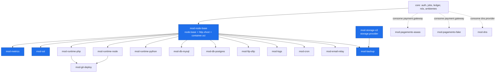
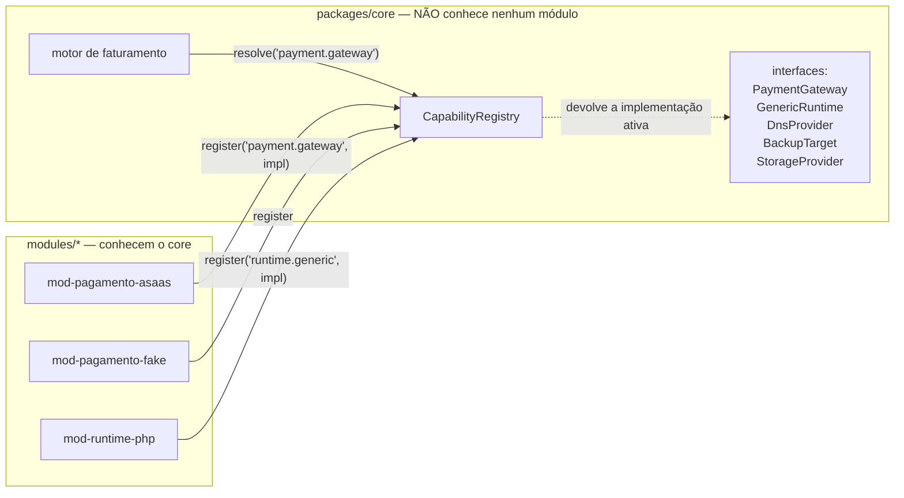
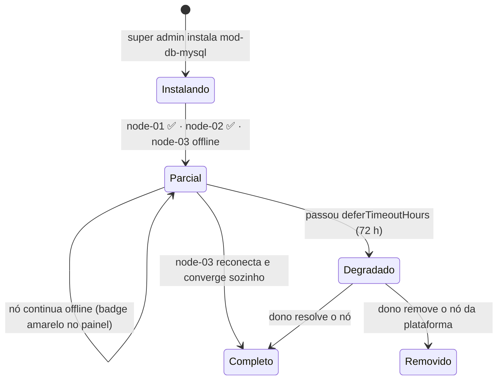

# 08 — Sistema de Módulos, Instalação & Documentação (Ciclo 2)

> **Especialista #10 (DevOps/Instalador) + #11 (Documentação/DX).**
> Responde ao requisito 2 e ao requisito 10 do briefing, ao ADENDO 1 §C (pagamento plugável)
> e ao Achado 5.0 da crítica do Ciclo 1 ("a modularidade do doc 03 é de fachada").
>
> **Documentos que este arquivo altera:** `03-arquitetura.md` §2 (substituído por este, exceto §2.6
> que é preservado e ampliado), `04-infra-linux.md` §10 (Ansible — **retirado**, ver §6).

---

## 0. Resumo executivo — as sete decisões

| # | Decisão | Em uma linha |
|---|---|---|
| **D1** | **Modularidade é contrato, não carregamento dinâmico.** | O que torna o sistema modular é o core **não conhecer nenhuma implementação concreta** (§3), não o módulo chegar por download em runtime. |
| **D2** | **Fase 1: entrega embutida (`builtin`).** Todos os módulos do catálogo oficial vêm **dentro do artefato do painel**, desligados por padrão. "Instalar" = ativar + migrar + provisionar nos nós. | Zero download, zero assinatura em runtime, zero rebuild para instalar. Módulo **novo** chega por `velozctl panel upgrade` (um comando). |
| **D3** | **Fase 2: pacote `.vpm`** assinado (cosign) para módulos de terceiros, com UI em **iframe sandbox**. Gatilho: existir um módulo que o dono não escreveu. | O mecanismo caro só é construído quando houver quem o use. |
| **D4** | **UI plugável = registry em build-time + slots + manifesto em runtime.** `React.lazy` sobre imports locais; `GET /api/v1/ui/manifest` decide o que aparece por usuário/tenant/ambiente. **ESM remoto e Module Federation: rejeitados em definitivo.** | Ratifica `05` §4.4 contra `03` §2.4. |
| **D5** | **Caminho principal de instalação = painel do super admin.** CLI (`velozctl`) e arquivo declarativo (`veloz.modules.yaml`) são **clientes da mesma API**, nunca caminhos paralelos. | O dono clica; a IA e o CI usam CLI; o disaster recovery usa o arquivo. |
| **D6** | **Bootstrap de nó = instalar os módulos de nó obrigatórios.** Um comando (`bootstrap.sh` com token de uso único) instala doctor + agente; **todo o resto do nó é convergido pelo próprio motor de módulos**. **Ansible sai da fase 1.** | Um mecanismo em vez de dois. `veloz-node-doctor.sh` é pré-requisito **bloqueante**. |
| **D7** | **Documentação é entregável de código,** versionada no mesmo repositório, com teste de aceite "o Tiago executa o runbook sozinho". Módulo sem `docs/operator.md` e `docs/runbook.md` **não passa no CI**. | Requisito 10 do briefing e E14 da crítica. |

### O que muda em relação ao Ciclo 1

| `03-arquitetura.md` §2 dizia | Agora |
|---|---|
| Módulo chega como `.vpm` assinado, baixado em runtime | Fase 1 embutido; `.vpm` só na fase 2 (D2/D3) |
| UI por ESM remoto com import map | Registry em build-time (D4) |
| Sidecar HTTP por módulo (`unix:///run/vp/mod-x.sock`) | **Cortado da fase 1.** Módulo é um pacote do monorepo que registra handlers no processo da API. Sidecar volta na fase 2, junto com o `.vpm` |
| Módulo *"NUNCA toca em outro schema"* e ponto | Continua valendo para escrita direta, **mas** existe a **Host API** (§3.6) — a porta oficial pelo qual um módulo participa de fluxo do core (ex.: `host.payments.settle()`) |
| Não havia rota de webhook | Tipo de rota `webhook` no manifesto (§2.4) |
| Não havia contrato de pagamento | `payment.gateway v1` (§3.2) |
| Provisionamento de nó por Ansible (`04` §10) | Módulos de nó + agente (D6) |

---

## 1. Catálogo de módulos — lista fechada do Ciclo 2

### 1.1 O que é core (**não** é módulo, nunca será)

Regra de corte: **se remover a peça o painel deixa de fazer sentido, é core. Se remover só tira uma
capacidade, é módulo.**

| Peça do core | Por que não é módulo |
|---|---|
| Autenticação, sessão, 2FA, RBAC, auditoria | É o que decide quem pode o quê — inclusive sobre módulos |
| Tenants, usuários, convites | Sem isso não há a quem cobrar nem o que isolar |
| Catálogo de nós, enroll, heartbeat, saúde do nó | É o mapa do mundo; módulos são instalados *nele* |
| Máquina de estados do ambiente (`create/start/stop/resize/delete`) | É o produto |
| Motor de jobs (Postgres como fila, `job_steps`, idempotência, locks) | É como qualquer módulo executa qualquer coisa |
| **Motor de faturamento**: metering, `usage_events`, rollup, ledger, saldo, fatura, suspensão | O *motor* é core; os **meios de pagamento** são módulos (ADENDO §C) |
| Gateway de API, rate limit, resolução de tenant, contexto assinado | Autorização centralizada — o erro clássico de plugin é delegar isso |
| Shell da UI, design system, slots, i18n | É a moldura em que o módulo se encaixa |
| Registro de módulos (este documento) | Meta-camada |
| Agente do nó (`veloz-agent`) e o helper root (`veloz-nodectl`) | É o executor de todo hook de módulo |
| Cofre de segredos | Módulo lê segredo, não guarda |
| Notificações transacionais do painel (e-mail de recuperação de senha etc.) | Sem isso ninguém entra no sistema |

> **Correção de nome (contradição nova, C21).** `04-infra-linux.md` §11.5 batizou de `velozctl` o
> **helper root do nó** com allowlist de `sudoers`. O briefing e o dono pedem `velozctl` como **CLI de
> administração da plataforma**. São coisas diferentes e o nome colide.
> **Resolução: o helper root do nó passa a se chamar `veloz-nodectl`; `velozctl` é a CLI de admin,
> que fala HTTPS com a API do control plane e não existe dentro do nó.**

### 1.2 Catálogo

Legenda de **escopo**: `platform` = instalado uma vez, vale para tudo · `node` = instalado por nó ·
`environment` = habilitado por ambiente do cliente.
Legenda de **fase**: `MVP` = uma das 14 entregas · `MVP+1` = primeira onda depois do primeiro cliente ·
`Depois` = tem manifesto e lugar no catálogo, mas não é construído agora.

| Módulo | Escopo | Fase | Obrig.? | O que faz | Depende de | Provê (capability) |
|---|---|---|---|---|---|---|
| `mod-node-base` | node | **MVP** | **Sim** | Docker Engine com `userns-remap`, nginx de borda, XFS `prjquota`, nftables, chrony, unattended-upgrades, usuários de serviço | — | `node.base v1`, `http.vhost v1`, `container.oci v1` |
| `mod-storage-s3` | platform | **MVP** | **Sim** | Bucket S3-compatível (Magalu) com object lock; destino de backup e de artefatos | — | `storage.provider v1` |
| `mod-metrics` | node | **MVP** | **Sim** | Coleta cgroup v2 + PSI + log da borda → remote-write no VictoriaMetrics; alimenta os gráficos (req. 8) | `node.base` | `metrics.collector v1` |
| `mod-ssl` | platform + node | **MVP** | **Sim** | ACME via `lego`, **fila serializada no CP** (nunca ACME do web server), deploy do cert no nó, renovação D-30 | `node.base`, `http.vhost` | `ssl.issuer v1` |
| `mod-backup` | platform + node | **MVP** | **Sim** | `restic` por ambiente + dump horário por database; **restore é o critério de aceite, não o backup** | `storage.provider`, `node.base` | `backup.engine v1` |
| `mod-runtime-php` | environment | **MVP** | Não¹ | PHP-FPM 7.4→8.4 por ambiente, troca de versão, extensões, `php.ini` pela UI | `node.base`, `http.vhost` | `runtime.generic v2`, `runtime.php v1` |
| `mod-runtime-node` | environment | **MVP** | Não¹ | Node 18/20/22/24 por ambiente, processo persistente sob supervisord, proxy reverso | `node.base`, `http.vhost` | `runtime.generic v2`, `runtime.node v1` |
| `mod-db-mysql` | node | **MVP** | Não¹ | **MariaDB 11 LTS** (rótulo "MySQL" na UI), instância compartilhada por nó, database+role por ambiente, dump horário | `node.base` | `db.generic v1`, `db.mysql v1` |
| `mod-db-postgres` | node | **MVP** | Não | PostgreSQL 17 compartilhado por nó, database+role por ambiente, dump horário | `node.base` | `db.generic v1`, `db.postgres v1` |
| `mod-ftp-sftp` | node | **MVP** | Não | SFTP por ambiente (instância sshd separada + `veloz-jump`), chave pública pela UI. **Sem FTP simples** (ver nota²) | `node.base` | `filetransfer.sftp v1` |
| `mod-logs` | environment | **MVP** | Não | Log da borda + do container, streaming ao vivo por WebSocket, download do trecho | `node.base` | `logs.stream v1` |
| `mod-pagamento-asaas` | platform | **MVP** | Sim³ | Pix + boleto + cartão via Asaas; recarga de saldo e cobrança de fatura | `payment.gateway` consumer no core | implementa `payment.gateway v1` |
| `mod-pagamento-fake` | platform | **MVP** | Sim⁴ | PSP fictício que aprova em 3 s. **Nunca habilitado em produção** (bloqueado por `environments: [dev, ci]`) | — | implementa `payment.gateway v1` |
| `mod-dns` | platform | **MVP (reduzido)** | Não | **Modo DNS externo**: gera as instruções de NS/A/CNAME, verifica propagação, avisa quando resolveu. **Não é autoritativo** | — | `dns.provider v1` (impl. `manual`) |
| `mod-cron` | environment | **MVP+1** | Não | Tabela de cron por ambiente; host dispara `docker exec`; histórico de execução e saída | `node.base` | `scheduler.cron v1` |
| `mod-git-deploy` | environment | **MVP+1** | Não | Deploy por `git pull` + comando de build; webhook do GitHub/GitLab; chave de deploy por ambiente | runtime.generic, `node.base` | `deploy.git v1` |
| `mod-email-relay` | platform + node | **MVP+1** | Não | SMTP **de saída** do cliente via relay externo (SES/Resend/Mailgun), DKIM por domínio, cota diária. **Sem caixa postal** | `node.base` | `email.relay v1` |
| `mod-pagamento-pix` | platform | **MVP+1** | Não | Pix direto na API do banco (EFI/Inter), sem PSP intermediário — taxa menor, integração mais chata | — | implementa `payment.gateway v1` |
| `mod-dns-cloudflare` | platform | **Depois** | Não | Gerencia a zona do cliente na Cloudflare por token delegado | — | implementa `dns.provider v1` |
| `mod-apps-1click` | environment | **Depois** | Não | Instalação de WordPress, Laravel, Ghost, n8n a partir de receitas versionadas | runtime.generic, `db.generic` | `apps.catalog v1` |
| `mod-firewall-waf` | node | **Depois** | Não | Coraza/ModSecurity com CRS na borda, por ambiente, com modo aprendizado | `node.base`, `http.vhost` | `waf.engine v1` |
| `mod-runtime-python` | environment | **Depois** | Não | Python 3.11→3.13 via `uv`. **É o teste de fogo da modularidade** (§3.1) | `node.base`, `http.vhost` | `runtime.generic v2`, `runtime.python v1` |
| `mod-redis` | environment | **Depois** | Não | Valkey/Redis por ambiente, com `maxmemory` do plano | `node.base` | `cache.kv v1` |
| `mod-alerts` | platform | **Depois** | Não | Regras de alerta sobre as métricas → e-mail/Telegram do dono e do cliente | `metrics.collector` | `alerting.engine v1` |
| `mod-backup-s3-alt` | platform | **Depois** | Não | Segundo destino de backup (Backblaze B2/Wasabi) para a regra 3-2-1 | — | implementa `storage.provider v1` |

¹ **"Não obrigatório" com uma ressalva honesta:** sem nenhum runtime e sem nenhum banco, o painel
liga e faz login, mas não hospeda nada. `mod-runtime-php` + `mod-db-mysql` são o *conjunto mínimo
comercial*, não um requisito técnico do core. Isso é proposital: é exatamente o que prova a modularidade.

² **FTP simples está fora, permanentemente.** Senha em texto claro na rede. A UI chama a tela de
"FTP/SFTP" porque é o nome que o cliente procura, e entrega SFTP.

³ **Pelo menos um módulo que implemente `payment.gateway` é obrigatório para cobrar.** O core não tem
nenhum embutido. Se nenhum estiver habilitado, a tela de recarga mostra "nenhum meio de pagamento
configurado" e o faturamento continua acumulando (o ledger é core) — não quebra, só não recebe.

⁴ Obrigatório **no CI**, não em produção. É o teste executável do Achado 5.0.

### 1.3 Grafo de dependências



Linha cheia = dependência dura (bloqueia instalação). Linha pontilhada = o **core consome uma
capability** — ele não sabe qual módulo a implementa, e é isso que o §3 protege.

---

## 2. `module.yaml` — manifesto definitivo

### 2.1 Regras gerais

- Arquivo obrigatório na raiz do módulo: `modules/<slug>/module.yaml`.
- **Validado por JSON Schema no CI** (`packages/contracts/schemas/module.schema.json`). Manifesto
  inválido reprova o build — não existe "módulo que sobe e falha depois".
- O manifesto é a **única** fonte de verdade sobre o módulo. Nada de configuração escondida em código.
- Campos desconhecidos são **erro**, não avisos (`additionalProperties: false`). Isso existe para
  impedir a IA construtora de inventar campo.

### 2.2 Tabela de campos

| Campo | Tipo | Obrig. | Descrição |
|---|---|---|---|
| `apiVersion` | `"veloz.panel/v1"` | **sim** | Versão do formato do manifesto |
| `kind` | `"Module"` | **sim** | — |
| `metadata.name` | `string` `^mod-[a-z0-9-]{2,40}$` | **sim** | Slug único e **imutável** |
| `metadata.version` | semver estrito `x.y.z` | **sim** | Versão do módulo |
| `metadata.displayName` | `string` | **sim** | Nome na UI (PT-BR) |
| `metadata.description` | `string` ≤ 200 | **sim** | Uma frase, em PT-BR, para o card do catálogo |
| `metadata.vendor` | `string` | **sim** | `"VelozPanel"` para os first-party |
| `metadata.license` | SPDX | **sim** | — |
| `metadata.icon` | caminho | não | SVG monocromático 24×24 |
| `metadata.categories` | `string[]` enum | **sim** | `runtime\|database\|network\|security\|operations\|billing\|apps` |
| `metadata.scope` | enum | **sim** | `platform \| node \| environment` |
| `metadata.tier` | enum | **sim** | `core-required \| recommended \| optional \| experimental` |
| `spec.delivery` | enum | **sim** | `builtin` (fase 1) \| `package` (fase 2, `.vpm`) |
| `spec.compat.core` | range semver | **sim** | Ex.: `">=1.4.0 <2.0.0"` |
| `spec.compat.sdk` | inteiro como string | **sim** | Major do Host SDK. Trocar = quebra |
| `spec.compat.agent` | range semver | não | Versão mínima do agente do nó |
| `spec.requires[]` | lista | não | `{module, version}` **ou** `{capability, version}` — preferir capability |
| `spec.conflicts[]` | lista | não | `{module}` ou `{capability}` |
| `spec.recommends[]` | lista | não | Sugerido na UI, não bloqueia |
| `spec.provides.capabilities[]` | lista | não | `{name, version, attributes}` — o que o módulo passa a oferecer |
| `spec.provides.implements[]` | lista | não | Capabilities **do core** que este módulo implementa (ex.: `payment.gateway`). Diferente de `capabilities`: aqui o core é o consumidor |
| `spec.provides.meters[]` | lista | não | `{key, unit, aggregation}` — unidades faturáveis |
| `spec.nodeRequirements` | objeto | se `scope: node` | `os[]`, `arch[]`, `minMemoryMB`, `minDiskGB`, `kernelFeatures[]`, `ports[]`, `systemPackages[]` |
| `spec.rollout` | objeto | se `scope: node` | Ver §2.5 — **é o que resolve "um nó offline"** |
| `spec.configSchema` | JSON Schema 2020-12 | não | Gera o formulário da UI automaticamente |
| `spec.secrets[]` | lista | não | `{key, label, required, rotatable}` — lidos do cofre, **nunca** do config |
| `spec.hostApi.scopes[]` | lista enum | não | **Menor privilégio explícito** (§3.6). Ex.: `payments.settle`, `jobs.emit`, `usage.emit` |
| `spec.hooks` | objeto | se tem `node/` | `preflight, install, postInstall, enable, configure, upgrade, disable, uninstall, rollback` |
| `spec.tasks[]` | lista | não | Tarefas expostas ao motor de jobs |
| `spec.database.schema` | `^mod_[a-z0-9_]+$` | se tem migrations | Schema exclusivo no Postgres do CP |
| `spec.database.migrations` | caminho | se tem schema | Diretório `NNNN_nome.up.sql` / `.down.sql` |
| `spec.api.basePath` | caminho | não | Sempre `/api/v1/modules/<slug-sem-mod->` |
| `spec.api.routes[]` | lista | não | `{method, path, permission, rateLimit, audit, longRunning}` |
| `spec.api.webhooks[]` | lista | não | `{path, auth: none, rawBody, rateLimit, ipAllowlist}` — **entrada não autenticada** (§2.4) |
| `spec.ui.mounts[]` | lista | não | Slots (§5) |
| `spec.permissions[]` | lista | não | Chaves de RBAC que o módulo adiciona |
| `spec.healthcheck` | objeto | não | `node` e/ou `service`, com `degradedPolicy` |
| `spec.uninstall` | objeto | **sim** | `dataPolicy`, `retentionDays`, `blockIf[]`, `dropSchema` |
| `spec.telemetry` | objeto | não | `metrics[]`, `logs[]` |
| `spec.docs.operator` | caminho | **sim** | **Reprova no CI se ausente ou vazio** |
| `spec.docs.runbook` | caminho | **sim** | **Reprova no CI se ausente ou vazio** |
| `spec.docs.user` | caminho | não | Só se o módulo tem tela para o cliente |
| `signature` | objeto | só `delivery: package` | cosign/sigstore |

### 2.3 Versionamento e compatibilidade — as quatro linhas do tempo

Existem **quatro** números de versão e confundi-los é a origem de metade dos bugs de sistemas de plugin.

| Versão | Formato | Quem incrementa | Regra |
|---|---|---|---|
| **Versão do módulo** | semver estrito `3.2.0` | o autor do módulo | `patch` = correção; `minor` = capacidade nova retrocompatível (ex.: PHP 8.5 na lista); `major` = migration destrutiva, config incompatível ou capability removida |
| **Versão do core** | semver `1.7.2` | o release do painel | Módulo declara **range**: `spec.compat.core: ">=1.4.0 <2.0.0"` |
| **Major do Host SDK** | inteiro `"1"` | mudança de contrato de UI/tarefa | Core suporta **N e N-1** por no mínimo 6 meses; `N-2` é recusado na instalação |
| **Major da capability** | inteiro `"2"` em `runtime.generic v2` | mudança do contrato de capacidade | Consumidor declara o major que aceita. Dois majores podem coexistir: um módulo pode `provides: [runtime.generic v1, runtime.generic v2]` durante a transição |

Decisão explícita: **range semver (npm-style), não pin.** Pin (`core: "1.4.0"`) transformaria todo
upgrade do painel em atualização de 20 manifestos. Range com teto de major é o equilíbrio.

**Matriz de decisão na instalação** (implementada em `packages/core/src/modules/compat.ts`):

| Situação | Resultado |
|---|---|
| `core` fora do range | **Bloqueia.** Mensagem: "mod-x 3.2.0 exige core >=1.4 <2.0; você tem 2.1.0. Atualize o módulo." |
| `sdk` = N ou N-1 | Instala |
| `sdk` = N-2 ou menor | **Bloqueia** |
| `sdk` > N | **Bloqueia.** "Este módulo é mais novo que o painel. Atualize o painel." |
| `requires` capability ausente | **Bloqueia** e oferece o módulo que a provê (resolução automática de 1 nível, com confirmação) |
| `conflicts` presente | **Bloqueia**, lista o conflitante |
| Downgrade de módulo | **Bloqueia**, exceto pelo rollback automático dentro da janela de 24 h (§4.6) |

### 2.4 O tipo de rota `webhook` — correção do Achado 5.0(c)

```yaml
api:
  basePath: "/api/v1/modules/pagamento-asaas"
  routes:
    - { method: GET,  path: "/config", permission: "admin.billing.manage" }
  webhooks:
    - path: "/webhooks/asaas"     # URL final: /webhooks/pagamento-asaas/webhooks/asaas
      auth: none                   # sem sessão, sem tenant resolvido
      rawBody: true                # o gateway NÃO faz parse: a assinatura é sobre os bytes originais
      rateLimit: "600/min"
      ipAllowlist: []              # opcional, editável pelo super admin na UI
      maxBodyBytes: 262144
```

Regras não negociáveis do gateway para rotas `webhook`:
1. Corpo cru preservado em `Buffer`, sem parse, sem normalização de header.
2. Nenhum contexto de tenant é injetado. O módulo **descobre** o tenant a partir do `provider_ref`,
   perguntando ao core via `host.payments.lookup(provider_ref)`.
3. A rota responde **202 imediatamente** e processa em job. PSP que espera resposta síncrona em 5 s
   não pode depender de nós fazermos trabalho longo dentro do request.
4. Toda chamada é registrada em `core.webhook_deliveries` (corpo cru + headers + resultado), com
   retenção de 30 dias. Sem isso, depurar "o Asaas diz que mandou" é impossível.

### 2.5 `rollout` — o campo que resolve "instalar com um nó offline"

```yaml
rollout:
  strategy: canary            # canary | all_at_once
  canaryNode: auto            # auto = o nó com menos ambientes
  canarySoakMinutes: 10       # tempo de observação antes de seguir
  requireNodes: majority      # all | majority | any
  onNodeFailure: abort        # abort | continue
  onNodeOffline: defer        # defer | abort
  deferTimeoutHours: 72       # depois disso o módulo entra em 'partial' e alerta o super admin
```

Semântica de `onNodeOffline: defer` (o padrão, e o caso do briefing): o módulo é marcado
`enabled` no control plane, `applied` nos nós que responderam e **`pending`** no nó offline. O nó, ao
reconectar, faz `GET /agent/v1/desired-state`, vê a divergência e converge sozinho. Ver §4.7.

### 2.6 Exemplo 1 — módulo de runtime (`mod-runtime-php`)

```yaml
apiVersion: veloz.panel/v1
kind: Module
metadata:
  name: mod-runtime-php
  version: 1.0.0
  displayName: "PHP"
  description: "Hospeda aplicações PHP com troca de versão por ambiente, de 7.4 a 8.4."
  vendor: "VelozPanel"
  license: "Apache-2.0"
  icon: "ui/icon.svg"
  categories: [runtime]
  scope: environment
  tier: recommended

spec:
  delivery: builtin
  compat: { core: ">=1.0.0 <2.0.0", sdk: "1", agent: ">=1.0.0" }

  requires:
    - capability: node.base
      version: "1"
    - capability: http.vhost
      version: "1"
  recommends:
    - module: mod-logs
    - module: mod-db-mysql

  provides:
    capabilities:
      - name: runtime.generic
        version: "2"
      - name: runtime.php
        version: "1"
        attributes:
          versions: ["7.4","8.0","8.1","8.2","8.3","8.4"]
          default: "8.3"
          eol:
            "7.4": "2022-11-28"
            "8.0": "2023-11-26"
            "8.1": "2025-12-31"
    meters:
      - { key: php.workers.hour, unit: worker-hour, aggregation: max_per_hour }

  nodeRequirements:
    os: ["debian>=13"]
    arch: ["amd64","arm64"]
    minMemoryMB: 384
    minDiskGB: 6
    kernelFeatures: ["cgroup2"]
    systemPackages: []          # tudo vive na imagem OCI, nada é instalado no host

  rollout:
    strategy: canary
    canarySoakMinutes: 10
    requireNodes: any            # basta um nó ter PHP para vender PHP
    onNodeFailure: continue
    onNodeOffline: defer

  configSchema:
    $schema: "https://json-schema.org/draft/2020-12/schema"
    type: object
    additionalProperties: false
    properties:
      version:      { type: string, enum: ["7.4","8.0","8.1","8.2","8.3","8.4"], default: "8.3", title: "Versão do PHP" }
      memory_limit: { type: string, pattern: "^[0-9]+M$", default: "256M", title: "memory_limit" }
      max_children: { type: integer, minimum: 1, maximum: 64, default: 8, title: "Processos PHP-FPM" }
      extensions:   { type: array, items: { type: string }, default: ["mbstring","curl","gd","pdo_mysql","intl","zip"], title: "Extensões" }
      opcache:      { type: boolean, default: true, title: "OPcache ligado" }
    required: [version]

  secrets: []
  hostApi:
    scopes: [jobs.emit, usage.emit, events.emit, config.read, config.write]

  hooks:
    preflight:   { run: "node/preflight.sh",    timeout: 60s,  mustBeIdempotent: true }
    install:     { run: "node/install.sh",      timeout: 900s, retries: 2 }
    postInstall: { run: "node/post-install.sh", timeout: 120s }
    enable:      { run: "node/enable.sh",       timeout: 120s }
    configure:   { run: "node/configure.sh",    timeout: 300s }
    upgrade:     { run: "node/upgrade.sh",      timeout: 900s, args: ["--from","$FROM_VERSION"] }
    disable:     { run: "node/disable.sh",      timeout: 120s }
    uninstall:   { run: "node/uninstall.sh",    timeout: 600s }
    rollback:    { run: "node/rollback.sh",     timeout: 600s }

  tasks:
    - name: php.provision
      run: "node/tasks/provision.sh"
      argsSchema: { type: object, properties: { version: {type: string}, config: {type: object} }, required: [version] }
      idempotent: true
      lock: environment
      timeout: 600s
      requiredPermission: "environment.runtime.update"
    - name: php.switch_version
      run: "node/tasks/switch_version.sh"
      argsSchema:
        type: object
        properties:
          from_version: { type: string }
          to_version:   { type: string }
          strategy:     { type: string, enum: ["graceful","immediate"], default: "graceful" }
        required: [to_version]
      idempotent: true
      lock: environment
      timeout: 300s
      requiredPermission: "environment.runtime.update"
    - name: php.restart_pool
      run: "node/tasks/restart_pool.sh"
      idempotent: true
      lock: environment
      timeout: 60s
      requiredPermission: "environment.runtime.restart"

  database:
    schema: mod_runtime_php
    migrations: "migrations/"

  api:
    basePath: "/api/v1/modules/runtime-php"
    routes:
      - { method: GET, path: "/environments/{environment_id}/ini", permission: "environment.runtime.read",   rateLimit: "60/min" }
      - { method: PUT, path: "/environments/{environment_id}/ini", permission: "environment.runtime.update", rateLimit: "10/min", audit: true }

  ui:
    mounts:
      - slot: "environment.sidebar"
        id: "php"
        label: "PHP"
        icon: "code"
        order: 30
        route: "/env/:environmentId/php"
        component: "PhpSettingsPage"
        visibleWhen: "env.runtime == 'php'"
        permission: "environment.runtime.read"
      - slot: "environment.overview.card"
        id: "php-version-card"
        component: "PhpVersionCard"
        order: 20
        visibleWhen: "env.runtime == 'php'"

  permissions:
    - { key: "environment.runtime.read",    label: "Ver configuração de runtime",   defaultRoles: ["owner","admin","developer","viewer"] }
    - { key: "environment.runtime.update",  label: "Alterar versão/config",         defaultRoles: ["owner","admin","developer"] }
    - { key: "environment.runtime.restart", label: "Reiniciar runtime",             defaultRoles: ["owner","admin","developer"] }

  healthcheck:
    node: { run: "node/health.sh", intervalSeconds: 30, timeoutSeconds: 10, failureThreshold: 3 }
    degradedPolicy: "disable_ui_writes"

  uninstall:
    dataPolicy: "retain_then_purge"
    retentionDays: 30
    blockIf: ["environments_using > 0"]
    dropSchema: false

  telemetry:
    metrics: ["php_fpm_active_children","php_fpm_slow_requests_total","php_fpm_max_children_reached"]
    logs: ["php-fpm.error","php-fpm.slow"]

  docs:
    operator: "docs/operator.md"
    runbook:  "docs/runbook.md"
    user:     "docs/user.md"
```

### 2.7 Exemplo 2 — módulo de pagamento (`mod-pagamento-asaas`)

O módulo que o Achado 5.0 provou ser impossível no contrato anterior. Repare em três coisas:
`provides.implements`, `api.webhooks` e `hostApi.scopes: [payments.settle]`.

```yaml
apiVersion: veloz.panel/v1
kind: Module
metadata:
  name: mod-pagamento-asaas
  version: 1.0.0
  displayName: "Asaas (Pix, boleto e cartão)"
  description: "Recebe pagamentos por Pix, boleto e cartão usando a conta Asaas do provedor."
  vendor: "VelozPanel"
  license: "Apache-2.0"
  categories: [billing]
  scope: platform
  tier: optional

spec:
  delivery: builtin
  compat: { core: ">=1.0.0 <2.0.0", sdk: "1" }

  requires: []
  conflicts: []

  provides:
    implements:
      - capability: payment.gateway
        version: "1"
        attributes:
          methods: ["pix","boleto","card"]
          currencies: ["BRL"]
          supports_refund: true
          supports_recurring: false
          supports_prepaid_topup: true
          settlement_delay_hours: { pix: 0, boleto: 24, card: 720 }

  configSchema:
    $schema: "https://json-schema.org/draft/2020-12/schema"
    type: object
    additionalProperties: false
    properties:
      environment:      { type: string, enum: ["sandbox","production"], default: "sandbox", title: "Ambiente Asaas" }
      pix_enabled:      { type: boolean, default: true,  title: "Aceitar Pix" }
      boleto_enabled:   { type: boolean, default: true,  title: "Aceitar boleto" }
      card_enabled:     { type: boolean, default: false, title: "Aceitar cartão" }
      min_topup_cents:  { type: integer, minimum: 500, default: 2000, title: "Recarga mínima (centavos)" }
      charge_expiry_minutes: { type: integer, minimum: 15, maximum: 10080, default: 1440 }
    required: [environment]

  secrets:
    - { key: ASAAS_API_KEY,        label: "Chave de API do Asaas",       required: true,  rotatable: true }
    - { key: ASAAS_WEBHOOK_TOKEN,  label: "Token do webhook (asaas-access-token)", required: true, rotatable: true }

  hostApi:
    scopes:
      - payments.settle        # <<< a porta oficial para escrever fato de pagamento no core
      - payments.lookup
      - secrets.read
      - events.emit
      - jobs.emit

  api:
    basePath: "/api/v1/modules/pagamento-asaas"
    routes:
      - { method: GET,  path: "/status", permission: "admin.billing.manage", rateLimit: "30/min" }
      - { method: POST, path: "/test-charge", permission: "admin.billing.manage", audit: true, rateLimit: "5/min" }
    webhooks:
      - path: "/webhook"
        auth: none
        rawBody: true
        rateLimit: "600/min"
        maxBodyBytes: 262144
        ipAllowlist: []

  database:
    schema: mod_pagamento_asaas
    migrations: "migrations/"     # guarda só o mapa provider_ref -> nosso charge_id e o log cru

  ui:
    mounts:
      - slot: "admin.billing.gateways"
        id: "asaas-settings"
        label: "Asaas"
        component: "AsaasSettingsPage"
        permission: "admin.billing.manage"
        order: 10
      - slot: "checkout.method"           # o cliente escolhe como pagar
        id: "asaas-pix"
        component: "AsaasPixCheckout"
        visibleWhen: "gateway.methods includes 'pix'"
        order: 10

  permissions:
    - { key: "admin.billing.gateway.configure", label: "Configurar meios de pagamento", defaultRoles: ["superadmin"] }

  healthcheck:
    probe:
      kind: capability
      capability: payment.gateway
      operation: describe          # chama describe() a cada 5 min; falha 3x => degraded
      intervalSeconds: 300
      failureThreshold: 3
    degradedPolicy: "alert_only"   # NUNCA esconder a tela de pagamento: o cliente precisa saber

  uninstall:
    dataPolicy: "never_purge"      # dado financeiro não é apagado, ponto
    retentionDays: 3650
    blockIf:
      - "open_charges > 0"
      - "is_only_enabled_payment_gateway == true"
    dropSchema: false

  telemetry:
    metrics: ["payment_charge_created_total","payment_webhook_received_total","payment_settle_failed_total"]
    logs: ["asaas.webhook","asaas.api"]

  docs:
    operator: "docs/operator.md"
    runbook:  "docs/runbook.md"
    user:     "docs/user.md"
```

### 2.8 Exemplo 3 — módulo de nó (`mod-db-mysql`)

```yaml
apiVersion: veloz.panel/v1
kind: Module
metadata:
  name: mod-db-mysql
  version: 1.0.0
  displayName: "MySQL"
  description: "Banco de dados MySQL para os ambientes deste nó (motor MariaDB 11 LTS)."
  vendor: "VelozPanel"
  license: "Apache-2.0"
  categories: [database]
  scope: node
  tier: recommended

spec:
  delivery: builtin
  compat: { core: ">=1.0.0 <2.0.0", sdk: "1", agent: ">=1.0.0" }

  requires:
    - { capability: node.base, version: "1" }
  recommends:
    - module: mod-backup

  provides:
    capabilities:
      - name: db.generic
        version: "1"
      - name: db.mysql
        version: "1"
        attributes:
          engine: "mariadb"
          engineVersion: "11.4"
          wireCompatible: "mysql-8.0"
          maxDatabasesPerNode: 60
    meters:
      - { key: db.storage.gb_hour, unit: gb-hour, aggregation: avg_per_hour }

  nodeRequirements:
    os: ["debian>=13"]
    arch: ["amd64","arm64"]
    minMemoryMB: 1024          # 800 MB de reserva de host + folga (Conflito 2, emenda 4)
    minDiskGB: 20
    kernelFeatures: ["cgroup2"]
    ports: []                  # escuta em 127.0.0.1 e no socket; acesso externo é por túnel
    systemPackages: []
    conflictsWithNodeModules: []

  rollout:
    strategy: canary
    canarySoakMinutes: 15
    requireNodes: all          # cada nó precisa do seu banco: ambiente não fala com banco de outro nó
    onNodeFailure: abort
    onNodeOffline: defer
    deferTimeoutHours: 72

  configSchema:
    $schema: "https://json-schema.org/draft/2020-12/schema"
    type: object
    additionalProperties: false
    properties:
      innodb_buffer_pool_mb: { type: integer, minimum: 128, maximum: 4096, default: 256, title: "Buffer pool (MB)" }
      max_connections:       { type: integer, minimum: 50, maximum: 1000, default: 200 }
      max_queries_per_hour:  { type: integer, minimum: 0, default: 200000, title: "Teto por conta (0 = sem teto)" }
      dump_interval_minutes: { type: integer, enum: [30,60,180,360], default: 60, title: "Dump automático a cada" }
      remote_access:         { type: boolean, default: false, title: "Permitir acesso externo (via túnel)" }
    required: [innodb_buffer_pool_mb]

  secrets:
    - { key: MYSQL_ROOT_PASSWORD, label: "Senha root da instância", required: true, rotatable: true, generateIfMissing: true }

  hostApi:
    scopes: [jobs.emit, usage.emit, events.emit, secrets.read, config.read, config.write]

  hooks:
    preflight:   { run: "node/preflight.sh",   timeout: 60s, mustBeIdempotent: true }
    install:     { run: "node/install.sh",     timeout: 1200s, retries: 1 }
    postInstall: { run: "node/post-install.sh", timeout: 300s }
    enable:      { run: "node/enable.sh",      timeout: 120s }
    configure:   { run: "node/configure.sh",   timeout: 300s }
    upgrade:     { run: "node/upgrade.sh",     timeout: 1800s }
    disable:     { run: "node/disable.sh",     timeout: 120s }
    uninstall:   { run: "node/uninstall.sh",   timeout: 900s }
    rollback:    { run: "node/rollback.sh",    timeout: 900s }

  tasks:
    - { name: mysql.create_database, run: "node/tasks/create_db.sh",  idempotent: true, lock: node, timeout: 60s,  requiredPermission: "environment.database.create" }
    - { name: mysql.drop_database,   run: "node/tasks/drop_db.sh",    idempotent: true, lock: node, timeout: 60s,  requiredPermission: "environment.database.delete" }
    - { name: mysql.reset_password,  run: "node/tasks/reset_pw.sh",   idempotent: true, lock: node, timeout: 30s,  requiredPermission: "environment.database.update" }
    - { name: mysql.dump,            run: "node/tasks/dump.sh",       idempotent: true, lock: none, timeout: 900s, longRunning: true, requiredPermission: "environment.database.read" }
    - { name: mysql.restore,         run: "node/tasks/restore.sh",    idempotent: false, unsafeRetry: false, lock: environment, timeout: 1800s, longRunning: true, requiredPermission: "environment.database.restore" }

  database:
    schema: mod_db_mysql
    migrations: "migrations/"

  api:
    basePath: "/api/v1/modules/db-mysql"
    routes:
      - { method: GET,  path: "/environments/{environment_id}/databases", permission: "environment.database.read" }
      - { method: POST, path: "/environments/{environment_id}/databases", permission: "environment.database.create", audit: true, rateLimit: "10/min" }
      - { method: POST, path: "/environments/{environment_id}/databases/{db}/dump", permission: "environment.database.read", longRunning: true, rateLimit: "3/min" }

  ui:
    mounts:
      - { slot: "environment.sidebar", id: "mysql", label: "Banco de dados", icon: "database", order: 40, route: "/env/:environmentId/mysql", component: "MysqlPage", permission: "environment.database.read" }
      - { slot: "admin.node.tabs",     id: "mysql-node", label: "MySQL", component: "MysqlNodePage", permission: "admin.nodes.manage", order: 20 }

  permissions:
    - { key: "environment.database.read",    label: "Ver bancos de dados",  defaultRoles: ["owner","admin","developer"] }
    - { key: "environment.database.create",  label: "Criar banco",          defaultRoles: ["owner","admin","developer"] }
    - { key: "environment.database.update",  label: "Alterar banco/senha",  defaultRoles: ["owner","admin","developer"] }
    - { key: "environment.database.delete",  label: "Apagar banco",         defaultRoles: ["owner","admin"] }
    - { key: "environment.database.restore", label: "Restaurar dump",       defaultRoles: ["owner","admin"] }

  healthcheck:
    node: { run: "node/health.sh", intervalSeconds: 30, timeoutSeconds: 10, failureThreshold: 3 }
    degradedPolicy: "disable_ui_writes"

  uninstall:
    dataPolicy: "retain_then_purge"
    retentionDays: 90
    blockIf:
      - "databases_on_node > 0"
    dropSchema: false

  telemetry:
    metrics: ["mysql_up","mysql_threads_connected","mysql_slow_queries_total","mysql_dump_age_seconds"]
    logs: ["mysql.error","mysql.slow"]

  docs:
    operator: "docs/operator.md"
    runbook:  "docs/runbook.md"
    user:     "docs/user.md"
```

---

## 3. Contrato de capabilities — o coração da modularidade

### 3.1 O princípio, em uma frase

> **O core declara interfaces. Módulos as implementam. O core resolve a implementação em runtime,
> por um registro, e nunca importa, nomeia ou testa uma implementação concreta.**

Existem **dois sentidos** de dependência, e o Ciclo 1 só tinha um:

| Sentido | Quem consome | Exemplo | Mecanismo |
|---|---|---|---|
| **Módulo estende o core** (aditivo) | o usuário, pela UI | `mod-logs` acrescenta a aba "Logs" | slot de UI + rota de API + tarefa |
| **Core consome o módulo** (inversão de dependência) | o core | o motor de faturamento pede uma cobrança | **capability + registry** — é isto que faltava |

O segundo sentido é o que o Achado 5.0 mostrou ausente. Ele é implementado assim:



A seta **nunca** vai de `core` para `mod-*`. Isso é verificável mecanicamente (§3.7), e é a única
definição de "modular" que sobrevive a pressão de prazo.

### 3.2 Registro e resolução (core)

```ts
// packages/core/src/capabilities/registry.ts
export type CapabilityName =
  | "runtime.generic"
  | "payment.gateway"
  | "dns.provider"
  | "backup.target"
  | "storage.provider"
  | "db.generic"
  | "metrics.collector"
  | "ssl.issuer"
  | "email.relay";

export interface CapabilityDescriptor<T> {
  /** Slug do módulo que registrou. Preenchido pelo loader, NUNCA pelo módulo. */
  readonly moduleName: string;
  readonly capability: CapabilityName;
  /** Major do contrato: "1", "2". */
  readonly version: string;
  /** Metadados declarativos do manifesto (provides.*.attributes). */
  readonly attributes: Readonly<Record<string, unknown>>;
  readonly impl: T;
}

export interface CapabilityRegistry {
  /** Chamado UMA vez, no boot, pelo loader de módulos habilitados. */
  register<T>(d: CapabilityDescriptor<T>): void;

  /** Todas as implementações habilitadas de uma capability. Pode ser vazio. */
  list<T>(cap: CapabilityName, major?: string): ReadonlyArray<CapabilityDescriptor<T>>;

  /**
   * A implementação ativa. `selector` é resolvido pelo core a partir de
   * configuração do super admin (ex.: gateway padrão) ou do recurso (ex.: runtime do ambiente).
   * Lança CapabilityUnavailableError se não houver — o core TRATA esse erro, não presume.
   */
  resolve<T>(cap: CapabilityName, selector?: { moduleName?: string; major?: string }): CapabilityDescriptor<T>;

  has(cap: CapabilityName, major?: string): boolean;
}
```

Três regras que a IA construtora **não pode** violar:

1. `resolve()` recebe `selector.moduleName` **vindo do banco** (`settings.default_payment_gateway`),
   nunca de uma constante no código.
2. Todo `resolve()` é envolvido por tratamento de `CapabilityUnavailableError` com mensagem de
   produto ("nenhum meio de pagamento configurado"), nunca `500`.
3. Nenhum arquivo em `packages/core/**` ou `apps/api/src/**` pode conter `import ... from "@veloz/mod-*"`.

### 3.3 `runtime.generic v2` — preservado do `03` §2.6, agora tipado

```ts
// packages/contracts/src/capabilities/runtime.ts
export type RuntimeVersionStatus = "supported" | "deprecated" | "eol";

export interface RuntimeVersion {
  readonly version: string;              // "8.3"
  readonly status: RuntimeVersionStatus;
  readonly eolDate?: string;             // ISO date
  readonly isDefault: boolean;
}

export interface RuntimeDetection {
  readonly runtime: string;              // "php" | "node" | ...
  readonly version: string;
  readonly confidence: number;           // 0..1
  readonly evidence: readonly string[];  // ["composer.json", "public/index.php"]
}

export interface RuntimeStatus {
  readonly version: string;
  readonly running: boolean;
  readonly workers: number;
  readonly uptimeSeconds: number;
  readonly socketPath: string;           // /run/vp/env/<env_id>/app.sock
}

export interface RuntimeContext {
  readonly environmentId: string;
  readonly nodeId: string;
  readonly tenantId: string;
}

/**
 * Contrato de QUALQUER runtime de linguagem.
 * O core desenha a tela de "trocar versão" a partir DESTA interface — nunca de "PHP".
 */
export interface GenericRuntime {
  /** Inspeciona o código do ambiente e sugere runtime+versão. */
  detect(ctx: RuntimeContext): Promise<RuntimeDetection | null>;

  /** Versões oferecidas. O core desenha um <select> com isto. */
  listVersions(): Promise<readonly RuntimeVersion[]>;

  /** Garante a versão instalada e configurada. IDEMPOTENTE. */
  provision(ctx: RuntimeContext, args: { version: string; config?: Record<string, unknown> }): Promise<void>;

  /** Troca de versão. graceful respeita drainTimeoutSeconds. IDEMPOTENTE. */
  switch(ctx: RuntimeContext, args: {
    fromVersion?: string;
    toVersion: string;
    strategy: "graceful" | "immediate";
    drainTimeoutSeconds?: number;
  }): Promise<void>;

  status(ctx: RuntimeContext): Promise<RuntimeStatus>;

  /** Remove uma versão não utilizada, liberando disco. IDEMPOTENTE. */
  teardown(ctx: RuntimeContext, args: { version: string }): Promise<void>;
}
```

**Contrato adicional (não expressável em tipo, verificado em teste):**
- `provision` e `switch` são idempotentes: chamar duas vezes com o mesmo argumento não muda o resultado.
- `switch` com `graceful` não derruba requisição em voo por mais que `drainTimeoutSeconds`.
- Todo runtime expõe seu processo em `/run/vp/env/<env_id>/app.sock`.
- Toda métrica publicada carrega os labels `env_id`, `runtime`, `version`.

### 3.4 `payment.gateway v1` — a correção do Achado 5.0

```ts
// packages/contracts/src/capabilities/payment.ts

/** Dinheiro SEMPRE em bigint de centavos. Nenhum float atravessa esta interface. */
export type Cents = bigint;

export type ChargeStatus =
  | "pending" | "authorized" | "succeeded" | "failed" | "expired" | "refunded" | "chargeback";

export type PaymentMethod = "pix" | "boleto" | "card";

export interface GatewayDescription {
  readonly methods: readonly PaymentMethod[];
  readonly currencies: readonly string[];      // ["BRL"]
  readonly supportsRefund: boolean;
  readonly supportsRecurring: boolean;
  readonly supportsPrepaidTopup: boolean;
  /** Quanto tempo até o dinheiro liquidar, por método. Alimenta a política de crédito do saldo. */
  readonly settlementDelayHours: Readonly<Partial<Record<PaymentMethod, number>>>;
}

/** Dados do pagador. O core monta isto; o módulo NÃO consulta a tabela de tenants. */
export interface PayerInfo {
  readonly name: string;
  readonly taxId: string;                      // CPF/CNPJ, só dígitos
  readonly email: string;
  readonly phone?: string;
}

export interface CreateChargeInput {
  readonly amountCents: Cents;
  readonly currency: string;
  readonly description: string;
  readonly method: PaymentMethod;
  readonly payer: PayerInfo;
  /** Chave de idempotência gerada pelo CORE. O módulo deve repassá-la ao PSP. */
  readonly idempotencyKey: string;
  readonly returnUrl: string;
  readonly expiresAt: string;                  // ISO 8601
}

export interface ChargeResult {
  readonly providerRef: string;                // id no PSP
  readonly status: ChargeStatus;
  readonly paymentUrl?: string;
  readonly pixCopyPaste?: string;              // BR Code (EMV)
  readonly pixQrCodeBase64?: string;
  readonly boletoBarcode?: string;
  readonly expiresAt?: string;
  /** Payload cru do PSP, guardado para auditoria. NUNCA interpretado pelo core. */
  readonly raw: Record<string, unknown>;
}

export interface ChargeSnapshot {
  readonly providerRef: string;
  readonly status: ChargeStatus;
  readonly amountCents: Cents;
  readonly paidAt?: string;
  readonly raw: Record<string, unknown>;
}

export interface WebhookVerification {
  readonly valid: boolean;
  /** Preenchidos apenas quando valid === true. */
  readonly providerRef?: string;
  readonly status?: ChargeStatus;
  readonly amountCents?: Cents;
  readonly paidAt?: string;
  /** Id do EVENTO no PSP — usado para deduplicação pelo core. */
  readonly eventId?: string;
  readonly raw?: Record<string, unknown>;
}

export interface PaymentGateway {
  describe(): GatewayDescription;
  createCharge(input: CreateChargeInput): Promise<ChargeResult>;
  getCharge(providerRef: string): Promise<ChargeSnapshot>;
  refund(args: { providerRef: string; amountCents: Cents; reason: string }): Promise<ChargeSnapshot>;

  /**
   * Recebe os BYTES CRUS e os headers. Valida a assinatura do PSP.
   * NUNCA devolve valid:true com base no conteúdo do corpo.
   */
  verifyWebhook(args: { headers: Readonly<Record<string, string>>; rawBody: Buffer }): Promise<WebhookVerification>;
}
```

**A regra que fecha o Achado 5.0:** o módulo **não escreve** em `core.transactions`. Ele devolve o
fato, e o **core** persiste — via `host.payments.settle()` (§3.6). O módulo tem `search_path` no seu
próprio schema e uma role sem permissão nos schemas alheios; a Host API é a **única** porta.

### 3.5 `dns.provider v1`, `backup.target v1`, `storage.provider v1`

```ts
// packages/contracts/src/capabilities/dns.ts
export type DnsRecordType = "A" | "AAAA" | "CNAME" | "TXT" | "MX" | "NS" | "CAA" | "SRV";

export interface DnsRecord {
  readonly type: DnsRecordType;
  readonly name: string;        // "@" | "www" | "_acme-challenge"
  readonly value: string;
  readonly ttl: number;
  readonly priority?: number;   // MX/SRV
}

export interface DnsProviderDescription {
  /** authoritative = nós gerenciamos a zona; instructional = só dizemos o que o cliente deve criar. */
  readonly mode: "authoritative" | "delegated" | "instructional";
  readonly supportsWildcard: boolean;
  readonly supportsAcmeDns01: boolean;   // decide se dá para emitir wildcard TLS
  readonly recordTypes: readonly DnsRecordType[];
  readonly propagationEstimateSeconds: number;
}

export interface DnsProvider {
  describe(): DnsProviderDescription;

  /** Lista o que EXISTE hoje no provedor (ou [] no modo instructional). */
  listRecords(args: { zone: string }): Promise<readonly DnsRecord[]>;

  /**
   * Estado desejado. Idempotente e declarativo: o provider calcula o diff.
   * No modo instructional, apenas registra o desejado e devolve pending:true.
   */
  applyRecords(args: { zone: string; records: readonly DnsRecord[] }): Promise<{
    applied: readonly DnsRecord[];
    pending: readonly DnsRecord[];        // o que o cliente precisa criar manualmente
  }>;

  /** Consulta DNS pública real (resolver externo), para saber se propagou. */
  verify(args: { zone: string; expected: readonly DnsRecord[] }): Promise<{
    ok: boolean;
    mismatches: readonly { record: DnsRecord; observed: readonly string[] }[];
    checkedAt: string;
  }>;
}
```

```ts
// packages/contracts/src/capabilities/backup.ts
export interface BackupSelector {
  readonly environmentId: string;
  /** Caminhos dentro do ambiente. O core não sabe o layout; o runtime informa. */
  readonly includePaths: readonly string[];
  readonly excludeGlobs: readonly string[];
  /** Dumps de banco já produzidos por db.generic e disponíveis nestes caminhos. */
  readonly databaseDumps: readonly string[];
}

export interface SnapshotRef {
  readonly id: string;
  readonly createdAt: string;
  readonly sizeBytes: bigint;
  readonly environmentId: string;
  /** true quando o destino tem object lock/imutabilidade ativo para este snapshot. */
  readonly immutable: boolean;
  readonly expiresAt?: string;
}

export interface RestoreOutcome {
  readonly restoredPaths: readonly string[];
  readonly bytesWritten: bigint;
  readonly durationSeconds: number;
}

export interface BackupTarget {
  describe(): {
    readonly engine: string;                 // "restic"
    readonly supportsIncremental: boolean;
    readonly supportsImmutability: boolean;
    readonly supportsPartialRestore: boolean;
  };

  backup(args: { selector: BackupSelector; tags: readonly string[] }): Promise<SnapshotRef>;

  list(args: { environmentId: string; since?: string }): Promise<readonly SnapshotRef[]>;

  /** Restauração para um destino explícito. NUNCA sobrescreve o ambiente sem targetPath. */
  restore(args: {
    snapshotId: string;
    targetPath: string;
    onlyPaths?: readonly string[];
    dryRun: boolean;
  }): Promise<RestoreOutcome>;

  /** Verificação de integridade sem restaurar tudo. Roda semanalmente por job do core. */
  verify(args: { snapshotId: string; sampleRatio: number }): Promise<{ ok: boolean; errors: readonly string[] }>;

  prune(args: { environmentId: string; keepDaily: number; keepWeekly: number; keepMonthly: number }): Promise<{ removed: number }>;
}
```

```ts
// packages/contracts/src/capabilities/storage.ts
export interface StorageProvider {
  describe(): {
    readonly kind: "s3" | "local";
    readonly endpoint: string;
    readonly region: string;
    readonly supportsObjectLock: boolean;
    readonly supportsPresignedUrl: boolean;
    readonly maxObjectBytes: bigint;
  };

  put(args: { key: string; body: Buffer | NodeJS.ReadableStream; contentType: string; immutableUntil?: string }): Promise<{ key: string; etag: string; sizeBytes: bigint }>;
  get(args: { key: string }): Promise<{ body: NodeJS.ReadableStream; contentType: string; sizeBytes: bigint }>;
  head(args: { key: string }): Promise<{ exists: boolean; sizeBytes?: bigint; lastModified?: string }>;
  delete(args: { key: string }): Promise<void>;
  list(args: { prefix: string; maxKeys?: number; cursor?: string }): Promise<{ keys: readonly string[]; nextCursor?: string }>;

  /** URL temporária para download direto pelo cliente (ex.: baixar um dump). */
  presign(args: { key: string; expiresInSeconds: number; operation: "get" | "put" }): Promise<{ url: string; expiresAt: string }>;

  /** Uso agregado — alimenta o meter storage.gb_hour do core. */
  usage(args: { prefix: string }): Promise<{ objects: number; bytes: bigint }>;
}
```

### 3.6 Host API — a porta única do módulo para o mundo

O módulo recebe **um objeto `host`**, criado pelo core, com escopo limitado pelo
`spec.hostApi.scopes` do manifesto. Pedir um método fora do escopo declarado lança
`HostScopeDeniedError` **e reprova no CI** (o escopo é conferido estaticamente contra o manifesto).

```ts
// packages/contracts/src/host.ts
export interface HostApi {
  readonly moduleName: string;
  readonly logger: Logger;

  /** DB do módulo: search_path fixo no schema dele, role sem acesso cruzado. */
  db(): DrizzleDatabase;                       // scope: db

  config: {
    read<T>(target: ConfigTarget): Promise<T>;                      // scope: config.read
    write<T>(target: ConfigTarget, value: T): Promise<{ revision: number }>; // scope: config.write
  };

  secrets: {
    read(key: string): Promise<string>;        // scope: secrets.read — nunca loga o valor
  };

  jobs: {
    emit(args: { kind: string; args: unknown; idempotencyKey: string; lock?: LockScope }): Promise<{ jobId: string }>;  // scope: jobs.emit
    watch(jobId: string): AsyncIterable<JobEvent>;
  };

  events: {
    emit(args: { type: string; subject: string; data: unknown }): Promise<void>;   // scope: events.emit
  };

  usage: {
    /** Evento faturável. Idempotente por (meterKey, subject, windowStart). */
    emit(args: { meterKey: string; subjectId: string; quantity: number; windowStart: string }): Promise<void>; // scope: usage.emit
  };

  payments: {
    /**
     * A ÚNICA forma de um módulo de pagamento afetar o saldo do cliente.
     * O core: deduplica por (provider, providerRef, eventId), valida o valor contra a cobrança
     * que ELE criou, escreve core.transactions, credita o ledger e emite o evento de domínio.
     * O módulo não sabe o que é ledger.
     */
    settle(args: {
      providerRef: string;
      eventId: string;
      status: ChargeStatus;
      amountCents: Cents;
      paidAt?: string;
      raw: Record<string, unknown>;
    }): Promise<{ accepted: boolean; reason?: "duplicate" | "amount_mismatch" | "unknown_charge" }>;  // scope: payments.settle

    /** Descobre a qual cobrança/tenant pertence um providerRef — para o fluxo de webhook. */
    lookup(providerRef: string): Promise<{ chargeId: string; tenantId: string; amountCents: Cents } | null>; // scope: payments.lookup
  };

  nodes: {
    list(): Promise<readonly { id: string; name: string; status: NodeStatus }[]>;  // scope: nodes.read
  };

  i18n: { t(key: string, vars?: Record<string, string | number>): string };
}
```

Escopos disponíveis (lista fechada): `db`, `config.read`, `config.write`, `secrets.read`,
`jobs.emit`, `events.emit`, `usage.emit`, `payments.settle`, `payments.lookup`, `nodes.read`,
`storage.use`, `notifications.send`.

### 3.7 A regra de ouro e como o CI a prova

> **O core não pode conhecer nenhuma implementação concreta.**

Prova em **cinco camadas**, todas rodando em `pnpm run check:decoupling` e no CI a cada PR.

**(1) Fronteira de import — `dependency-cruiser`.** É a camada mais forte, porque pega import
indireto e re-export.

```js
// .dependency-cruiser.cjs
module.exports = {
  forbidden: [
    {
      name: "core-nao-importa-modulo",
      severity: "error",
      comment: "REGRA DE OURO: o core não pode conhecer nenhuma implementação concreta.",
      from: { path: "^(packages/core|packages/contracts|apps/api/src)/" },
      to:   { path: "^(modules/|packages/mod-)" },
    },
    {
      name: "modulo-nao-importa-modulo",
      severity: "error",
      comment: "Módulo fala com módulo por capability, nunca por import.",
      from: { path: "^modules/([^/]+)/" },
      to:   { path: "^modules/(?!\\1/)" },
    },
    {
      name: "modulo-nao-acessa-db-do-core",
      severity: "error",
      from: { path: "^modules/" },
      to:   { path: "^packages/core/src/db/(schema|client)" },
    },
    {
      name: "ui-do-core-nao-importa-ui-de-modulo",
      severity: "error",
      comment: "Exceção única: o registry gerado.",
      from: { path: "^apps/painel/src/(?!modules/registry\\.generated\\.ts)" },
      to:   { path: "^modules/[^/]+/ui/" },
    },
  ],
};
```

**(2) Léxico proibido — grep com lista fechada e allowlist explícita.**

```bash
#!/usr/bin/env bash
# scripts/ci/check-core-decoupling.sh
# Falha se o core mencionar QUALQUER implementação concreta.
set -euo pipefail

ESCOPO_CORE='packages/core/src apps/api/src packages/contracts/src apps/painel/src'
EXCLUIR='--exclude-dir=node_modules --exclude-dir=__fixtures__ --exclude=*.generated.ts --exclude=*.test.ts'

# Marcas de fornecedor e de tecnologia de implementação. Uma linha = um termo.
PROIBIDOS='asaas|stripe|mercadopago|mercado.?pago|pagseguro|pagar\.?me|efi(pay)?|gerencianet|banco.?inter|
cloudflare|route53|godaddy|registro\.br|desec|
restic|borgbackup|kopia|duplicati|
backblaze|wasabi|magalu|minio|
php-fpm|phpfpm|composer|pyenv|rbenv|nvm|
mariadb|mysqld|pg_dump|mysqldump|
lego|certbot|acme\.sh|
modsecurity|coraza|
postfix|dovecot|stalwart|msmtp'

FALHAS=0
while IFS= read -r termo; do
  [ -z "$termo" ] && continue
  if hits=$(grep -rniE "$termo" $ESCOPO_CORE $EXCLUIR 2>/dev/null); then
    echo "❌ REGRA DE OURO VIOLADA — o core menciona '$termo':"
    echo "$hits" | sed 's/^/    /'
    FALHAS=$((FALHAS+1))
  fi
done <<< "$(echo "$PROIBIDOS" | tr '|' '\n')"

# O core também não pode citar um slug de módulo, exceto no registry gerado e nas seeds.
if hits=$(grep -rnoE '"mod-[a-z0-9-]+"' $ESCOPO_CORE $EXCLUIR \
          --exclude-dir=seeds 2>/dev/null); then
  echo "❌ REGRA DE OURO VIOLADA — slug de módulo hardcoded no core:"; echo "$hits" | sed 's/^/    /'
  FALHAS=$((FALHAS+1))
fi

[ "$FALHAS" -eq 0 ] && echo "✅ Regra de ouro OK: o core não conhece nenhuma implementação." || exit 1
```

Nota honesta sobre falso positivo: a palavra `php` sozinha é permitida no core em **um** lugar — as
mensagens de i18n e as *seeds* do catálogo de planos, que são dados, não código. Por isso a lista
proibida usa `php-fpm` (implementação) e não `php` (rótulo). O termo `mysql` também é permitido
como **rótulo de UI**; `mysqld` e `mysqldump` (implementação) não são.

**(3) Teste do core vazio.** O teste mais valioso dos cinco.

```ts
// packages/core/test/core-sem-modulos.spec.ts
it("o painel funciona com ZERO módulos instalados", async () => {
  const app = await bootCore({ modules: [] });
  expect((await app.post("/api/v1/auth/login", CRED)).status).toBe(200);
  expect((await app.get("/api/v1/environments")).status).toBe(200);
  expect((await app.get("/api/v1/nodes")).status).toBe(200);
  expect((await app.get("/api/v1/billing/ledger")).status).toBe(200);   // motor de faturamento é core
  // e o que depende de módulo degrada com mensagem, não com 500:
  const r = await app.post("/api/v1/billing/topup", { amountCents: 5000 });
  expect(r.status).toBe(409);
  expect(r.body.code).toBe("no_payment_gateway_configured");
});
```

**(4) Teste da troca a quente.** `mod-pagamento-fake` prova o fluxo ponta a ponta; a troca prova que
não há acoplamento.

```ts
it("trocar o gateway de pagamento não exige mudança no core", async () => {
  const app = await bootCore({ modules: ["mod-pagamento-fake"] });
  const c1 = await topUpFlow(app, 5000n);              // criar cobrança -> webhook -> saldo creditado
  expect(c1.balanceAfter).toBe(5000n);

  await app.post("/api/v1/admin/modules/mod-pagamento-fake/disable");
  await app.post("/api/v1/admin/modules/mod-pagamento-fake-2/install");  // outro fake, outro provider_ref
  const c2 = await topUpFlow(app, 3000n);
  expect(c2.balanceAfter).toBe(8000n);
  // nenhum arquivo do core mudou entre c1 e c2 — é o ponto do teste
});
```

**(5) Chaos de módulo.** Derrubar propositalmente qualquer módulo em staging não pode impedir login,
listagem de ambientes, pause/start nem o cálculo de fatura. Roda semanalmente no CI, com um módulo
sorteado por vez, e é **critério de aceite de E13**.

| Camada | Pega o quê | Custo de manter |
|---|---|---|
| 1. dependency-cruiser | import direto e indireto | ~40 linhas de config |
| 2. grep de léxico | string, comentário, nome de coluna | ~40 linhas de bash |
| 3. core vazio | acoplamento em runtime que o import não revela | 1 teste |
| 4. troca a quente | seleção hardcoded de implementação | 1 teste |
| 5. chaos | falha em cascata | 1 job semanal |

> **Se estas cinco checagens passam, a frase "o sistema é modular" deixa de ser opinião.**

---

## 4. Instalação de módulo — a experiência que o dono pediu

### 4.1 Os três caminhos e a escolha do principal

| | (a) Painel do super admin | (b) CLI `velozctl` | (c) Arquivo declarativo |
|---|---|---|---|
| Quem usa | **o dono, no dia a dia** | a IA construtora, o CI, o próprio dono quando o painel está fora do ar | disaster recovery e "montar tudo de novo" |
| Descoberta | catálogo com busca, card, screenshot, docs | `velozctl module search` | nenhuma — você já sabe o que quer |
| Validação | formulário gerado do `configSchema`, com preview do que vai acontecer | mesmas validações, em texto | mesmas validações, em lote |
| Reversível | botão "Desfazer" por 24 h | `velozctl module rollback` | `--dry-run` obrigatório antes do apply |
| Vira auditoria | sim (`actor = user`) | sim (`actor = token`) | sim (`actor = token`, `source = file`) |
| Fase | **MVP** | **MVP** | MVP+1 |

> **Decisão D5 — o caminho principal é (a), o painel.** Foi literalmente o que o dono pediu
> (*"uma forma simples de fazer instalação de cada módulo"*), e é o único caminho que ele vai usar
> aos domingos. (b) e (c) existem porque a IA constrói e o CI testa — mas **os três chamam
> exatamente os mesmos endpoints**. Não existe lógica de instalação dentro da CLI nem dentro da UI.

```
UI do super admin ─┐
velozctl        ───┼──►  POST /api/v1/admin/modules/{name}/install   ──► ModuleInstallService (único lugar com lógica)
veloz.modules.yaml ┘                                                      └─► jobs no motor de jobs ──► agentes dos nós
```

Isso não é elegância: é a defesa contra o bug mais comum de painéis de hospedagem — a CLI e a UI
divergirem e produzirem estados diferentes.

### 4.2 (a) Pelo painel — a tela, passo a passo

**`Admin → Módulos`**, três abas: **Instalados** · **Catálogo** · **Atualizações**.

Card do catálogo mostra: ícone, nome PT-BR, uma frase, categoria, escopo, `tier`, versão, e um badge
de estado (`Disponível` · `Instalado` · `Atualização disponível` · `Incompatível`).

Clicar em **Instalar** abre um assistente de **4 passos**, sempre os mesmos:

1. **Verificação** — o painel mostra o resultado de `POST /modules/{name}/preflight` **antes de
   qualquer mudança**: dependências (✅/❌), conflitos, compatibilidade de core e SDK, requisitos de nó
   por nó, espaço em disco, e uma linha de resumo: *"Vai instalar em node-01 e node-02. node-03 está
   offline — será aplicado quando voltar."* Botão "Continuar" fica **desabilitado** se houver ❌ duro.
2. **Configuração** — formulário **gerado a partir do `configSchema`** (nada codificado à mão), com
   `title`/`default` de cada campo, e uma seção separada para `secrets` (campos mascarados, com aviso
   "isto vai para o cofre, não para o banco de configuração").
3. **Onde** — só para `scope: node`: lista de nós com checkbox, respeitando `rollout.requireNodes`.
   Para `scope: platform` e `environment` este passo não aparece.
4. **Confirmação** — resumo em texto puro + estimativa de tempo + o que acontece se falhar
   ("desfazemos automaticamente e você não perde nada"). Botão **Instalar**.

Ao confirmar, a tela vira um **painel de progresso ao vivo** (o mesmo componente de log de job usado
em todo o painel, via WebSocket): cada passo do §4.3 aparece como uma linha com ✅/⏳/❌ e o log real
embaixo. Falhou? Aparece o erro, o que foi desfeito, e dois botões: **Tentar de novo** e
**Ver runbook** (link direto para `docs/runbook.md` do módulo).

**Depois de instalado**, a página do módulo tem 5 abas: *Visão geral* (estado por nó) ·
*Configuração* · *Segredos* · *Logs e saúde* · *Documentação* (renderiza o `docs/operator.md` do
módulo **dentro do painel** — o dono não precisa procurar arquivo).

### 4.3 O que acontece por dentro — a sequência canônica de 14 passos

Vale para os três caminhos. Cada passo é um `job_step` visível no painel, com log próprio.

```mermaid
sequenceDiagram
  autonumber
  participant U as Super admin (painel/CLI)
  participant API as API do core
  participant DB as Postgres do CP
  participant J as Motor de jobs
  participant A1 as agente node-01
  participant A3 as agente node-03 (offline)

  U->>API: POST /admin/modules/mod-db-mysql/install
  API->>API: 1. Autoriza (admin.modules.manage) + audita
  API->>DB: 2. Resolve dependências e conflitos (grafo)
  API->>API: 3. Compat: core range, sdk major, capability majors
  API->>DB: 4. Valida config contra configSchema; grava secrets no cofre
  API->>API: 5. Verifica artefato (fase 1: checksum do build; fase 2: cosign)
  API->>DB: 6. Cria module_installations(state='installing') + snapshot pré-instalação
  API->>DB: 7. Migrations do schema mod_db_mysql (transação; falhou = down + abort)
  API->>J: 8. Enfileira module.install por NÓ ALVO (canário primeiro)
  J->>A1: 9. preflight.sh (dry-run) no node-01
  A1-->>J: ok
  J->>A1: 10. install.sh -> post-install.sh (idempotentes, com retry)
  J->>A1: 11. health.sh (3 tentativas, 30s)
  A1-->>J: saudável
  J->>J: 12. soak do canário (canarySoakMinutes)
  J->>A3: 13. node-03 offline -> estado 'pending', NÃO falha a instalação
  API->>DB: 14. state='enabled'; registra rotas, permissões, capabilities, mounts de UI
  API-->>U: instalado (2/3 nós, 1 pendente)
```

Detalhe de cada passo, na ordem, com o que acontece **quando dá errado**:

| # | Passo | Falha ⇒ |
|---|---|---|
| 1 | **Autorização + auditoria.** Só `superadmin` com 2FA ativo. Registra `actor`, `ip`, `payload` | 403, nada acontece |
| 2 | **Resolução de dependências.** Grafo topológico; se falta `node.base`, oferece instalar junto (1 nível, com confirmação explícita) | Bloqueia com a lista do que falta |
| 3 | **Compatibilidade.** Range do core, major do SDK, majores de capability, `conflicts` | Bloqueia com a mensagem da matriz §2.3 |
| 4 | **Validação de config + segredos.** `configSchema` com AJV; segredos vão para o cofre (nunca para `module_config`, nunca para o log) | 422 com o campo e o motivo |
| 5 | **Verificação do artefato.** *Fase 1:* o módulo já está no build; confere o `SHA256SUMS` do release e que o slug existe no registry gerado. *Fase 2:* baixa o `.vpm`, valida `cosign verify` contra a chave confiável, recusa não assinado (salvo `--dev` de super admin, auditado) | Aborta antes de tocar em qualquer coisa |
| 6 | **Registro + snapshot.** `module_installations(state='installing')`, `pg_dump` do schema do módulo (se existir) e cópia da config anterior. Guarda 24 h | — |
| 7 | **Migrations.** `NNNN_*.up.sql` numa transação, restritas ao schema do módulo, com `statement_timeout` | Roda `down` na ordem inversa, `DROP SCHEMA`, aborta |
| 8 | **Fan-out por nó.** Um job por nó alvo, com `lock: node`; canário primeiro | — |
| 9 | **`preflight.sh` (dry-run) em cada nó.** Checa `nodeRequirements` **na máquina real**: RAM livre, disco, arch, pacotes, portas | Nó marcado `failed`; `onNodeFailure` decide abortar ou continuar |
| 10 | **`install.sh` → `post-install.sh`.** Rodam como usuário `veloz`, com `veloz-nodectl` para o que exige root; idempotentes; `retries` do manifesto; `exit 10` = retentável, outro ≠ 0 = fatal | `rollback.sh` no nó + `uninstall.sh`; nó volta ao estado anterior |
| 11 | **Healthcheck.** `health.sh` 3× em 30 s; para `scope: platform` sem nó, chama `describe()` da capability | Trata como falha do passo 10 |
| 12 | **Soak do canário.** `canarySoakMinutes` observando métricas e healthcheck antes de seguir para os demais nós | Aborta o rollout; nós já feitos são revertidos se `onNodeFailure: abort` |
| 13 | **Nós restantes** (ou `pending` se offline — §4.7) | conforme `rollout` |
| 14 | **Ativação.** Em **uma transação**: `state='enabled'`, rotas no gateway (recarga a quente da tabela de rotas), permissões no RBAC, capabilities no registry, mounts de UI no manifesto, `meters` no catálogo de faturamento | Se qualquer parte falhar, tudo volta e o módulo fica `installed` (inativo, sem efeito) |

**Tempo esperado** (medido no MVP, alvo declarado): módulo `platform` sem nó: **< 10 s**. Módulo de
runtime em 2 nós: **< 3 min** (dominado pelo pull da imagem OCI). `mod-db-mysql`: **< 8 min**.

### 4.4 (b) Pela CLI

`velozctl` é um binário Node-SEA (mesmo pipeline do agente), roda **na máquina do dono**, fala HTTPS
com a API do control plane, autentica por token pessoal (`~/.velozctl/config.yaml`, permissão 600).

```bash
velozctl login                                     # device code; grava token
velozctl module search pagamento                   # busca no catálogo
velozctl module info mod-pagamento-asaas           # manifesto renderizado + docs/operator.md

velozctl module install mod-pagamento-pix \
    --set environment=production \
    --set min_topup_cents=2000 \
    --secret PIX_CLIENT_ID=... \
    --secret-file PIX_CERT=/caminho/cert.pem \
    --wait                                          # segue o log ao vivo; exit != 0 se falhar

velozctl module install mod-db-mysql --nodes node-01,node-02 --canary node-02 --wait
velozctl module preflight mod-db-mysql --nodes all  # só verifica, não muda nada
velozctl module ls
velozctl module status mod-db-mysql                 # estado por nó, saúde, versão, última config
velozctl module config get mod-db-mysql
velozctl module config set mod-db-mysql innodb_buffer_pool_mb=512
velozctl module logs mod-db-mysql --node node-01 --follow
velozctl module upgrade mod-runtime-php --to 1.1.0 --canary node-02 --wait
velozctl module rollback mod-runtime-php            # dentro da janela de 24 h
velozctl module disable mod-cron
velozctl module uninstall mod-cron --keep-data
velozctl module purge mod-cron --confirm mod-cron   # exige digitar o nome. Irreversível
velozctl module export > veloz.modules.yaml         # gera o arquivo declarativo do estado atual
```

Regras da CLI:
- **Sem lógica própria.** Cada subcomando é uma chamada de API. Se a API não expõe, a CLI não faz.
- `--wait` é o padrão em terminal interativo; em CI é obrigatório passar explicitamente.
- Saída legível por padrão, `--json` para script.
- Toda operação destrutiva (`purge`, `uninstall` sem `--keep-data`) exige `--confirm <nome>`.

### 4.5 (c) Pelo arquivo declarativo

```yaml
# veloz.modules.yaml — estado desejado da plataforma
apiVersion: veloz.panel/v1
kind: ModuleSet
metadata:
  cluster: producao
modules:
  - name: mod-node-base
    version: "1.0.0"
    enabled: true
    nodes: [node-01, node-02, node-03]
  - name: mod-runtime-php
    version: "1.0.0"
    enabled: true
    config: { version: "8.3", max_children: 8 }
  - name: mod-db-mysql
    version: "1.0.0"
    enabled: true
    nodes: [node-01, node-02, node-03]
    config: { innodb_buffer_pool_mb: 256, dump_interval_minutes: 60 }
  - name: mod-pagamento-asaas
    version: "1.0.0"
    enabled: true
    config: { environment: production, pix_enabled: true }
    secretsFrom: env        # ASAAS_API_KEY vem da variável de ambiente; nunca do arquivo
```

```bash
velozctl apply -f veloz.modules.yaml --dry-run   # SEMPRE primeiro: imprime o diff
velozctl apply -f veloz.modules.yaml
```

Regras:
- **Segredo nunca entra no arquivo.** Só `secretsFrom: env | vault | prompt`. O CI recusa um arquivo
  com valor de segredo literal (checagem por regex no `pre-commit` e no pipeline).
- `--dry-run` imprime o diff em três seções: **instalar**, **alterar config**, **desabilitar**.
- O arquivo é **aditivo por padrão**: módulo instalado que não está no arquivo é apenas *reportado*,
  não removido. Remover exige `--prune`, e `--prune` exige `--confirm`.
- Uso principal: **reconstruir a plataforma do zero** e manter o `git` como registro do que está
  ligado. É o `docs/20-INSTALAR-NO-ZERO.md` em forma executável.

### 4.6 Rollback

| Quando | Gatilho | O que acontece |
|---|---|---|
| Durante a instalação | qualquer passo 7–14 falha | Automático: `rollback.sh` nos nós já tocados, migrations `down`, schema removido, estado volta a `available`. O cliente final não vê nada |
| Depois da instalação, ≤ 24 h | botão "Desfazer" / `velozctl module rollback` | Restaura o snapshot do passo 6 (schema + config), volta a versão anterior nos nós, reaplica rotas |
| Depois de 24 h | — | **Não existe rollback.** O caminho é `uninstall` (que preserva dados por `retentionDays`) ou uma nova versão do módulo corrigindo |
| Upgrade que passa no canário e falha nos demais | healthcheck do nó N | Canário permanece na versão nova, os demais voltam; módulo entra em `partial` e **alerta o super admin** — nunca fica silenciosamente misturado |

**Migrations são forward-only** depois da janela de 24 h. `down` existe exclusivamente para o
rollback dentro da janela. Depois disso, corrigir é com migration nova.

### 4.7 O caso do briefing: instalar módulo de nó com um dos 3 nós offline

Este é o caso **normal**, não a exceção: três VPS em três provedores diferentes, pela internet
pública, sem rede privada. A instalação **não pode** exigir os três nós de pé.

**Regra:** o control plane é a fonte da verdade do **estado desejado**; o nó converge quando puder.



O que acontece, exatamente:

1. **Preflight** já avisa na tela do passo 1: *"node-03 está offline há 2 h. A instalação continua e
   será aplicada automaticamente quando ele voltar."* O botão **não** fica bloqueado
   (`rollout.onNodeOffline: defer`).
2. O control plane grava `node_module_state(node_id=node-03, module=mod-db-mysql, desired='enabled',
   applied=null, state='pending')`.
3. O módulo fica **`enabled` na plataforma** e **`partial` no detalhe**. O card mostra `2/3 nós`.
4. **O escalonador de ambientes passa a excluir node-03** para qualquer ambiente que exija a
   capability `db.mysql`. Isso é automático: o escalonador já filtra nós por capability
   (é a mesma consulta que decide onde criar um ambiente PHP). **Nenhum cliente cai num nó que não
   tem o módulo.**
5. Quando node-03 reconecta, seu primeiro `GET /agent/v1/desired-state` devolve a divergência. O
   agente executa `preflight → install → post-install → health` e reporta. Sem intervenção humana.
6. Se `health` falhar na reconexão, o nó fica `failed` para aquele módulo, com alerta e link para o
   runbook. O nó **continua servindo** os módulos que já tinha — a falha é por módulo, não por nó.
7. Se passar de `deferTimeoutHours` (72 h por padrão), o módulo vira `degraded` na visão da
   plataforma e o super admin recebe alerta: *"mod-db-mysql pendente em node-03 há 3 dias."*

**Casos-limite decididos** (para a IA não inventar):

| Situação | Decisão |
|---|---|
| `rollout.requireNodes: all` e um nó offline | **Bloqueia a instalação.** Só `mod-node-base` e `mod-db-*` usam `all` — para eles, um nó sem o módulo é um nó quebrado |
| Nó volta com a versão do agente incompatível (`compat.agent`) | Converge o agente primeiro (auto-upgrade do agente é job do core), depois o módulo |
| Nó volta depois do módulo ter sido **desinstalado** | O desired-state diz `absent`; o agente **não instala** e limpa o que houver |
| Dois nós offline dos três, `requireNodes: majority` | Bloqueia: não há maioria viva |
| Nó offline e o módulo é **desinstalado** enquanto isso | Fica `pending-removal`; a limpeza roda na reconexão. Se o nó nunca voltar, remover o nó da plataforma limpa o registro |
| **Nó nunca mais volta** (provedor sumiu) | `velozctl node forget node-03 --confirm node-03`: remove nó e todos os `node_module_state`. Ambientes daquele nó vão para o runbook de restore (`docs/40`) |

### 4.8 Estados do módulo — tabela definitiva

| Estado | Significa | Rotas ativas? | UI visível? | Tarefas aceitas? |
|---|---|---|---|---|
| `available` | no catálogo, não instalado | não | não | não |
| `installing` | em progresso | não | não | não |
| `installed` | presente e inativo | não | não | não |
| `enabled` | ativo em todos os nós alvo | sim | sim | sim |
| `partial` | ativo, mas pendente em ≥1 nó | sim | sim (com badge) | sim, exceto nos nós pendentes |
| `configuring` | aplicando nova config | sim | sim (somente leitura) | não |
| `upgrading` | trocando de versão | sim | sim (somente leitura) | não |
| `degraded` | healthcheck falhando | conforme `degradedPolicy` | conforme `degradedPolicy` | não |
| `failed` | instalação/upgrade falhou e o rollback também | não | não (card de erro) | não |
| `uninstalling` | removendo | não | não | não |
| `removed` | removido, dados em retenção | não | não | não |
| `purged` | dados apagados | não | não | não |

---

## 5. UI plugável — decisão definitiva

### 5.1 Decisão

> **Registry em build-time + slots nomeados + manifesto de UI em runtime.**
> Ratifica `05-nodejs-nextjs.md` §4.4 e **substitui** `03-arquitetura.md` §2.4.
> **ESM remoto e Module Federation estão rejeitados em definitivo** — não são "adiados".
> **Fase 2 (terceiros): iframe sandbox** em origem separada.

Motivos, resumidos (a análise longa está em `05` §4.4): Module Federation nunca suportou App Router
e está sendo encerrado; ESM remoto não dá isolamento nenhum (mesma origem, mesmo cookie), exige
afrouxar a CSP de um painel de hospedagem, e depende de React como singleton — frágil em Next 16 +
Turbopack, com o sintoma "Invalid hook call", que é dos piores de depurar e o que a IA construtora
mais vai quebrar. O benefício ("adicionar módulo sem recompilar") vale para um marketplace; aqui
quem publica módulo é o próprio dono e o painel é **um** deploy.

O que **não** muda em relação ao desenho do arquiteto: slots nomeados, Host SDK versionado,
`ErrorBoundary` por slot, `GET /api/v1/ui/manifest`. **Só troca o mecanismo de carregamento.**

### 5.2 As três peças

**(1) Registry gerado.** Um script varre `modules/*/module.yaml`, lê `spec.ui.mounts[].component`
e gera o arquivo. Nunca editado à mão; o CI falha se o gerado divergir do commitado.

```ts
// apps/painel/src/modules/registry.generated.ts — GERADO por `pnpm gen:modules`. NÃO EDITAR.
import { lazy } from "react";
export const MODULE_UI = {
  "mod-runtime-php": {
    PhpSettingsPage: lazy(() => import("@veloz/mod-runtime-php/ui/PhpSettingsPage")),
    PhpVersionCard:  lazy(() => import("@veloz/mod-runtime-php/ui/PhpVersionCard")),
  },
  "mod-db-mysql": {
    MysqlPage:     lazy(() => import("@veloz/mod-db-mysql/ui/MysqlPage")),
    MysqlNodePage: lazy(() => import("@veloz/mod-db-mysql/ui/MysqlNodePage")),
  },
  "mod-pagamento-asaas": {
    AsaasSettingsPage: lazy(() => import("@veloz/mod-pagamento-asaas/ui/AsaasSettingsPage")),
    AsaasPixCheckout:  lazy(() => import("@veloz/mod-pagamento-asaas/ui/AsaasPixCheckout")),
  },
} as const;
```

**(2) Manifesto em runtime.** `GET /api/v1/ui/manifest?environmentId=...` devolve **só** os mounts
de módulos `enabled`, filtrados por permissão do usuário, por tenant e por `visibleWhen`.
Habilitar/desabilitar um módulo muda o painel **na hora**, sem rebuild. O que exige atualizar o
painel é **um módulo que ainda não existe no build** — e isso é um deploy, que acontece de qualquer
jeito.

```jsonc
// resposta
{ "sdk": 1,
  "mounts": [
    { "id":"php", "module":"mod-runtime-php", "slot":"environment.sidebar",
      "label":"PHP", "icon":"code", "order":30,
      "route":"/env/:environmentId/php", "component":"PhpSettingsPage" },
    { "id":"php-version-card", "module":"mod-runtime-php",
      "slot":"environment.overview.card", "component":"PhpVersionCard", "order":20 }
  ] }
```

**(3) O componente `<Slot>`.** Uma peça, usada em todo o painel.

```tsx
// apps/painel/src/modules/Slot.tsx
export function Slot({ name, ...props }: { name: SlotName } & Record<string, unknown>) {
  const { data: manifest, isLoading } = useUiManifest();
  if (isLoading) return <SlotSkeleton />;

  return manifest.mounts
    .filter((m) => m.slot === name)
    .sort((a, b) => a.order - b.order)
    .map((m) => {
      const C = MODULE_UI[m.module]?.[m.component];
      if (!C) return <ModuleMissing key={m.id} module={m.module} />;   // habilitado no CP, ausente no build
      return (
        <ErrorBoundary key={m.id} fallback={<ModuleBroken module={m.module} mountId={m.id} />}
                       onError={(e) => reportUiError(m, e)}>
          <Suspense fallback={<CardSkeleton />}>
            <ModuleScope module={m.module}><C {...props} /></ModuleScope>
          </Suspense>
        </ErrorBoundary>
      );
    });
}
```

### 5.3 Catálogo fechado de slots (Ciclo 2)

Slot novo = mudança do Host SDK. Lista fechada para a IA não inventar nome.

| Slot | Onde aparece | Props recebidas | Múltiplos? |
|---|---|---|---|
| `environment.sidebar` | menu lateral do ambiente | `environmentId` | sim |
| `environment.overview.card` | cards da visão geral | `environmentId`, `environment` | sim |
| `environment.tabs` | abas dentro de uma seção | `environmentId` | sim |
| `environment.actions` | menu "..." do ambiente | `environmentId` | sim |
| `environment.create.step` | passo extra no funil de criação | `draft` | sim |
| `domain.actions` | ações de um domínio | `domainId` | sim |
| `admin.sidebar` | menu do super admin | — | sim |
| `admin.settings` | página de configurações globais | — | sim |
| `admin.node.tabs` | abas da página de um nó | `nodeId` | sim |
| `admin.billing.gateways` | meios de pagamento | — | sim |
| `admin.dashboard.card` | cards do painel do admin | — | sim |
| `checkout.method` | escolha de forma de pagamento | `amountCents`, `invoiceId?` | sim |
| `billing.section` | seções extras da área de cobrança | `tenantId` | sim |
| `onboarding.step` | passos do primeiro acesso | `tenantId` | sim |

Regra do `order`: 0–99 reservado ao core; 100+ para módulos. Empate resolve por slug alfabético
(determinístico — a UI não pode mudar de ordem entre dois carregamentos).

### 5.4 Permissões na UI — e o que a UI **não** decide

Cada mount declara `permission`. O **servidor** filtra o manifesto antes de enviá-lo; o cliente não
recebe mount que não pode ver. Mas a regra que importa é a inversa:

> **A UI não autoriza nada.** Renderizar um botão de admin para um cliente não lhe dá nenhum poder —
> a chamada volta `403`. O filtro no manifesto é **usabilidade**, não segurança. Toda a autorização
> está na API (`05` §4.5).

`visibleWhen` é uma expressão **declarativa e restrita** (não é JavaScript arbitrário — é uma
mini-linguagem avaliada no servidor, com um parser fechado), sobre um contexto conhecido:
`env.runtime`, `env.state`, `env.capabilities`, `tenant.plan`, `gateway.methods`, `node.capabilities`.
Expressão inválida = mount omitido + erro no log do módulo. **Nunca** `eval`.

### 5.5 Módulo quebrado NÃO derruba o painel — as sete camadas

| # | Falha | Contenção | Resultado visível |
|---|---|---|---|
| 1 | Componente lança no render | `ErrorBoundary` por mount | Card "Módulo PHP indisponível — ver detalhes". O resto da página funciona |
| 2 | `import()` do chunk falha (deploy parcial, rede) | `Suspense` + retry 1× + timeout de 10 s | Skeleton vira card de erro; evento `ui.module_load_failed` no CP |
| 3 | Módulo habilitado no CP, ausente no build | `ModuleMissing` | Card honesto: "Este módulo precisa de uma atualização do painel" + botão que copia o comando |
| 4 | Módulo demora para responder à API | Timeout de 5 s (30 s em `longRunning`) + circuit breaker (5 falhas/30 s ⇒ aberto por 60 s) | A tela do módulo mostra erro; nenhuma outra tela é afetada |
| 5 | Módulo em loop de render / vazamento | Contador de renders por mount; > 50/s ⇒ desmonta e marca `degraded` | Card de erro + alerta ao super admin |
| 6 | CSS do módulo vaza e quebra o layout | CSS Modules obrigatório + `ModuleScope` (container com `contain: layout style` e prefixo de classe) | Estilo fica dentro do card |
| 7 | Módulo tenta acessar dado de outro tenant | Host SDK escopado + RLS no banco + contexto assinado pelo gateway | `403`; evento de segurança |

**Critério de aceite (chaos de UI, no CI):** um módulo de teste (`mod-ui-caos`) que lança exceção no
render, importa chunk inexistente e entra em loop **não pode** impedir login, listagem de ambientes,
pause/start, nem a tela de cobrança. Roda a cada PR que toca `apps/painel`.

### 5.6 Fase 2 — iframe sandbox para terceiros

Quando existir um módulo que o dono não escreveu, ele **não** entra no build:

- servido de `modules.velozpanel.com.br` (**origem diferente**, sem cookie de sessão do painel);
- `<iframe sandbox="allow-scripts allow-forms" allow="" referrerpolicy="no-referrer">`;
- comunicação por `postMessage` **tipado e versionado** (`@velozpanel/host-sdk/iframe`), com
  allowlist de mensagens e validação zod dos dois lados;
- token de escopo estreito (5 min, só o `basePath` do módulo, só o ambiente atual), emitido pelo
  core sob demanda — nunca o token de sessão;
- altura negociada por `postMessage`; sem acesso ao DOM do pai; sem `allow-same-origin`.

Pior UX, isolamento real. **O critério é a origem da confiança, não a capacidade técnica.**

---

## 6. Bootstrap de um nó novo — do servidor cru ao nó operacional

### 6.1 Decisão D6 e o trade-off

| Opção | Prós | Contras | Veredito |
|---|---|---|---|
| **Ansible** (`04` §10) | idempotente de graça, reaplica no dia 200, sem agente | **segunda toolchain** (Python) num projeto Node; duplica o mecanismo de convergência que os hooks de módulo já são; playbooks do `04` assumem Incus/ZFS, que saíram | **Sai da fase 1** |
| **Bash idempotente à mão** | zero dependência | ~1500 linhas de `if grep -q ... else`; é reimplementar Ansible pior (o próprio `04` avisou) | Não |
| **Bootstrap mínimo + módulos de nó** | **um** mecanismo de convergência, na linguagem do projeto, reaproveitando hooks/jobs/log/rollback que já existem | precisamos escrever a idempotência dos hooks — mas isso é obrigatório de qualquer forma | **Escolhido** |

> **D6: o nó é bootstrapado pelos próprios módulos de nó.** `bootstrap.sh` faz **só** o mínimo
> irredutível (validar o nó, instalar o agente, matricular). A partir daí, `mod-node-base` e os
> demais módulos de nó convergem tudo pelo motor de jobs — com log ao vivo no painel, retry,
> healthcheck e rollback que já existem.
>
> **Gatilho para reintroduzir Ansible:** > 8 nós, **ou** necessidade de configurar algo que não cabe
> em módulo (ex.: rede física, LUKS, tuning de kernel específico do provedor).

### 6.2 Pré-requisito bloqueante: `veloz-node-doctor.sh`

**Nenhum nó entra na plataforma sem sair `0` ou `2` no doctor.** O script (já versionado em
`Plan/scripts/veloz-node-doctor.sh`) verifica o Achado 0.1 da crítica: se a VPS for baseada em
container (OpenVZ/LXC/Virtuozzo), **a arquitetura inteira é inviável naquele nó**.

Três usos, todos obrigatórios:

1. **Antes de contratar a VPS 3** — pedir ao provedor um teste de 24 h, rodar o doctor, e só
   então pagar. Isto é critério de compra, não de instalação.
2. **Dentro do `bootstrap.sh`**, como primeira coisa. Exit `1` ⇒ o script aborta e **não instala nada**.
3. **Semanalmente**, pelo agente, como job do core. Um `kernel upgrade` do provedor pode desabilitar
   `user namespaces` e quebrar o nó silenciosamente; o doctor semanal pega isso antes do cliente.

```bash
# saída de exemplo (resumo)
== 1. Tipo de virtualização (BLOQUEADOR) ==
  [OK]      systemd-detect-virt                kvm — virtualização real
== 3. cgroup v2 e limites a quente (BLOQUEADOR p/ requisito 9) ==
  [OK]      escrita em memory.max              funciona (hot-resize de RAM viável)
...
RESULTADO: APTO (0 críticos, 1 atenção)
```

> ⚠️ PENDENTE Ciclo 3 — o doctor precisa ganhar as checagens de **XFS com `prjquota`** e de
> **`userns-remap` do Docker**, que passaram a ser requisito depois do Veredito do Conflito 1
> (o script atual ainda testa `zfs`, que saiu do desenho).

### 6.3 O passo a passo real — VPS 3, do zero

**Tempo total esperado: 25 a 40 minutos**, dos quais ~20 são download de pacotes e imagens.

```
FASE 0 — antes de pagar (10 min)
  0.1  Pedir ao provedor: KVM, Debian 13, ≥ 8 GB RAM, ≥ 100 GB NVMe, IPv4 dedicado, cota de banda por escrito
  0.2  Subir a VPS de teste, rodar o doctor:
         scp Plan/scripts/veloz-node-doctor.sh root@IP:/tmp/
         ssh root@IP 'bash /tmp/veloz-node-doctor.sh'
  0.3  Exit 1 (qualquer CRÍTICO) ⇒ NÃO CONTRATAR. Trocar de provedor.

FASE 1 — preparar o servidor (5 min, manual, uma vez)
  1.1  Debian 13 limpo, atualizado:  apt update && apt full-upgrade -y && reboot
  1.2  Chave SSH do dono em /root/.ssh/authorized_keys; senha desabilitada
  1.3  Hostname definitivo:  hostnamectl set-hostname node-03
  1.4  Registrar no DNS: node-03.velozpanel.com.br -> IP (facilita tudo depois)

FASE 2 — matricular no painel (2 min)
  2.1  No painel: Admin -> Nós -> "Adicionar nó"
  2.2  Preencher: nome (node-03), rótulo do provedor, região, cota de banda mensal
  2.3  O painel gera um comando com TOKEN DE USO ÚNICO, válido por 60 minutos:

       curl -fsSL https://admin.velozpanel.com.br/install/node.sh | sudo bash -s -- \
         --token=vpe_a1b2c3... --cp=https://admin.velozpanel.com.br --name=node-03

FASE 3 — o que o bootstrap.sh faz (5 min, automático)
  3.1  Roda o veloz-node-doctor.sh embutido. Exit 1 => ABORTA e não instala nada
  3.2  Cria o usuário de serviço 'veloz' (sem shell) e o helper root 'veloz-nodectl' com sudoers de allowlist
  3.3  Baixa o agente (binário Node-SEA, ~50 MB), confere SHA256 contra a assinatura publicada
  3.4  Gera par de chaves NO NÓ (a chave privada nunca sai dali) e faz CSR
  3.5  Troca o token de uso único por um CERTIFICADO DE CLIENTE mTLS (validade 90 dias, renovação automática)
  3.6  Instala /etc/systemd/system/veloz-agent.service, habilita e sobe
  3.7  Agente abre o long-poll: GET /agent/v1/tasks/next?wait=30s
  3.8  Nó aparece ONLINE no painel. O bootstrap.sh terminou. Ele nunca mais é executado.

FASE 4 — convergência por módulos (15-30 min, automático, com log ao vivo no painel)
  4.1  O CP calcula o desired-state do nó novo: todos os módulos com scope 'node' e requireNodes: all
  4.2  mod-node-base:  Docker com userns-remap, XFS prjquota no /srv, nftables, nginx de borda,
                       chrony, unattended-upgrades, sysctl, AppArmor, limites de journald
  4.3  mod-metrics:    coletor de cgroup/PSI + remote-write autenticado para o VictoriaMetrics do CP
  4.4  mod-ssl:        cliente ACME e diretório de certificados (a EMISSÃO é serializada no CP)
  4.5  mod-db-mysql:   MariaDB 11, buffer pool do manifesto, slice de cgroup, dump horário
  4.6  mod-backup:     restic + credencial do bucket (lida do cofre, nunca gravada em disco em claro)
  4.7  mod-runtime-php / mod-runtime-node: pull das imagens OCI base (a parte mais demorada)
  4.8  Cada módulo roda health.sh. Verde = nó ganha a capability correspondente

FASE 5 — validação antes de receber cliente (10 min, semiautomática)
  5.1  velozctl node check node-03 --strict     (doctor + saúde de todos os módulos + relógio)
  5.2  velozctl node smoke node-03              (cria um ambiente de teste, sobe, HTTP 200, apaga)
  5.3  Conferir no painel: capabilities do nó, RAM livre, disco livre, latência CP<->nó
  5.4  Rodar T2 (cold start p95 < 5 s) e T3/T4 (hot-resize) — os testes do Conflito 1
  5.5  SÓ ENTÃO: Admin -> Nós -> node-03 -> "Aceitar novos ambientes" (o nó nasce DRENADO)

FASE 6 — registrar (5 min, manual, e não é opcional)
  6.1  Anotar no painel: provedor, custo mensal, cota de banda, data de renovação, contato do suporte
  6.2  Adicionar o nó ao veloz.modules.yaml e commitar
  6.3  Guardar o certificado de recuperação do nó no cofre pessoal (1Password/Bitwarden)
```

**Decisões embutidas neste fluxo, que a IA não pode alterar:**

- **O nó nasce drenado** (`accepts_new_environments = false`). Nenhum cliente cai num nó que ainda
  não foi validado. Passo 5.5 é a única forma de sair desse estado.
- **A chave privada do nó é gerada no nó** e nunca trafega. O token de matrícula é de uso único e
  expira em 60 min.
- **`bootstrap.sh` roda uma vez.** Não é idempotente por desenho — reaplicar configuração é papel dos
  módulos. Rodar de novo num nó já matriculado é recusado (detecta o certificado existente).
- **O `bootstrap.sh` é servido pelo próprio control plane** (`/install/node.sh`), com o hash publicado
  na documentação. O dono pode conferir antes de executar — e o `docs/20` mostra como.

### 6.4 Bootstrap do control plane (buraco C18 da crítica)

A crítica apontou que **ninguém provisiona o control plane**. Fica aqui, porque é o mesmo assunto.

```
CP-1  VPS dedicada (não hospeda cliente): 4 vCPU, 8 GB RAM, 80 GB. Debian 13
CP-2  curl -fsSL https://github.com/<org>/velozpanel/releases/latest/download/install-cp.sh | sudo bash
      -> Postgres 17, nginx, Node 24, VictoriaMetrics, usuários de serviço, systemd units, nftables
CP-3  velozctl cp init  -> cria o primeiro super admin (senha + 2FA obrigatório), gera a chave da CA
                           interna que assina os certificados dos nós, e a chave do cofre
CP-4  GUARDAR FORA DO SERVIDOR: chave da CA, chave do cofre, credencial do bucket de backup.
      Se estas três se perderem junto com o servidor, NÃO HÁ RECUPERAÇÃO
CP-5  Backup do Postgres do CP: WAL archiving contínuo para o bucket + base backup diário.
      RTO declarado: 60 min. TESTAR O RESTORE trimestralmente (runbook em docs/40)
CP-6  Deploy do painel: artefato 'standalone' do CI, extrair + systemctl restart.
      NUNCA rodar 'next build' no CP (pico de 2-4 GB de RAM = OOM)
```

> ⚠️ PENDENTE Ciclo 3 — alta disponibilidade do control plane. Hoje o CP é ponto único de falha:
> se ele cair, os nós continuam servindo os sites (o agente opera autônomo), mas ninguém instala
> módulo, cria ambiente nem cobra. Decidir entre "aceitar e documentar o RTO de 60 min" (recomendado
> para a fase 1) e "CP em duas VPS com Postgres replicado" (caro e complexo para 4–5 clientes).

---

## 7. Criar um módulo novo — o caminho para a IA construtora

Estrutura obrigatória (o CI valida cada item):

```
modules/mod-exemplo/
├── module.yaml               # manifesto (§2). Validado por JSON Schema
├── package.json              # name: "@veloz/mod-exemplo"
├── src/
│   ├── index.ts              # export default defineModule({...}) — registro de capabilities e rotas
│   └── capabilities/         # implementações das interfaces do core
├── node/                     # hooks e tarefas rodadas pelo agente (bash ou node)
│   ├── preflight.sh  install.sh  post-install.sh  enable.sh
│   ├── configure.sh  upgrade.sh  disable.sh  uninstall.sh  rollback.sh  health.sh
│   └── tasks/
├── ui/                       # componentes React; CSS Modules obrigatório
│   ├── index.ts              # re-exporta os componentes citados em ui.mounts
│   └── icon.svg
├── migrations/               # 0001_init.up.sql / 0001_init.down.sql
├── messages/pt-BR.json       # i18n do módulo
├── docs/
│   ├── operator.md           # OBRIGATÓRIO — como o DONO opera este módulo
│   ├── runbook.md            # OBRIGATÓRIO — o que fazer quando quebra
│   └── user.md               # se tem tela de cliente
└── test/
    ├── capability.spec.ts    # roda a suíte de conformidade da capability
    └── hooks.spec.ts         # idempotência: rodar 2x = mesmo estado
```

```ts
// modules/mod-exemplo/src/index.ts
import { defineModule } from "@veloz/contracts";
import { ExemploGateway } from "./capabilities/gateway.js";

export default defineModule({
  name: "mod-exemplo",
  register(host) {                       // host tem SÓ os escopos do manifesto
    return {
      capabilities: [
        { name: "payment.gateway", version: "1", impl: new ExemploGateway(host) },
      ],
      routes: {                          // casam 1:1 com spec.api.routes do manifesto
        "GET /status": async (req) => ({ ok: true }),
      },
      webhooks: {
        "POST /webhook": async (req) => { /* verifyWebhook -> host.payments.settle */ },
      },
    };
  },
});
```

**Suíte de conformidade.** Cada capability publica um pacote de testes que **qualquer**
implementação precisa passar (`@veloz/contracts/conformance`). Isso é o que impede a IA de escrever
um `PaymentGateway` que "compila" mas devolve float, ignora idempotência ou confia no corpo do
webhook.

```ts
// modules/mod-pagamento-exemplo/test/capability.spec.ts
import { runPaymentGatewayConformance } from "@veloz/contracts/conformance";
runPaymentGatewayConformance(() => new ExemploGateway(fakeHost), {
  // 14 testes: idempotência de createCharge, rejeição de webhook com assinatura inválida,
  // amountCents sempre bigint, status mapeado ao enum, refund parcial, erro de rede não perde fato...
});
```

**Checklist de merge de um módulo** (é o gate do CI, não sugestão):

- [ ] `module.yaml` valida contra o JSON Schema, sem campo desconhecido
- [ ] `docs/operator.md` e `docs/runbook.md` existem e têm > 400 caracteres úteis
- [ ] Suíte de conformidade da capability passa
- [ ] Hooks são idempotentes: rodar 2× produz o mesmo estado (teste em container)
- [ ] `rollback.sh` existe se há `upgrade.sh`
- [ ] Migrations sobem **e descem** num banco limpo
- [ ] Nenhum import de outro módulo; nenhum import do core além de `@veloz/contracts`
- [ ] `hostApi.scopes` do manifesto cobre exatamente o que o código usa (checado estaticamente)
- [ ] Strings em `messages/pt-BR.json` — zero string de UI hardcoded
- [ ] Componentes de UI usam apenas o design system do Host SDK
- [ ] `pnpm run check:decoupling` verde

---

## 8. Modelo de dados do sistema de módulos (core)

```sql
-- Registro do que existe. Populado no boot a partir dos manifestos do build (fase 1).
CREATE TABLE core.modules (
  name              text PRIMARY KEY CHECK (name ~ '^mod-[a-z0-9-]{2,40}$'),
  version           text NOT NULL,
  scope             text NOT NULL CHECK (scope IN ('platform','node','environment')),
  tier              text NOT NULL,
  manifest          jsonb NOT NULL,
  manifest_checksum text NOT NULL,
  delivery          text NOT NULL DEFAULT 'builtin',
  available_since   timestamptz NOT NULL DEFAULT now()
);

CREATE TABLE core.module_installations (
  module_name    text PRIMARY KEY REFERENCES core.modules(name),
  state          text NOT NULL,                       -- §4.8
  version        text NOT NULL,
  previous_version text,
  installed_at   timestamptz NOT NULL DEFAULT now(),
  installed_by   uuid REFERENCES core.users(id),
  rollback_until timestamptz,                         -- installed_at + 24h
  snapshot_ref   text,                                -- chave do dump pré-instalação no bucket
  last_error     jsonb
);

-- Config versionada. Segredo NUNCA entra aqui (vai para core.secrets, cifrado).
CREATE TABLE core.module_config (
  module_name text NOT NULL REFERENCES core.modules(name),
  scope_type  text NOT NULL CHECK (scope_type IN ('platform','node','environment')),
  scope_id    text NOT NULL DEFAULT '',               -- node_id ou environment_id, '' para platform
  revision    int  NOT NULL,
  config      jsonb NOT NULL,
  applied_at  timestamptz,
  created_by  uuid REFERENCES core.users(id),
  PRIMARY KEY (module_name, scope_type, scope_id, revision)
);

-- O coração do caso "nó offline": desejado x aplicado, por nó.
CREATE TABLE core.node_module_state (
  node_id        uuid NOT NULL REFERENCES core.nodes(id) ON DELETE CASCADE,
  module_name    text NOT NULL REFERENCES core.modules(name),
  desired        text NOT NULL CHECK (desired IN ('enabled','disabled','absent')),
  applied        text,
  applied_version text,
  state          text NOT NULL,                       -- pending|applying|applied|failed|pending-removal
  last_attempt_at timestamptz,
  last_error     jsonb,
  deferred_since timestamptz,
  PRIMARY KEY (node_id, module_name)
);

-- Registro de capabilities: quem provê o quê, e qual é a implementação ATIVA.
CREATE TABLE core.capabilities (
  capability  text NOT NULL,
  major       text NOT NULL,
  module_name text NOT NULL REFERENCES core.modules(name),
  attributes  jsonb NOT NULL DEFAULT '{}',
  PRIMARY KEY (capability, major, module_name)
);

-- Seleção da implementação ativa quando há mais de uma. Preenchido pelo super admin.
CREATE TABLE core.capability_selection (
  capability  text PRIMARY KEY,
  module_name text NOT NULL REFERENCES core.modules(name),
  selected_by uuid REFERENCES core.users(id),
  selected_at timestamptz NOT NULL DEFAULT now()
);

-- Auditoria de webhook (§2.4). Retenção 30 dias.
CREATE TABLE core.webhook_deliveries (
  id           bigserial PRIMARY KEY,
  module_name  text NOT NULL,
  path         text NOT NULL,
  received_at  timestamptz NOT NULL DEFAULT now(),
  remote_ip    inet,
  headers      jsonb NOT NULL,
  raw_body     bytea NOT NULL,
  verified     boolean,
  outcome      text,
  event_id     text
);
CREATE UNIQUE INDEX ON core.webhook_deliveries (module_name, event_id) WHERE event_id IS NOT NULL;
```

---

## 9. Riscos deste desenho

| # | Risco | Prob. | Impacto | Mitigação |
|---|---|---|---|---|
| M1 | **A fase 1 embutida vira desculpa para acoplar.** "É tudo o mesmo build mesmo, chama direto" | **Alta** | **Crítico** — mata o requisito 2 | As 5 camadas do §3.7 no CI. Sem elas, este documento é decoração |
| M2 | Explosão de estados (`partial`, `degraded`, `pending`) que ninguém entende | Média | Alto | §4.8 é a lista fechada. Tela do módulo mostra estado por nó, sempre. Nenhum estado novo sem entrada nessa tabela |
| M3 | Hooks não idempotentes: rodar 2× quebra o nó | **Alta** (é o erro clássico da IA) | Alto | Teste de idempotência obrigatório no CI, em container descartável, `assert` de estado igual |
| M4 | O dono instala módulo em produção sem ler o `operator.md` | Alta | Médio | O passo 4 do assistente mostra o resumo do `operator.md` **antes** do botão Instalar |
| M5 | Segredo do módulo vaza em log de job | Média | **Crítico** | Segredos só via `host.secrets.read()`; redator de log com allowlist de campos; teste que injeta segredo conhecido e faz grep no log |
| M6 | Módulo de pagamento credita saldo errado (valor, moeda, duplicidade) | Média | **Crítico** | `settle()` valida contra a cobrança que o **core** criou; dedup por `(provider, providerRef, eventId)`; `bigint` de centavos; conformance suite |
| M7 | Migration de módulo trava o Postgres do CP | Baixa | Alto | `statement_timeout` e `lock_timeout` no role do módulo; migration roda em transação; janela de manutenção sugerida na UI |
| M8 | `builtin` cria a ilusão de que instalar módulo novo é instantâneo | **Alta** | Médio | A UI **diz** quando é preciso atualizar o painel, com o comando pronto. `docs/30` explica a diferença em uma frase |
| M9 | Capability com 2 implementações e nenhuma seleção ⇒ comportamento aleatório | Média | Alto | `capability_selection` obrigatória: com 2+ implementações e nenhuma escolhida, o core **recusa** e pede a escolha ao super admin |
| M10 | Nó pendente por semanas passa despercebido | Média | Alto | `deferTimeoutHours` + alerta + badge `2/3 nós` no card, sempre visível |

---

## 10. Rastreabilidade: o que este documento fecha

| Item | Origem | Onde está resolvido |
|---|---|---|
| Requisito 2 — sistema modular | Briefing | §1, §2, §3 (e §3.7 é a prova) |
| Requisito 10 — instalação simples + documentação | Briefing | §4, §7, `Plan/docs/*` |
| ADENDO §C — pagamento plugável | ADENDO 1 | §3.4 (`payment.gateway v1`), §3.6 (`settle`), §2.4 (webhook), §2.7 (manifesto real) |
| Achado 5.0 — modularidade de fachada | Crítica C1 | §3 inteiro; teste `mod-pagamento-fake` em §3.7(4) |
| C19 — Next.js × ESM remoto | Crítica C1 | §5 (D4) |
| C21 — colisão do nome `velozctl` | **novo neste documento** | §1.1 (helper do nó vira `veloz-nodectl`) |
| Achado 0.1 — VPS container-based | Crítica C1 | §6.2 (doctor bloqueante em 3 momentos) |
| C18 — ninguém provisiona o CP | Crítica C1 | §6.4 (parcial; HA fica pendente) |
| E13 — gateway plugável | Crítica C1 §10 | §3.4 + §3.7 |
| E14 — documentação operacional | Crítica C1 §10 | `Plan/docs/00..50` |
| `03` §2.6 — `runtime.generic` | Doc 03 | §3.3 (preservado e tipado) |

### Pendências declaradas

> ⚠️ PENDENTE Ciclo 3 — **empacotamento `.vpm` e assinatura cosign**: formato do tarball, cadeia de
> confiança, rotação da chave de assinatura, e o que acontece com módulos já instalados quando a
> chave é revogada.
>
> ⚠️ PENDENTE Ciclo 3 — **catálogo remoto de módulos**: se haverá um índice publicado (URL + JSON
> assinado) ou se o catálogo continua sendo o que veio no build.
>
> ⚠️ PENDENTE Ciclo 3 — **cota de recursos por módulo no CP** (CPU/RAM/conexões de banco), relevante
> só quando existir sidecar (fase 2).
>
> ⚠️ PENDENTE Ciclo 3 — **alta disponibilidade do control plane** (§6.4).
>
> ⚠️ PENDENTE Ciclo 4 — **preço e licenciamento de módulos** (módulo pago, módulo por plano):
> o `configSchema` e o `tier` já suportam, mas a regra de negócio não existe.
