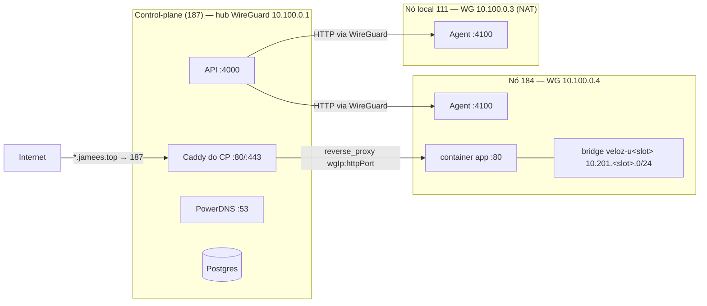

# 02 — Ambiente na rede

Como um ambiente ganha IP, fica isolado por dono, e é publicado com subdomínio + HTTPS.

## Topologia



Três planos de rede distintos:

1. **Gestão (API → agente):** por **WireGuard**. O agente escuta `:4100` **só no IP WG do nó** (`deploy/node/docker-compose.node.yml:29-31`), nunca público. O cliente não alcança o agente.
2. **Rede interna do ambiente:** cada container vive numa **bridge Docker por dono** (`veloz-u<slot>`), com IP fixo. Containers de donos diferentes ficam em bridges diferentes → isolados.
3. **Acesso público:** o Caddy do control-plane serve `<sub>.jamees.top` (HTTPS) e faz `reverse_proxy` para `IP-WG-do-nó:httpPort` por cima do túnel.

---

## 1. IPAM — alocação de IP (`apps/api/src/ipam.ts`)

### Modelo

- **`owner_networks`** (`schema.ts:324-340`) — um `/24` por `(node_id, owner_id)`:
  - `slot` (3º octeto 0-255), `subnet` = `10.201.<slot>.0/24`, `gateway` = `10.201.<slot>.1`, `bridge_name` = `veloz-u<slot>`.
  - Únicos `(node_id, owner_id)` e `(node_id, slot)`.
  - O 2º octeto é **fixo `201`** (`ipam.ts:9-11`) — escolhido pra não colidir com WG (`10.77`/`10.100`) nem docker0 (`172.17`).
- **`env_addresses`** (`schema.ts:343-355`) — um IP fixo por container: `env_id`, `role` (`app` | `db` | `tool:<kind>`), `ip`, `container_id`. Único `(node_id, ip)` → não-colisão por construção.

### `allocateAddress(nodeId, ownerId, envId, role)` (`ipam.ts:22-79`)

- Roda em transação com **advisory lock por nó**: `pg_advisory_xact_lock(hashtext('ipam:'+nodeId))` (`ipam.ts:30`) — serializa a alocação daquele nó (solto no COMMIT).
- **Idempotente:** se já existe IP para `(env_id, role)`, reusa (`ipam.ts:37-42`).
- **Slot:** `slot = coalesce(max(slot), -1) + 1` no nó (`ipam.ts:45`) — próximo livre sequencial; erro `no_owner_subnet` se `> 255`. Insere a `owner_networks` (`ipam.ts:52-56`).
- **IP:** varre hosts **de .10 a .254** em `10.201.<slot>.` (`ipam.ts:64`), pega o primeiro fora de `env_addresses`; erro `subnet_full` se cheio. `.1` (gateway) e `.2`–`.9` ficam reservados.
- Insere com `on conflict (env_id, role) do nothing`; trata corrida relendo o vencedor.
- Retorna `{ subnet, gateway, bridgeName, ip }`.

Outros: `ownerNetworkFor(nodeId, ownerId)` (`ipam.ts:82-91`) lê a bridge existente (recriar container na mesma rede); `releaseAddresses(envId)` (`ipam.ts:94-96`) só apaga `env_addresses` (**não** remove a bridge — pode ter irmãos).

---

## 2. Bridge do dono no nó — `ensureNetwork` (`apps/agent/src/docker.ts:735-758`)

Idempotente (`inspect`; se existe, retorna). Cria via `createNetwork`:

```ts
{
  Driver: "bridge",
  CheckDuplicate: true,
  IPAM: { Driver: "default", Config: [{ Subnet: subnet, Gateway: gateway }] },  // 10.201.<slot>.0/24 / .1
  Options: {
    "com.docker.network.bridge.enable_icc": "true",             // (!) ver divergência abaixo
    "com.docker.network.bridge.enable_ip_masquerade": "true",   // egress p/ internet
  },
  Labels: { "vp.owner": ownerId },
}
```

O IP fixo é aplicado no `createContainer` via `NetworkingConfig.EndpointsConfig[bridge].IPAMConfig.IPv4Address = ip`. Migração a quente (dual-home) existe em `attachNetwork` (`docker.ts:967-981`).

> ⚠️ **Divergência código × Plan (importante):** o código cria a bridge com **`enable_icc=true`** e nome **`veloz-u<slot>`**. Os docs `Plan/BANCO-POR-AMBIENTE.md` descrevem `icc:false`, bridges `brv<hash>`, `/16` por nó e `enable_ip_masquerade=false` — **nada disso está no código**. Ao documentar/mexer, use o comportamento real.

---

## 3. Isolamento multi-tenant — o que está no código × o que é config de host

**No código (só containers de serviço, `provisionService`):**
- `CapDrop: ["NET_RAW","NET_ADMIN"]` — mata ARP-spoof L2 na bridge do dono.
- `SecurityOpt: ["no-new-privileges"]`, `PidsLimit: 512`.
- Bridges por-dono distintas → o Docker já isola L2/L3 entre donos.

**Lacunas / config manual de host (NÃO versionada — só em `Plan/` como TODO):**
- `icc:false` global, chain `DOCKER-USER` (drop inter-bridge no mesmo nó), `bridge-nf-call-iptables`, sysctl persistente → `Plan/SERVICOS-POR-AMBIENTE.md:100-103`, `Plan/BANCO-POR-AMBIENTE.md:58-70`, `Plan/REDE-DOCKER-VALIDACAO.md:255-283`.
- Anti-spoof inter-dono cross-node = cryptokey routing do WireGuard (`AllowedIPs` estrito) + `rp_filter`.
- Container de **app** não tem `CapDrop`/`no-new-privileges`/`PidsLimit` (só serviço tem) — ver [01 §2](01-criar-ambiente-docker.md).

> Se for endurecer o isolamento de rede de verdade, o caminho é versionar `daemon.json` + a chain `DOCKER-USER` em `deploy/node/` (hoje é manual, e regras fora do `PostUp` do `wg0.conf` se perdem no reboot sem `iptables-persistent`).

---

## 4. WireGuard e resolução do nó (`apps/api/src/nodes.ts`, `agent.ts`)

- **Malha WG:** hub 187 = control-plane; nós rodam o agente. A API fala com o agente em `http://<wgIp>:4100`.
- ⚠️ **Duas faixas coexistem** (migração incompleta): `deploy/wireguard/README.md` e o `AGENT_URL`/MariaDB do compose usam **`10.77.0.0/24`** (hub `.1`, nós `.2`/`.3`); comentários de código e o PowerDNS do compose já usam **`10.100.0.0/24`** (`cp-ingress.ts:31`, `docker-compose.prod.yml:73`). **Na prática, o que vale é o `nodes.agent_url` gravado no banco** (em produção hoje é `10.100.0.x`).
- `agentUrlForNode(nodeId)` (`nodes.ts:15-19`): lê `nodes.agent_url`; fallback `DEFAULT_AGENT_URL` (`agent.ts:10`, `AGENT_URL` ou `http://localhost:4100`).
- `pickNodeForNewEnv({region?})` (`nodes.ts:31-77`): entre nós `online` com `agent_url`, filtra por região (503 se sem capacidade) e escolhe o **menos carregado** (conta ambientes `running/paused/provisioning`).
- `httpHostForNode(nodeId)` (`nodes.ts:91-95`): `http_host ?? public_host`. Usado no `accessUrl` por IP:porta (nó NAT: `http_host` = IP LAN; `public_host` costuma ser só p/ SSH).

---

## 5. Publicação da porta HTTP

- App: `PortBindings: { "80/tcp": [{ HostIp:"0.0.0.0", HostPort:"" }] }` → **porta efêmera** do host, lida por `inspect` e devolvida como `httpPort` (persistido em `environments.http_port`).
- Serviço: sem publicação (só IP interno da bridge), **salvo** painel embutido (ex.: rabbitmq publica 15672).

> A porta efêmera **muda se o container for recriado** (não num simples restart). Por isso, ao recriar/republicar, o vhost do Caddy precisa ser reescrito com a nova porta (é o que `syncSubVhost`/`enablePanel` fazem).

---

## 6. Ingress HTTP — Caddy do control-plane (`apps/api/src/cp-ingress.ts`)

A API escreve arquivos `*.caddy` em `CP_INGRESS_DIR` (default `/caddy-managed`), um **volume compartilhado** com o container do Caddy do CP, que faz `import /etc/caddy/managed/*.caddy` e **recarrega** ao detectar mudança (um watcher que dá `caddy reload` a cada ~5 s). TLS por-host é **HTTP-01 automático**.

- Zonas: `SUB_ZONE = "jamees.top"` (ambientes) e `TOOL_ZONE = "jamees.top"` (painéis de serviço) — `cp-ingress.ts:12,17`. `subFqdn(sub, zone)` → `${sub}.${zone}`.
- `wgIpFromAgentUrl(agentUrl)` (`cp-ingress.ts:31-35`): extrai o host do `agent_url` (`http://10.100.0.4:4100` → `10.100.0.4`) → é o **IP WG do nó** usado como upstream.
- `putSite(sub, upstream, zone)` (`cp-ingress.ts:38-44`): valida host + upstream (`IP:porta`) e escreve:
  ```
  <sub>.jamees.top {
      encode gzip zstd
      reverse_proxy <wgIp>:<httpPort>
  }
  ```
- `removeSite(sub, zone)` (`cp-ingress.ts:47-51`): apaga o `.caddy` (libera o nome, para de renovar o cert).
- Quem escreve o upstream: `syncSubVhost(sub, nodeId, httpPort)` (`environments.ts:61-70`) e o `backfill-subdomains.ts`.

### DNS wildcard (`apps/api/src/dns-pdns.ts`, `db/backfill-subdomains.ts`)

- `*.jamees.top A <CP_IP>` (TTL 300) criado via `pdns.replaceRRsets` (`backfill-subdomains.ts:20-28`, `CP_PUBLIC_IP` default `187.127.49.205`). Então **todo** `<sub>.jamees.top` resolve para o control-plane — criar um subdomínio novo **não** cria registro DNS, só escreve o vhost.
- O cliente do PowerDNS fala só pela HTTP API (`PDNS_API_URL` default `http://pdns:8081`), nunca no SQL. Nameservers `ns1.geestao.top`=187 / `ns2.geestao.top`=184.

> ⚠️ **Use jamees.top, não jamees.com.** `jamees.com` é autoritativo no **Cloudflare** (sem wildcard `*.jamees.com`) → subdomínios não resolvem e o Let's Encrypt não emite. `jamees.top` é o PowerDNS de vocês, com wildcard funcionando. Painel e ambiente compartilham a zona jamees.top; por isso `subdomain.isSubTaken` checa **`environments.auto_subdomain` e `env_tools.subdomain`** (evita colisão).

---

## 7. `accessUrl` — como o painel decide a URL do ambiente

Server-side em `toEnvironment` (`apps/api/src/routes/environments.ts:75-91`), por prioridade:

1. `r.domain` → `https://<domain>` (domínio próprio do cliente).
2. `r.autoSubdomain` → `https://<sub>.jamees.top`.
3. `r.httpPort && r.nodeId && !serviceUiPort(type)` → `http://<httpHost>:<httpPort>` (IP público/LAN do nó : porta efêmera).
4. serviço com painel embutido (rabbitmq): `panelUrl(...)` → `https://<sub>.jamees.top` do painel.

O painel só consome `env.accessUrl` (botão "Abrir site", linha "Principal" em Endereços).

Continua em: [01 — Docker](01-criar-ambiente-docker.md) · [03 — Deploy](03-deploy.md).
