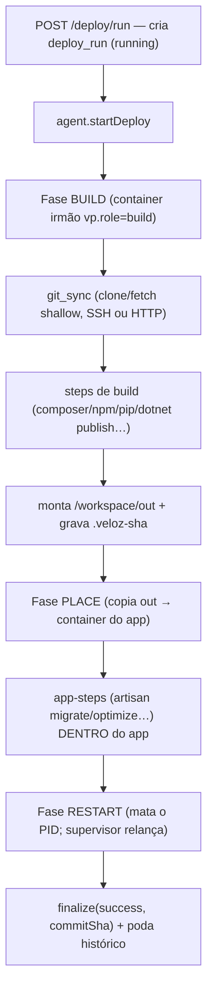

# 03 — Deploy do código do cliente

Como o código de um repositório git vira um app rodando. É diferente do **release da plataforma** (buildar/enviar as imagens api/painel/agent — isso está em [05](05-release-plataforma.md)).

**Princípio central** (`apps/agent/src/deploy.ts:10-15`): o build roda num **container efêmero IRMÃO** (label `vp.role=build`, RAM própria de 2 GB, volume `veloz-deploy-<envId>`); depois os arquivos buildados são **COLOCADOS** (`place`) no container do app **já rodando**, sem recriá-lo. Quem orquestra é a API (`apps/api/src/routes/deploy.ts`); quem executa é o agente (`apps/agent/src/deploy.ts`).



Marcadores no log ao vivo: `::vp:phase:*` e `::vp:step:<kind>:start|exit:<rc>` (a UI parseia isso).

---

## 1. Fase BUILD (`apps/agent/src/deploy.ts:562-569`)

1. `startBuildContainer` (`:127-164`): sobe o container efêmero. Imagem = `resolveBuildImage` (a base do runtime; fallback pra tag mais recente do mesmo tipo). `Cmd: ["sh","-c","sleep 3600"]`, `Memory = 2048 MB` (`BUILD_MEM_MB`, `:48`), `Binds: ["veloz-deploy-<envId>:/workspace"]`, `WorkingDir: /workspace`.
2. `buildScript(args)` (`:354-465`) gera um shell script, transportado em **base64** e executado (`printf '%s' '<b64>' | base64 -d > build.sh && bash build.sh`). Saída ao vivo por `execStream` (`:518-531`).
3. Se `exit != 0` → `finalize(failed)` e sai.
4. Lê o SHA do commit em `/workspace/out/.veloz-sha`.

### git_sync — clone/checkout (`:359-364`)

Sempre **shallow** (`--depth 1`):
```sh
if [ -d /workspace/repo/.git ]; then cd /workspace/repo && git fetch --depth 1 origin -- '<branch>' && git reset --hard FETCH_HEAD;
else rm -rf /workspace/repo && git clone --depth 1 --branch '<branch>' -- '<repoUrl>' /workspace/repo; fi
```

Autenticação (no `Env` do container de build, `:133-138`):
- **SSH (deploy key):** `GIT_SSH_COMMAND=ssh -i /workspace/.ssh/id_ed25519 -o BatchMode=yes -o StrictHostKeyChecking=accept-new -o UserKnownHostsFile=/workspace/.ssh/known_hosts`. A chave privada vive **no volume** (`/workspace/.ssh/`), gerada por `generateDeployKey` (`:197-221`, ed25519) ou importada (`:167-190`). Só a **fingerprint** é persistida no DB; a pública aparece 1× no painel. `known_hosts` via `ssh-keyscan github.com gitlab.com bitbucket.org`.
- **HTTP (user/senha ou token):** injeta `GIT_USER`/`GIT_PASS` + credential helper (`:158-162`).
- Imagens **.NET SDK** não trazem `openssh-client` → instalado sob demanda (guard `command -v ssh`).

### Detecção de framework — `detectStack` (`:294-351`)

O `kind` (runtime) vem do DB; a detecção refina o **framework**:
- **python:** `manage.py` → `django` (`suggestedPythonCmd = python manage.py runserver 0.0.0.0:80 --insecure --noreload`); senão `python` + `suggestedStartFile` (primeiro de `app.py main.py wsgi.py server.py`).
- **static:** `package.json` com script `build` → `spa`; senão `static`.
- **dotnet:** acha `*.csproj`/`*.sln` → `dotnet`; senão `none`.
- **node** com `"next":` no package.json → `nextjs` (`runModel=standalone`).
- `composer.json` + `artisan` + `laravel/framework` → `laravel`.

### Steps de build por framework — `defaultSteps` (API, `routes/deploy.ts:128-169`)

- **Laravel:** git_sync → composer_install → (se package.json) npm_ci + npm_build → laravel_fix_index → artisan_storage_link → artisan_clear → artisan_optimize → **artisan_migrate** (desligado por padrão, `mutatesData=true`).
- **Python:** git_sync → (requirements) pip_install → python_restart.
- **Static:** git_sync → (spa) npm_ci + npm_build.
- **.NET:** git_sync → dotnet_publish → dotnet_restart.
- **Node/genérico:** git_sync → (composer) composer_install → (package.json) npm_ci + npm_build → node_restart.

Comandos concretos (`deploy.ts:368-419`):
- `composer_install`: `composer install --no-dev --optimize-autoloader --no-interaction --prefer-dist`.
- `npm_ci`: detecta pnpm-lock/yarn.lock/package-lock e usa o gerenciador certo (`pnpm install --frozen-lockfile` / `yarn --frozen-lockfile` / `npm ci`).
- `npm_build`: nextjs → `NEXT_PRIVATE_STANDALONE=true npm run build`; senão `npm run build --if-present`.
- `pip_install`: `pip install --no-cache-dir --target=.vp-vendor -r requirements.txt` (vendoriza em `.vp-vendor` → sobrevive a recreate).
- `dotnet_publish`: `dotnet publish "$PROJ" -c Release -o /workspace/publish -p:UseAppHost=false --nologo`.
- `shell`: comando livre do usuário.

### Montagem do artefato → `/workspace/out` (`:420-462`)

- **Next.js standalone:** `.next/standalone/.` + `.next/static` + `public`.
- **Laravel:** `out/framework/` = repo inteiro (sem `.git`); `out/www/` = conteúdo de `public/`.
- **SPA:** auto-detecta `dist|build|out`; desce pra subpasta com `index.html` (caso Angular).
- **static/python/django:** `cp -a . out/`.
- **dotnet:** copia `/workspace/publish/.`.
- Grava `/workspace/out/.veloz-sha = git rev-parse HEAD`.

---

## 2. Fase PLACE — copia `out` para o container do app (`:571-576`)

Todos usam `getArchive` (build) → `putArchive` em `/.veloz-incoming` (app) → `cp -a`. O placer varia por framework:

- `placeIntoApp` (`:626-636`) — node/genérico: `cp -a out/. <workdir>/` **sobrepõe, não apaga** (preserva `.env`/uploads).
- `placeStatic` (`:642-654`) — deploy **limpo**: `rm -rf` tudo menos `.vp-*` (preserva o Caddyfile) antes de copiar.
- `placeDotnet` (`:661-673`) — deploy **limpo** em `/app` (DLLs antigas não podem sobrar).
- `placeLaravel` (`:682-704`) — dois destinos no mesmo container:
  - `/var/projeto-laravel` (framework, **fora do docroot**): atualiza o código **preservando `storage/` e `.env`**; garante dirs graváveis (`storage/...`, `bootstrap/cache`).
  - `/var/www` (docroot): substitui 100% com `out/www/.`; symlink `ln -sfn /var/projeto-laravel/storage/app/public /var/www/storage`.
  - Motivo: o `.env` fica **fora** do docroot → nunca é servido.

## 3. App-steps pós-place (`:580-588`)

Passos que precisam do ambiente do app (têm `.env`/DB), rodados via `execStream(appContainerId, ...)` — `appStepCommand(kind)` (`:468-500`). Prefixo `LOAD` carrega `/veloz/env` antes:
- `laravel_fix_index`: `sed` no `/var/www/index.php` apontando pra `/var/projeto-laravel/`.
- `artisan_storage_link`, `artisan_clear` (`optimize:clear`), `artisan_optimize` (`config/route/view:cache`), `artisan_migrate` (`migrate --force`).

## 4. Fase RESTART (`:591-608`)

Reinicia o **processo** do app com o código novo (o supervisor relança — ver [01 §7](01-criar-ambiente-docker.md)). Helpers em `docker.ts`: `applyNodeStart`, `applyPythonCmd`/`applyPythonStart`, `applyDotnetCmd`/`restartDotnet`, `applyPhpRoot` (Laravel), `restartApp` (static). Nenhum recria o container.

## 5. finally (`:615-618`)

`killContainer` remove o container de build; `writeLogToEnv` grava o log em `/veloz/deploys/<runId>.log` dentro do app, podando pra `historyLimit` (default 10).

---

## Modelo de dados (`apps/api/src/db/schema.ts:169-241`)

- **`deploy_configs`** (PK = envId): `connectionMode` (`none|public|ssh|local`), `provider`, `repoUrl`, `branch` (default `main`), `mode` (`simple|advanced`), `publicKey`/`fingerprint`, `httpUsername`/`httpPasswordEnc`, `deployStrategy` (`place|recreate`), `framework`, `runModel`, `subdir`, `historyLimit` (10; 0 = nunca apagar), `autoEnabled`/`intervalMinutes`/`nextCheckAt`/`lastRemoteSha` (auto-deploy, ver abaixo), `lastRunId`/`lastRunStatus`/`lastGoodSha`.
- **`deploy_steps`**: `ord`, `enabled`, `kind`, `command` (livre só em `kind="shell"`), `label`, `cwd`, `mutatesData`.
- **`deploy_runs`**: `trigger` (`manual|auto`), `status` (`running|success|failed|interrupted`), `exitCode`, `failedStepKind`, `commitSha`/`commitMessage`/`commitAuthor`, `stepsSnapshot` (jsonb), `log` (~64KB redigido), `startedAt`/`finishedAt`. Índice `(envId, startedAt)`.

### Rotas (API, `apps/api/src/routes/deploy.ts`, sob `/environments/:id/deploy`)

`GET /deploy` · `PUT /deploy/connection` · `POST /deploy/probe` · `POST /deploy/key/generate|import|test` · `PUT /deploy/http-credentials` · `PUT /deploy/history` · `GET/PUT /deploy/branch(es)` · `POST /deploy/steps/detect` · `PUT /deploy/steps` · `PUT /deploy/auto` · **`POST /deploy/run`** (cria o run e chama `agent.startDeploy` — retorna já) · `GET /deploy/runs` · `GET /deploy/runs/:runId/log` · `DELETE /deploy`.

`POST /deploy/run` (`:413-447`) monta o `buildEnv` só com as env-vars marcadas `buildTime=true`.

---

## Logs de deploy — **polling, não SSE**

1. O agente guarda o log em memória (`deployState: Map<runId,…>`, teto ~400KB), exposto por `GET /deploy/log/:runId` (agente), passando por `redact` (mascara `*KEY|TOKEN|SECRET|PASS*`, corta a 64KB).
2. A API (`GET /environments/:id/deploy/runs/:runId/log`) chama o agente enquanto `running`; quando termina, **persiste** no `deploy_runs` e **poda** o histórico pra `historyLimit`.
3. O painel (`.../deploy/[runId]/page.tsx`) faz **poll a cada 1,5 s** enquanto `status==="running"`.

> **SSE** no projeto é só para **logs de container** (aba Logs) e Redis pub/sub — não para deploy.

---

## Auto-deploy por push — **lacuna conhecida (roadmap)**

- **Não há webhook** (nenhum handler `x-github`/`x-gitlab`/`push_event`).
- O polling está **parcialmente** implementado: `PUT /deploy/auto` grava `autoEnabled`/`intervalMinutes`/`nextCheckAt`, e existem as colunas `nextCheckAt`/`lastRemoteSha`/`lastCheckAt` + `deploy_runs.trigger="auto"`. **Mas não há scheduler** que consuma isso (o `worker.ts` só processa `provision_env`/`delete_env`; os crons de billing/dns/metrics não tocam deploy).
- **Na prática, todo deploy é manual** via `POST /deploy/run` (`trigger:"manual"` hardcoded).
- Para implementar: um cron que varra `deploy_configs` com `autoEnabled` e `nextCheckAt <= now()`, compare o SHA remoto (`git ls-remote`) com `lastRemoteSha` e dispare `startDeploy` com `trigger:"auto"`.

Continua em: [01 — Docker](01-criar-ambiente-docker.md) · [05 — Release da plataforma](05-release-plataforma.md).
