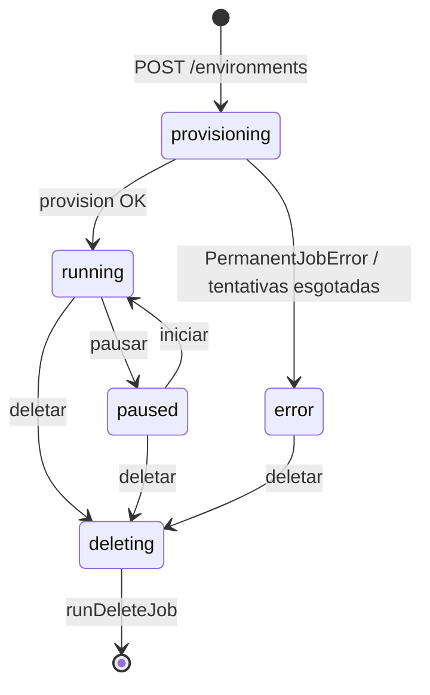

# 04 — Ciclo de vida de um ambiente

Da chamada `POST /environments` até `running` (ou `error`), e a remoção. Isto é a **orquestração** que envolve a criação do container ([01](01-criar-ambiente-docker.md)) e a rede ([02](02-ambiente-rede.md)).

---

## 1. `POST /environments` (`apps/api/src/routes/environments.ts:197-317`)

Entrada: `createEnvironmentInput` (`packages/contracts/src/index.ts:576-587`): `name` (2–40), `plan` (slug), `runtime {kind,version}` (obrigatório se app), `type` (slug em `env_types`; ausente = app), `region?`, `nodeId?`, `template` (default `none`; `nextjs` pré-configura).

**Validações (em ordem):**

| Checagem | Erro | Linha |
|---|---|---|
| `getPlan(plan)` existe | 400 `invalid_plan` | `:208-209` |
| plano ativo | 400 `plan_inactive` | `:212` |
| **limite de máquinas** (não-admin): nº de envs raiz `< plan.maxEnvironments` | 409 `env_limit_reached` | `:215-228` |
| `type` existe e ativo | 400 `invalid_type` | `:233-238` |
| plano ≥ recursos mínimos do tipo (`minVcpu`/`minMemMb`) | 422 `invalid_plan_for_type` | `:242-256` |
| app tem `runtime` | 400 `invalid_runtime` | `:258` |
| **saldo** (não-admin): `balanceCents ≥ ceil((plan+tipo)/720)` | 402 `insufficient_balance` | `:263-274` |

**Grava** (sempre `state="provisioning"`, `nodeId=null` — o nó é escolhido no worker):
- app (`:280-293`): `runtimeKind/runtimeVersion`; template `nextjs` seta `nodeStartFile="server.js"`, insere `deployConfigs` (nextjs/standalone) e env-vars `PORT=80/HOSTNAME=0.0.0.0/NODE_ENV=production`.
- service (`:294-299`): `typeId`, `runtimeKind="node"`.
- stack (`:300-313`): insere a **raiz** + uma **2ª linha** `<name>-db` (`typeId=child.id`, `parentEnvId=root.id`), ambas `provisioning`.

**Enfileira** (`:314`): `jobs.insert({ kind:"provision_env", envId: root.id, payload:{region, template} })`. Retorna `toEnvironment(root)` na hora (provisionamento é assíncrono).

---

## 2. Fila de jobs (`schema.ts:388-411`) + Worker (`apps/api/src/worker.ts`)

`jobs`: `kind` (`provision_env|delete_env`), `env_id` (**sem FK** — delete apaga o env), `status` (`queued|running|done|failed|canceled`), `attempts`/`max_attempts` (provision=8, delete=20), `run_after`, `locked_by`/`locked_at`/`heartbeat_at`, `last_error`. Índices `(run_after)` e `(env_id)`.

Worker (roda dentro do processo da API):
- `CONCURRENCY = VP_WORKER_CONCURRENCY ?? 2`, poll 2 s, pool Postgres dedicado.
- **Reaper:** re-enfileira jobs `running` com `heartbeat_at < now()-90s`. **Poda:** apaga `done|canceled` com `finished_at < now()-7d`.
- **Claim** (`FOR UPDATE SKIP LOCKED`, `:42-54`): pega 1 job `queued` com `run_after <= now()`, marca `running`, `attempts+1`.
- **Advisory lock por env** (`:82-87`): `pg_try_advisory_lock(hashtextextended(envId,0))` na mesma conexão reservada. Se outro worker está no mesmo env → devolve o job com `run_after = now()+5s`. Garante **≤ 1 job por ambiente** no cluster.
- **Heartbeat:** `setInterval` 20 s.
- **Dispatch:** `provision_env → runProvisionJob`; `delete_env → runDeleteJob`.
- **Falha** (`:96-114`): `PermanentJobError` ou `attempts ≥ maxAttempts` → `status="failed"` + `environments.state="error"`. Senão **retry com backoff**: `run_after = now() + min(300s, 2^attempts · 5s) + jitter`.

---

## 3. Provisioner (`apps/api/src/provisioner.ts`)

`runProvisionJob` (`:165-230`), reconciliador idempotente:
1. Se já `running` → return.
2. `nodeId` nulo → `pickNodeForNewEnv({region})` (menos carregado), grava.
3. `agentUrl = agentUrlForEnv({nodeId})`.
4. Roteia por `envTypes.category`: `service → provisionServiceEnv`, `stack → provisionStackEnv`, senão `provisionApp`.
5. Best-effort: subdomínio `.jamees.top` p/ envs web (`putSite`); e para serviços com painel embutido (rabbitmq), `enablePanel(fresh)`.
6. Erro: `PermanentJobError` → `state=error` e re-lança (sem retry); transitório → grava `errorMessage`, mantém `provisioning`, re-lança (worker faz retry).

As três funções (`provisionApp` `:30-59`, `provisionServiceEnv` `:62-91`, `provisionStackEnv` `:116-162`) seguem o padrão: **allocateAddress → (credenciais) → agent.provision(Service) → gravar `containerId`/`httpPort`/`state=running`**. Detalhes de cada uma em [01 — Docker](01-criar-ambiente-docker.md).

Helpers: `envVarsFor` (decifra env-vars), `rebuildServiceEnv`/`rebuildCreds` (reconstroem credenciais persistidas p/ o container casar com o painel), `ensureServiceUiPublished` (recria um serviço publicando a porta do painel).

---

## 4. Estados (`contracts/index.ts:209-216`)

`provisioning | running | paused | error | deleting` (coluna `environments.state`). Ações do painel: **pausar** (`environments.ts` → `paused`, cobrança suspensa), **iniciar** (`→ running`), **reiniciar** (restart do container), **deletar** (`→ deleting` + job).

---

## 5. Remoção — `runDeleteJob` (`provisioner.ts:233-255`)

Disparado por `DELETE /environments/:id` (`environments.ts:535-538`): marca raiz + filhos `deleting`, **cancela** jobs `provision_env` ainda `queued`, insere `jobs{kind:"delete_env", maxAttempts:20}`.

`runDeleteJob`, para cada `[...filhos, raiz]`:
1. `cpIngress.removeSite(subdomínio)`.
2. Se `containerId` → `agent.remove` (confirma antes de apagar; falha → retry).
3. `agent.removeVolume` de `veloz-data-<id>`, `veloz-deploy-<id>`, `veloz-code-<id>` (best-effort).
4. `releaseAddresses(id)` (libera IPs no IPAM; a bridge fica).
5. `db.delete(environments)` por `parentEnvId` e por `id`.

No agente: `removeExistingByEnv` lista containers por label `vp.env=<envId>` e força `remove`.

---

## Como adicionar um novo TIPO de serviço (checklist)

1. **Catálogo:** adicionar a linha em `env_types` no seed (`apps/api/src/db/push-and-seed.ts`): `id` (slug), `category`, `image` (stock), `internalPort`, `dataPath`, `defaultTool?`, `priceMonthCents`, `minVcpu`/`minMemMb`.
2. **Runtime do serviço:** um `case` em `serviceRuntime` (`apps/api/src/services.ts`) — env do Docker (credenciais), `readiness`, e o `store` (o que persiste cifrado).
3. **Conexão exibida:** um `case` em `connectionInfo` (`services.ts`) — host/porta/usuário/URL.
4. **Painel embutido (opcional):** se tiver UI web, adicionar em `SERVICE_UI_PORTS` (`services.ts`) e a exposição segue o modelo do [painel de serviço](../apps/api/src/service-panel.ts).
5. **Distribuir a imagem** para os nós (pull automático no 1º uso, ou pré-carregar).

Continua em: [01 — Docker](01-criar-ambiente-docker.md) · [03 — Deploy](03-deploy.md).
