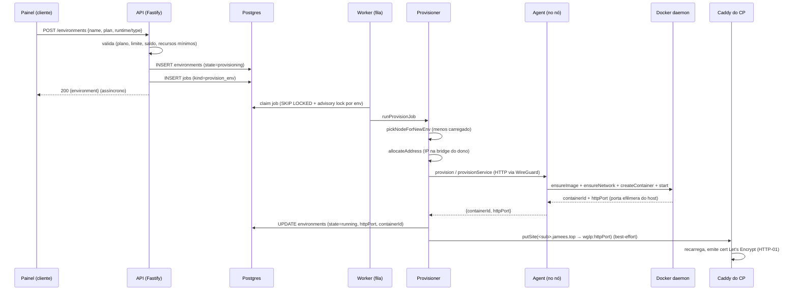

# Documentação de desenvolvedor — velozPanel / Jamees

Painel de hospedagem próprio: o cliente cria **ambientes** (apps de código, bancos/serviços, ou stacks), o sistema provisiona um **container Docker** por ambiente num dos **nós**, dá **rede isolada por dono**, **subdomínio + HTTPS** automáticos, e **deploy por git**. A cobrança é por hora.

> ⚠️ **Fonte da verdade = o código** (`apps/`, `packages/`, `deploy/`). Os documentos em `Plan/` descrevem um desenho-alvo (aspiracional) e **divergem** do código em vários pontos (bridge, isolamento de rede, faixa WireGuard). Cada doc aqui marca essas divergências. Quando houver conflito, **o código manda**.

## Índice

| Doc | Assunto |
|---|---|
| [Arquitetura (visão visual)](arquitetura.md) · [diagrama](arquitetura.png) | Panorama da arquitetura com diagrama. Comece por aqui para o mapa geral. |
| [01 — Criar ambiente (Docker)](01-criar-ambiente-docker.md) | Como o container de um ambiente é criado: imagem, volumes, limites kernel, hardening, portas, app × serviço × stack. |
| [02 — Ambiente na rede](02-ambiente-rede.md) | WireGuard, bridge por dono, IPAM, isolamento multi-tenant, ingress Caddy + DNS. |
| [03 — Deploy do código](03-deploy.md) | Pipeline de deploy (git → build efêmero → place → restart), presets por framework, logs. |
| [04 — Ciclo de vida](04-ciclo-de-vida.md) | Rota de criação, fila de jobs, worker, provisioner, estados, remoção. |
| [05 — Release da plataforma](05-release-plataforma.md) | Build/envio das imagens e recriação de api/painel em produção. |

## Monorepo (pnpm workspaces)

```
apps/
  api/        Fastify + Drizzle (Postgres). Orquestra tudo, persiste, expõe /api/v1. Roda o WORKER da fila.
  agent/      Roda em CADA nó. Fala com o Docker daemon (dockerode). Faz build/deploy, SSH gateway.
  painel/     Next.js (App Router). O painel do cliente + super admin.
packages/
  contracts/  Zod: tipos/validação compartilhados (RUNTIME_VERSIONS, planos, todos os schemas de API).
  db-console/  Console de banco embutido (Jamees Studio).
deploy/       Artefatos de produção (docker-compose do control-plane e dos nós, base images, WireGuard).
Plan/         Documentos de planejamento (aspiracionais — NÃO são a fonte da verdade).
docs/         Esta documentação.
```

## Os 4 processos

- **api** (`apps/api`, porta 4000) — recebe as chamadas do painel, valida com Zod (`packages/contracts`), grava no Postgres, e **enfileira** o trabalho pesado. Fala com o agente de cada nó por HTTP sobre WireGuard.
- **worker** (dentro do processo da api, `apps/api/src/worker.ts`) — consome a fila `jobs` (provisionar/remover ambiente) com `FOR UPDATE SKIP LOCKED` + advisory lock por ambiente.
- **agent** (`apps/agent`, porta 4100 só na WireGuard) — um por nó. Cria/remove containers, builda e faz deploy, expõe o gateway SSH (2222). O cliente **nunca** alcança o agente.
- **painel** (`apps/painel`, porta 3000) — Next.js atrás do Caddy do control-plane.

## Fluxo ponta a ponta (criar um ambiente)



Detalhes em [04 — Ciclo de vida](04-ciclo-de-vida.md).

## Modelo de dados (tabelas centrais)

O schema é criado por **SQL manual idempotente** em `apps/api/src/db/push-and-seed.ts` (`CREATE TABLE IF NOT EXISTS` + `ALTER ... ADD COLUMN IF NOT EXISTS`), **não** por migrations do Drizzle. O `schema.ts` é só a tipagem. Para aplicar mudanças de schema em produção: `pnpm --filter @velozplanel/api exec tsx src/db/push-and-seed.ts` (ou `docker compose run --rm --no-deps api pnpm db:push`).

| Tabela | Papel | Arquivo |
|---|---|---|
| `environments` | O ambiente (state, typeId, runtime, containerId, httpPort, autoSubdomain, domain, parentEnvId) | `schema.ts:42+` |
| `env_types` | Catálogo de tipos (php/node/.../rabbitmq/n8n): imagem, porta interna, dataPath, preço, mínimos | `schema.ts:304-321` |
| `jobs` | Fila (provision_env / delete_env) | `schema.ts:388-411` |
| `owner_networks` | /24 por (dono, nó): bridge `veloz-u<slot>` | `schema.ts:324-340` |
| `env_addresses` | Um IP fixo por container (role app/db/tool) | `schema.ts:343-355` |
| `service_credentials` | Credenciais de serviço, cifradas | `schema.ts:375-383` |
| `env_tools` | Painéis de UI por serviço (rabbitmq_mgmt, jstudio): enabled + subdomain | `schema.ts:358-371` |
| `deploy_configs` / `deploy_steps` / `deploy_runs` | Config e histórico de deploy | `schema.ts:169-241` |
| `nodes` | Os nós (agent_url na WG, public_host, http_host, region, status) | `schema.ts:28+` |

## Convenções de código (do dono)

- **Nunca** renomear identificadores internos: `velozplanel/*`, `VP_*`, `@velozplanel/*`, bridge `veloz-u*`, labels `vp.env`/`vp.role`. A **marca visível** é "Jamees"; o código/infra continua velozPanel.
- Subdomínios de ambiente **e** de painel de serviço usam **`jamees.top`** (wildcard no PowerDNS próprio). **Não** usar `jamees.com` para isso (é Cloudflare, sem wildcard). Ver [02 — Ambiente na rede](02-ambiente-rede.md).
- PT-BR nos comentários e na UI.
